# Carshenas (کارشناس)

**An appraiser's opinion on every used-car listing in Iran.** Carshenas reads used-car listings from Divar, turns each messy, free-text listing into a structured record, estimates the car's market value from comparable listings, and rates the asking price from «معامله‌ی عالی» (a great deal) to «خیلی گران» (way too expensive), with the reason in plain Farsi. It is "Torob for cars", modeled on CarGurus and Autolist: Farsi, right to left, phone first. One developer built it AI-first with Claude Code, as an answer to Torob's AI Product Engineer challenge ([the brief](docs/product/challenge.md)).

**Live site:** TODO-01 · **Demo video:** TODO-03 · [Submission notes](docs/submission/notes.md) · [Every number and the command that regenerates it](docs/submission/numbers.md) · [Evidence](docs/evidence/README.md)

The name: کارشناس means expert or appraiser, and «کارشناسی» is the inspection and valuation a careful buyer pays for before buying a used car. Read as English it is *car* + *shenas*, "one who knows cars".

## What it looks like

Screenshots of the running product on 2026-10-04, with real listings from the live index. Listing photos are Divar's own images, shown from Divar's addresses and never stored (ADR-0025), so the screenshots show drawn stand-ins in their place. The wording on screen is being rewritten to a voice guide (`TODO-09`).

**Home.** One box takes a sentence, or a link to rate.

<table>
  <tr>
    <td width="66%">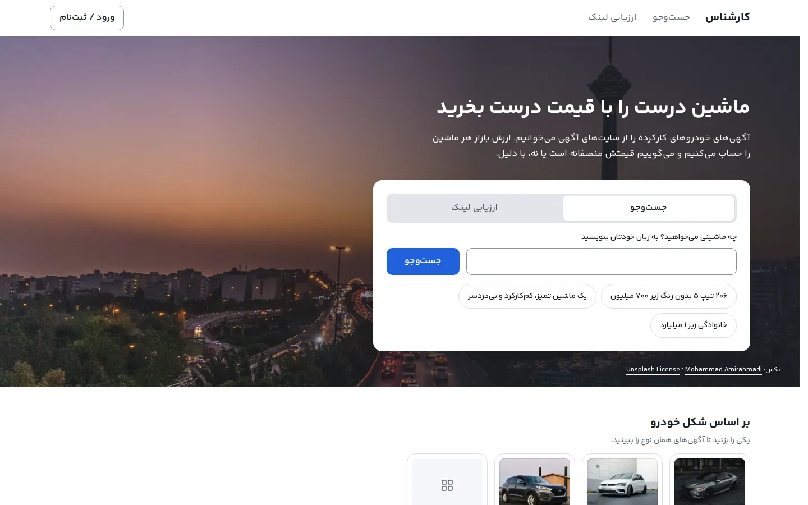</td>
    <td width="34%">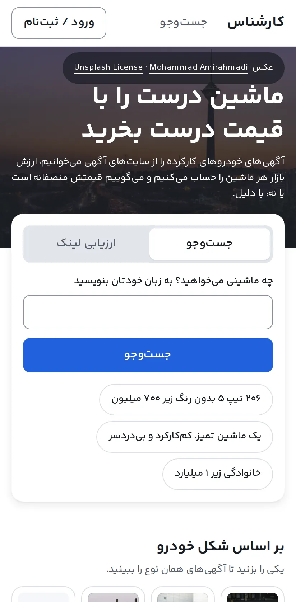</td>
  </tr>
</table>

**Search in plain Farsi.** The sentence «۲۰۶ تیپ ۲ بدون رنگ زیر ۱ میلیارد» became four filters, shown as chips that can be taken off. The results start with the best deals: «معامله‌ی عالی», 18 % under the market value, and so on down.

<table>
  <tr>
    <td width="66%">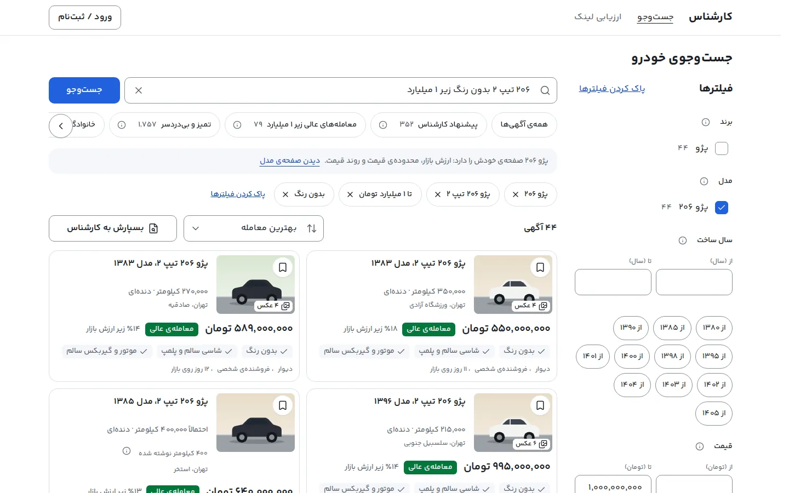</td>
    <td width="34%">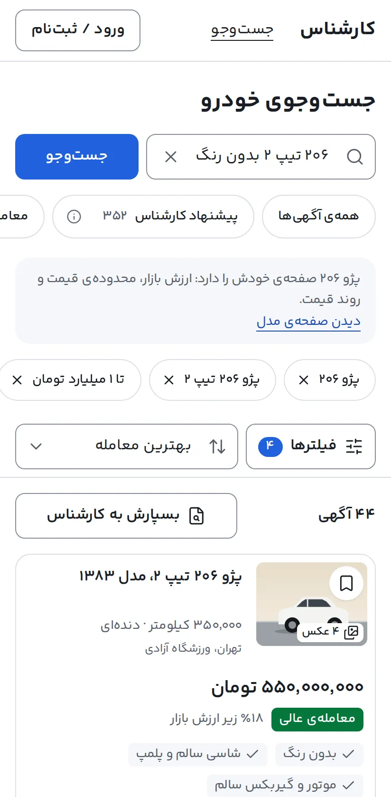</td>
  </tr>
</table>

**A listing, and why it is rated as it is.** The verdict, a five-band gauge with the asking price on it, the market value with its date, then the reasons, the ten comparable listings and the price history.

<table>
  <tr>
    <td width="66%">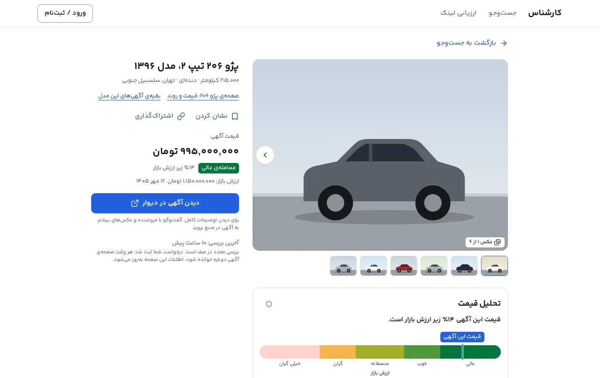</td>
    <td width="34%">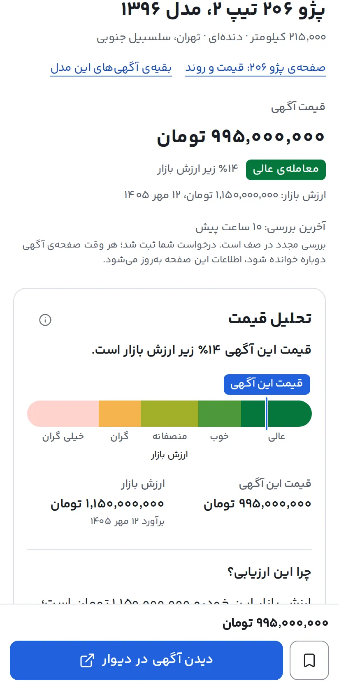</td>
  </tr>
  <tr>
    <td colspan="2">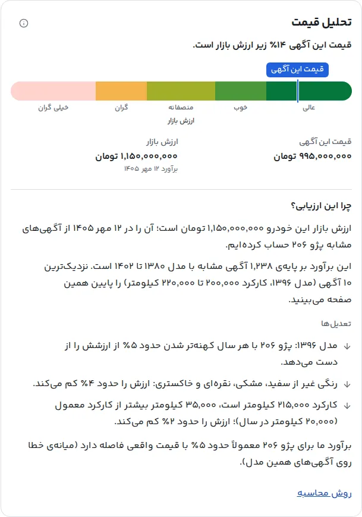</td>
  </tr>
</table>

**Paste a link.** A Divar link is answered from the data Carshenas already holds, with the same analysis the listing page has.

<table>
  <tr>
    <td width="66%">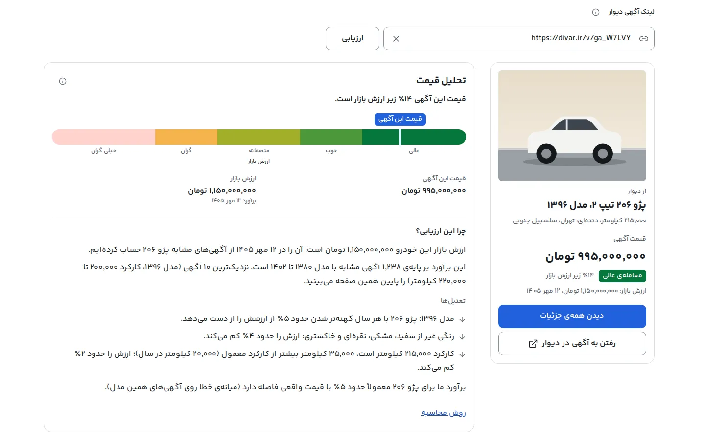</td>
    <td width="34%">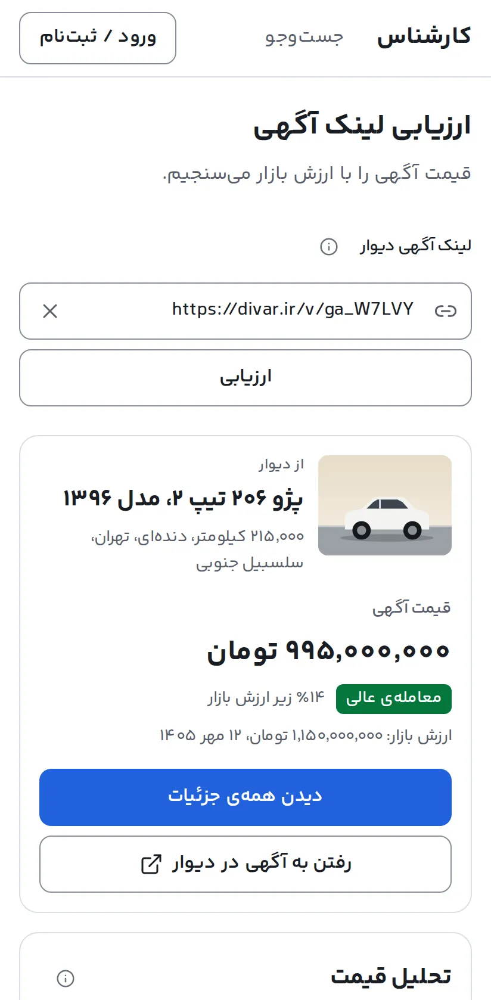</td>
  </tr>
</table>

**The numbers the product shows about itself.** The status page, `/status`, is public: how fresh the index is, what the market values are dated, and how far off they were, model by model.

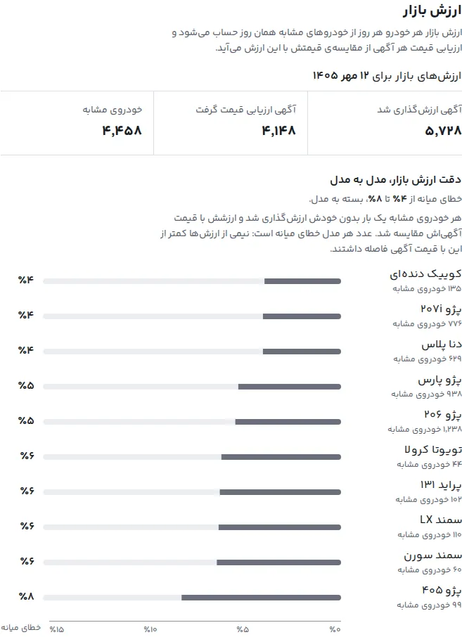

## How it works

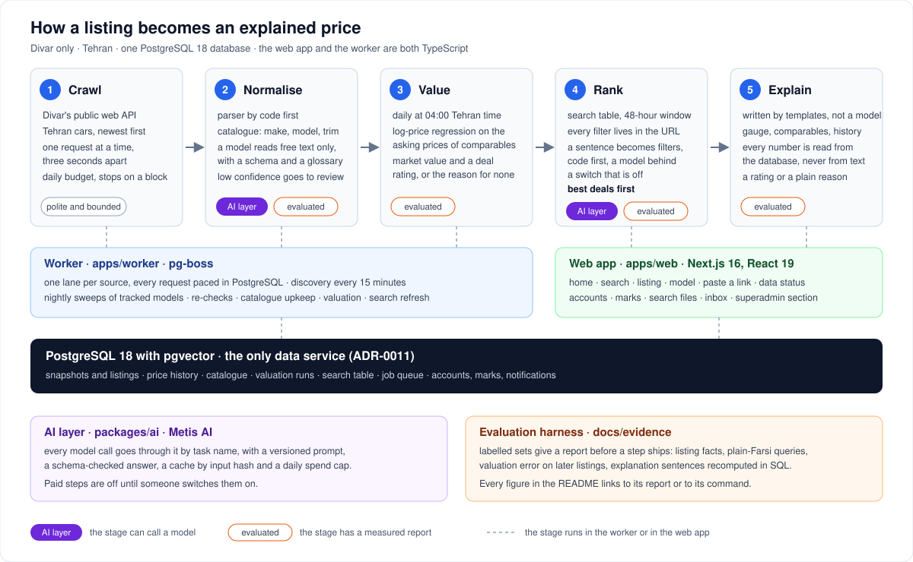

1. **Crawl.** A worker keeps a live, bounded index of Divar's Tehran cars: discovery of new listings every 15 minutes, a nightly sweep of the ten models read in depth, re-checks of what a buyer opens. One request at a time, at least three seconds apart, a daily budget, and a stop on any block. Photos are never downloaded and personal data is never kept ([ADR-0008](docs/decisions/0008-crawl-only-what-sources-allow.md), [ADR-0017](docs/decisions/0017-live-bounded-replayable-listing-index.md), [ADR-0018](docs/decisions/0018-source-lanes-request-pacing-and-rate-limits.md)).
2. **Normalise.** Structured fields are parsed by code and matched to one catalogue of makes, models and trims. A language model reads only what code cannot: the condition and the meaning of the price in the ad's text, against a schema and a glossary, with a confidence, a review queue and an evaluation behind it ([ADR-0021](docs/decisions/0021-ai-layer-on-the-ai-sdk.md)).
3. **Value.** Once a Tehran day, a regression on the asking prices of comparable listings gives every car a market value, and the asking price is rated against it. A listing whose price cannot be trusted gets no rating and a reason ([S01](docs/specs/S01-deal-ratings.md)).
4. **Rank.** A table of searchable listings, kept fresh by the worker, serves search. A typed sentence becomes filters, by code first ([ADR-0027](docs/decisions/0027-search-filters-as-declarative-definitions.md), [ADR-0028](docs/decisions/0028-search-table-kept-fresh-by-marks.md), [ADR-0029](docs/decisions/0029-plain-farsi-search-code-first-model-behind-a-switch.md)).
5. **Explain.** The listing page's text is written by templates from stored facts, so every number is read from the database and none comes from a model ([ADR-0030](docs/decisions/0030-listing-explanation-written-by-templates.md)).

## How it answers the brief

Torob's brief is four steps: crawl offers, normalise messy data, rank by user intent, explain the best choice. Its careers page lists ten problems behind every search. One table, with what was measured. Each figure's command and file are in [`docs/submission/numbers.md`](docs/submission/numbers.md); the figures were measured on 2026-10-04 unless a link says otherwise.

| Step | Torob's problem | What Carshenas does | Measured |
|---|---|---|---|
| Crawl | Price validity («اعتبار قیمت») | A live index with a request budget; a listing that leaves the market leaves the results; every page says when it was last checked | 26,231 active listings, 1,133 new and 14 gone in 24 hours. The one-hour target for a new listing is **not met** (median 3 hours) and the status page says so |
| Crawl | Shop matching («تطبیق فروشگاه‌ها») | One source. Dealers are told from private sellers, and a repost never counts twice in a market value. Cross-site duplicate groups are not built | not measured |
| Normalise | Attribute extraction («استخراج ویژگی‌ها») | Fields by code; condition and price meaning read from the text by a model with a glossary | 99.9 % of facts right on 66 held-out ads (791 of 792), US$3.02 per 1,000 ads: [report](docs/evidence/listing-facts/2026-09-30/report.md) |
| Normalise | The same product under other names («تشخیص کالای مشابه») | One catalogue of makes, models and trims, with aliases and typos | 26,242 of 26,254 active listings matched to a model (coverage, not accuracy); a link's title names the car right 99.8 % of the time: [report](docs/evidence/paste-link-coverage/2026-10-04/title-car-all.md) |
| Normalise | Contradictory data («کشف تناقض داده») | A price that contradicts the text (a down payment, a teaser, a typo) gets no rating and says why; an ad that instructs the model is held for a person | price meaning right on 99.1 %; 11 of 11 hostile ads held; about half of the searchable listings carry no rating, each with its reason |
| Rank | Query understanding («فهم عبارت جست‌وجو») | A sentence becomes filters shown as chips; code reads first, a model only what code cannot | 95.2 % of 270 labelled sentences right by code alone, 92.5 % on the 133 set aside for testing, 96.7 % with the model: [report](docs/evidence/query-understanding/2026-10-04-country/report.md) |
| Rank | Multi-stage ranking («رتبه‌بندی چندمرحله‌ای») | Filters, then the gap to the market value, then freshness; best deals first | search p95 52 ms on 3,008 searchable listings and 316 ms on 100,000 (`TODO-05`): [report](docs/evidence/search-api/2026-10-02/load-results.md) |
| Rank | Personal recommendation («پیشنهاد اختصاصی») | Intent words become filters; a search file keeps a search working and tells the buyer of a new great deal or a price drop | built and tested; no accuracy figure |
| Rank | User-behaviour signals («سیگنال رفتار کاربران») | Pasted links, searches, marks and search files add up to demand per model; the superadmin decides which models are read in depth | built; no figure |
| Explain | Low latency («پاسخ کم‌تأخیر») | Market values and ratings are computed before the search, and PostgreSQL serves it | the speed row above |
| Explain | The best choice, with its reason | A gauge, the ten comparables, the price history and the adjustments, in plain Farsi, from templates | 281 of 281 sentences match the stored facts: [report](docs/evidence/listing-page/2026-10-02-explanation-faithfulness.md) |

The market value itself: a median error of 6.77 % on listings posted after a cut date and learned only from before it (306 listings), and 4 % to 8 % by model on the status page. The split is by listing age, not yet by a market that moved ([report](docs/evidence/valuation/2026-09-30.md)).

## Run it locally

Needs Node 22 or later, pnpm 10 (`corepack enable`) and Docker.

```bash
git clone https://github.com/youridol544/carshenas.git && cd carshenas   # TODO-02: private until the submission
corepack enable && pnpm install --frozen-lockfile
cp example.env .env                      # local-only passwords for a database on 127.0.0.1
cp /path/to/any-variable-font.woff2 apps/web/src/components/layout/fonts/YekanBakh-VF.woff2   # see below
pnpm db:up && pnpm db:migrate            # PostgreSQL 18 with pgvector in Docker, then the schema
pnpm dev                                 # http://localhost:3000
```

Three things a clone does not have, on purpose:

- **The typeface.** The interface is set in Yekan Bakh, a licensed font that is never committed ([ADR-0015](docs/decisions/0015-yekan-bakh-self-hosted-never-committed.md)). `next dev` stops without a file at that path. Any variable `woff2` file lets it run, with different letter shapes; [`docs/runbooks/licensed-font.md`](docs/runbooks/licensed-font.md) says how the owner's copy is provided.
- **The data.** A new database is empty: the home page shows no numbers and search says there are no listings. The listings come from the crawl, which sends requests to Divar from your machine, so read [ADR-0008](docs/decisions/0008-crawl-only-what-sources-allow.md) first. `pnpm account:superadmin <name>` makes the superadmin (its password is shown once); `CRAWLER_USER_AGENT` and a `METIS_API_KEY` go into `.env` (any non-empty key starts the worker, and no model is called unless a paid step is switched on); `pnpm worker` starts the worker; the superadmin enables the Divar source at `/admin/sources` ([`docs/runbooks/worker.md`](docs/runbooks/worker.md)). A restorable data release is the faster way (`TODO-10`, CS-119). Or open the live site above.
- **The models.** Nothing calls a language model by itself: the search box is code-only unless `SEARCH_UNDERSTANDING_AI` is set, listing explanations are templates, and the worker reads listing text with a model only when `EXTRACTION_SCHEDULED=1` ([`docs/runbooks/ai-layer.md`](docs/runbooks/ai-layer.md)).

`./scripts/init.sh` does all of this and then runs every check. The checks, the editor, browser tests and the rest of a contributor's day are in [`docs/runbooks/development.md`](docs/runbooks/development.md).

## Stack

TypeScript throughout, on Node 22.

- **Web app:** Next.js 16 and React 19 with the React Compiler, Tailwind CSS 4 with logical utilities only (right to left by construction), Base UI primitives, Yekan Bakh. Accounts are a username and a password, hashed with Argon2id, with sessions in PostgreSQL ([ADR-0020](docs/decisions/0020-username-and-password-accounts.md)).
- **Worker:** Node and pg-boss 12 on the same PostgreSQL; one lane per crawled source, every request paced in the database.
- **Data:** PostgreSQL 18 with pgvector as the only data service: records, search, vectors and the job queue ([ADR-0011](docs/decisions/0011-postgresql-for-records-search-vectors-and-jobs.md)). Kysely on node-postgres, plain SQL migrations with dbmate, types generated from the database, Squawk on every migration ([ADR-0012](docs/decisions/0012-kysely-and-sql-migrations.md)).
- **AI layer:** `packages/ai`, the AI SDK's core and provider packages under a layer of our own, reaching every model through Metis AI with versioned prompts, schema-checked answers, a cache by input hash and spend caps ([ADR-0019](docs/decisions/0019-reach-language-models-through-metis-ai.md), [ADR-0021](docs/decisions/0021-ai-layer-on-the-ai-sdk.md)). Gemini 3.7 Flash reads listing text; Gemini 3.5 Flash-Lite helps with sentences, behind a switch that is off.
- **Locale:** `packages/locale` writes and reads Persian digits, tomans, Jalali dates and bidi isolates ([ADR-0014](docs/decisions/0014-money-in-toman-and-jalali-in-the-interface.md)).
- **Quality:** Vitest, PGlite schema tests, Playwright on phone and desktop with axe, gorilla testing, a lint that enforces the structure and the styling rules, and a copy lint for the Farsi text.

## The repository

| Path | What |
|---|---|
| `apps/web/` | The Next.js app: the public pages, accounts, the buyer's marks, search files and inbox, and the superadmin section |
| `apps/worker/` | The crawler and the pipeline: jobs on pg-boss, parsing, valuation, the search table's upkeep, alerts. [Runbook](docs/runbooks/worker.md) |
| `packages/` | Code the web app and the worker share: `search` (every filter, order and catalogue as one definition), `ai`, `locale`, `db`, `accounts`, `notifications`, `observability` |
| `db/` | SQL migrations, the committed `schema.sql`, server settings, the roles bootstrap |
| `e2e/` | Playwright: the app's tests, the harness's self-tests, gorilla testing and the demo walk ([`e2e/README.md`](e2e/README.md)) |
| `docs/` | Everything below |
| `backlog/` | Every task as a markdown file, changed only through the Backlog.md CLI |
| `.claude/` | Skills, rules, subagents and hooks for Claude Code |

**Where to read, in this order**

1. [`docs/product/challenge.md`](docs/product/challenge.md) and [`docs/product/vision.md`](docs/product/vision.md): what is asked and what is built.
2. [`docs/decisions/`](docs/decisions/README.md): the decision records. The ones that shape the product: 0006 (why used cars), 0008 and 0017 (the data), 0011 (PostgreSQL only), 0018 (lanes and pacing), 0021 (the AI layer), 0027 to 0030 (search, the search table, sentences, explanations), 0034 (pasted links).
3. [`docs/specs/`](docs/specs/README.md): the rules of the deal rating (S01), the filters (S02), the search page (S03), plain-Farsi search (S04).
4. [`docs/evidence/`](docs/evidence/README.md): what was measured, and the command to measure it again.
5. [`docs/research/`](docs/research/README.md): cited notes on the field, the market, the sources' rules, the AI layer and the interface.
6. [`docs/design/design-language.md`](docs/design/design-language.md) (type, tokens, colour, motion), [`docs/design/product-voice.md`](docs/design/product-voice.md) (how every string is written) and [`docs/design/data-model.md`](docs/design/data-model.md) (the tables that exist).
7. [`docs/runbooks/`](docs/runbooks/README.md): the worker, the database, the AI layer, accounts, logs and errors, the licensed font, development.
8. [`docs/submission/`](docs/submission/README.md): the notes, the demo script, the shot list, the numbers and the recording-day checklist.

## Honest limits

- **One source, one city.** Divar's Tehran passenger cars and pick-ups. A second source and duplicates across sites are not built; sources are adapters, and a partner feed would replace the crawler without touching the rest ([ADR-0017](docs/decisions/0017-live-bounded-replayable-listing-index.md) point 11).
- **The crawl goes against Divar's terms.** The terms and robots.txt are recorded and, by the owner's decision of 2026-09-28 for this demo, not followed ([ADR-0008](docs/decisions/0008-crawl-only-what-sources-allow.md)). The crawl is polite, bounded and stops on any block, and keeps no personal data. A product would not run like this.
- **Asking prices, not sale prices.** The market value is a regression on what sellers ask. The ratings have not been checked against what the market did next (CS-73) or against published price tables (CS-74), and the accuracy split is by listing age because the index began on 2026-09-30.
- **Searchable is a fraction of listed.** About 26,000 listings are on the market and about 4,200 are searchable: details are read in depth for ten tracked models, and results show only listings seen in the last 48 hours. When the crawl pauses for two days, search empties (`TODO-06`, CS-116).
- **Freshness.** A new listing reaches the index in a median of 3 hours, against a target of 1 hour.
- **The evaluation sets are small and labelled by one agent.** 117 listings for reading text (CS-48 replaces them, `TODO-04`) and 270 sentences for search, with no second labeller (CS-90) and wide intervals on the held-out parts.
- **The typeface is licensed and not in the repository**, so a clone runs with another font; a web licence for the deployed site is the owner's to register ([ADR-0015](docs/decisions/0015-yekan-bakh-self-hosted-never-committed.md)).
- **No bot and no phone sign-in.** Notifications are an inbox in the site; sign-in is a username and a password with no recovery (CS-76, CS-80).
- **Metis AI is a dependency of the model steps**, and its credit is for tasks only: nothing on the buyer's path spends it.

## Built AI-first

Built from 2026-09-26 by one developer with Claude Code: over 600 commits and 50 tasks done by 2026-10-04. How:

- **Tasks are files.** Every task, with its acceptance criteria and the evidence that checked each one, lives in [`backlog/`](backlog/) and changes only through the Backlog.md CLI. An agent finishes a task at "In Review"; only the developer moves it to Done.
- **The map is `AGENTS.md`.** It stays under 150 lines and links to what a task needs. Thirteen path-scoped rules in `.claude/rules/` attach when a matching file is opened: React, the App Router, the database, the AI layer, copy, tests.
- **Skills and decisions are written down.** Thirteen skills (`plan`, `work`, `adr`, `research`, `ui-design`, `react-patterns`, `database`, `ai-features`, `copy-fa`, `verify-ui` and others) carry the practice, most of them written from a cited research note. More than forty decision records bind what was decided.
- **Reviewers are read-only agents with their own context.** `task-reviewer`, `design-reviewer`, `database-reviewer`, `ai-reviewer` and `copy-reviewer` check a change against its criteria and produce their own evidence; none edits a file.
- **Hooks keep it honest.** One loads the board at the start of a session, one refuses commands that would destroy database data, one formats every edited file.
- **Lanes build in parallel.** Each lane is a git worktree with its own copy of the database; a coordinator reviews, merges and moves the data. The search, the listing page, accounts, notifications, search files and marks were built that way, overnight, with the developer away.
- **Numbers come from commands.** An AI step ships with a labelled set and a report; a figure in this README is a command's output, listed in [`docs/submission/numbers.md`](docs/submission/numbers.md).

More: [`docs/runbooks/development.md`](docs/runbooks/development.md) (the checks, the commands, how to work with Claude Code here) and [`.claude/skills/README.md`](.claude/skills/README.md) (every skill, its origin and licence).

## Licence and credits

Licence: TODO-13 (the owner's decision; see [`docs/submission/open-items.md`](docs/submission/open-items.md)).

- The typeface is Yekan Bakh 4 by Reza Bakhtiarifard and Mahan Jafarzadeh, bought from Fontiran, and is not part of this repository.
- The photographs on the home page and the body-type selector are credited where they are shown and in `apps/web/public/**/credits.json`, each under its own licence.
- Some skill files under `.claude/skills/` are copied from open projects, with their licences beside them ([`.claude/skills/README.md`](.claude/skills/README.md)).
- Listing text, photos and the sources' content are never committed: the repository holds code, decisions, counts and labelled fixtures only.
