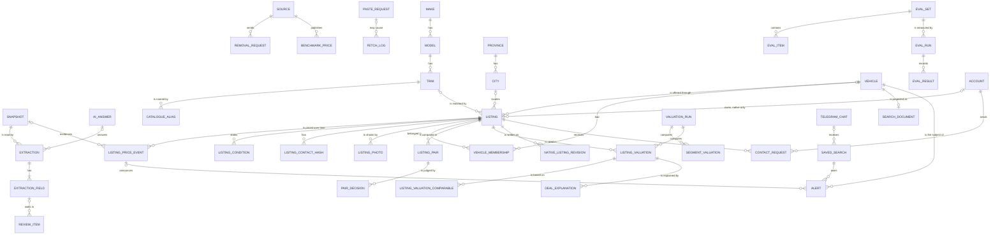

# The Carshenas data model

- Status: normative for the tables that exist, a plan for the rest. Written 2026-09-27 with CS-4.
- Decisions it rests on: ADR-0011 (PostgreSQL 18 is the only data service: records, search, vectors and jobs), ADR-0012 (Kysely on node-postgres, plain SQL migrations), ADR-0013 (data modelling rules), ADR-0008 (crawl policy; point 7 now reads "keyed hashes"), ADR-0025 (photos kept as the source's own addresses, never as files; it superseded ADR-0010), ADR-0017 (a live index within a request budget: layer 1b), ADR-0018 (the worker's lanes, pacing and job queue schema), ADR-0020 (accounts), ADR-0023 (the superadmin section's role).
- Evidence: the data-model research pass and its lab, `docs/research/2026-09-27-database-research/data-model.md` (sixty constraint cases, a native-listings migration applied on top of live crawled rows, volume runs at 300,000 listings), and the integrity and performance passes beside it.

## How this document changes

- **The migrations are the truth.** The tables that exist are defined by `db/migrations/` and the schema they produce, `db/schema.sql`; `packages/db/src/db-types.ts` is generated from the migrated database. This document explains them and plans the rest. Where it disagrees with a migration, the migration is right and this file has a bug.
- **A planned table is created by the task named for it**, through a migration, and the same commit moves it here from "Planned" to "What exists", noting anything the task decided differently from the plan.
- **A change to an existing table is a new migration.** A migration that has reached `main` is never edited (`pnpm db:lint` fails on it); the commit that adds the migration updates the matching section here.
- **The conventions are enforced, not only written.** The schema tests (`apps/web/src/server/db/schema-catalog.test.ts` and `schema-constraints.test.ts`, run by `pnpm check`) and Squawk (`pnpm db:lint`) fail on what breaks them; the `database` skill explains how to work within them.

## 1. The model in one page

### Three levels: the car, the offer, the observation

| Level | What it is | Tables | How it changes |
|---|---|---|---|
| **The car** | A physical vehicle, placed in the catalogue (make, model, trim, model year). Its listings on several sites form one duplicate group: the group *is* the vehicle. | `vehicle` and its membership history (CS-55); `make`, `model`, `trim` (CS-50) | Groups are recomputed as evidence arrives; a merged vehicle stays as a tombstone that points at the survivor. |
| **The offer** | One listing on one source: its price, seller, status and market dates. | `listing` (exists) | Its id never changes; what it says about the car is re-derived from observations. |
| **The observation** | What a source showed at one moment. | `fetch_log` and `snapshot` for crawled listings (exist); `native_listing_revision` for native listings (later) | Never changes. |

schema.org separates the car from its offer the same way (a `Car` with `offers`), and Torob separates a product from the shops' offers. Cars are not fungible, so Torob's single "product" becomes two things here: the catalogue position, which the model page shows (CS-67), and the physical vehicle, which the "also listed on" group shows (CS-64). A claim such as mileage belongs to the particular vehicle, but two listings of one car may state it differently, so claims are stored per listing and the listings are clustered, rather than one mileage being stored per vehicle.

Data flows one way: **observations → recorded model responses → derived rows → pages**. A rebuild replays that flow from the observations and reuses the recorded model responses instead of asking the model again (Fowler: an event log can be replayed, but only with the external answers it got at the time).

### Four kinds of data

| Kind | Tables (now, then planned) | Update | Delete | Rebuild |
|---|---|---|---|---|
| **Immutable observations** | `source_policy_check`, `fetch_log`, `snapshot`; later `listing_price_event`, `pair_decision`, submitted `native_listing_revision` | Never: a trigger refuses it | Only inside a purge for a removal request (ADR-0008 point 8) | They are the input; nothing rebuilds them |
| **Recorded model responses** | `ai_answer` (every validated answer, CS-45); later `extraction`, `extraction_field`, `deal_explanation`, model verdicts in `pair_decision` | Never in place: a new prompt version writes new rows beside the old | With their snapshot, in a purge; `ai_answer` rows that only purged listings used, with them (CS-60) | Reused through their cache key (`ai_answer.cache_key`), never re-asked on a rebuild |
| **Derived and rebuildable** | `listing` attributes (not its identity), `listing_condition`, `listing_contact_hash`, current vehicle membership, valuations, `search_document`, facet counts | Freely, by the job that owns them | By re-derivation | From observations plus recorded responses |
| **Curated** | `source`, `listing_status_transition`, the catalogue and aliases, geography, code tables, evaluation sets (the repository file is the truth), human review decisions | Reviewed changes; lifecycle rules only through migrations | Rarely; `ON DELETE RESTRICT` protects what refers to them | Restored from the repository or a backup |

Identity rows cut across these kinds: `listing.id`, `vehicle.id`, and later `telegram_chat`, `saved_search` and `alert` are never re-minted, so URLs, alerts and evaluation references survive every rebuild. Upserts on natural keys keep them stable.

## 2. Rules every table follows

ADR-0013 records these as binding; the schema tests check the ones marked **tested**.

### Keys and identity

- **Surrogate keys are `bigint GENERATED ALWAYS AS IDENTITY`** (**tested**: a single-column bigint primary key must be an always-identity; no `serial`). Identity values have gaps: an `INSERT … ON CONFLICT` consumes one even when it inserts nothing, so never rely on gapless ids.
- **Natural keys are named UNIQUE constraints**: a listing is `(source_id, source_listing_key)`, a snapshot is `(listing_id, content_sha256)`. The crawler upserts on them, so a re-crawl never mints a second id for the same listing.
- **Tiny curated vocabularies use text codes** as their key (`source.id = 'bama'`, checked by `^[a-z][a-z0-9_]{1,30}$`): readable in logs, job names and URLs. Keys and foreign keys are `bigint`, `text` or `uuid`, never `integer` (**tested**).
- **Composite keys keep related rows consistent.** A child that must agree with its parent on a second column references both: `listing (source_id, origin) → source (id, origin)` stops a crawled listing from claiming a native source; `crawl_run (policy_check_id, source_id)` can only cite a policy check of its own source; `fetch_log (snapshot_id, listing_id)` can only point at a snapshot of its own listing. The parent carries a `UNIQUE (id, …)` constraint as the target.
- **Capabilities are random tokens, stored hashed.** A Telegram link token or a "stop alerts" link is 32 random bytes; only its SHA-256 is stored. Identifiers are never secrets: RFC 9562 says UUIDs "MUST NOT be used as security capabilities".
- **UUIDv7 only for ids minted outside the database** (PostgreSQL 18 has `uuidv7()`); none exist yet.

### Types

- **Strings are `text`**, with a named CHECK for the real rule (a format, a non-blank value, a list of values). Never `char(n)` or `varchar(n)` (**tested**).
- **A state is `text` with a CHECK listing its values**, which a later migration can widen; the TypeScript types carry the same list as a union (**tested** against `.kysely-codegenrc.json`). The one planned exception is `deal_rating`, an ordered enum, because its order is its meaning (`deal_rating <= 'good'` is "good or better") and the five CarGurus levels are stable.
- **Money is `bigint` whole tomans, named `_toman`** (ADR-0014), and every amount column has its own range CHECK written `<column> BETWEEN <low> AND 999999999999999`, named `<table>_<column>_range`: the low end is 1 for a price, 0 where zero means something, −999999999999999 for a signed difference. The bound keeps every amount, and the sum of any nine, exact in a JavaScript number, so `parseInt8` never throws on money. Never `money`, `numeric` or floating point, never rials, and no other low end: a floor would be a plausibility rule, and plausibility drifts with inflation, so it is a flag in code, not a constraint. **Tested**: a column whose name holds a currency word (toman, rial, irr, irt), or a `numeric` or floating-point column that names a price, amount, cost, fee or value (a `_pct` aside), must end in `_toman`, be `bigint` and carry that CHECK with that name; no `money` column. An integer column with no currency word in its name (`asking_price bigint`, `market_value bigint`) is caught only in review, by ADR-0013's rule that units go in names. A CHECK per column rather than a shared domain, because adding a column of a constrained domain rewrites the whole table (measured on PostgreSQL 18 for CS-2). A CHECK added inline with a column still scans the table under ACCESS EXCLUSIVE (202 ms for a million rows in the CS-2 review, against 1.1 ms for a bare column), so on a table with rows the column comes first, then the CHECK `NOT VALID`, then `VALIDATE` in a later migration. A price that is not a price carries no amount (layer 3).
- **The one amount not in tomans is what a language model cost**: `cost_usd_micros`, whole millionths of a US dollar (`ai_answer`, CS-45; the planned `eval_run`). Metis prices every call in dollars and converts to rials at a rate that moves daily (ADR-0019), so the dollar figure is the one that stays true. It keeps the same range CHECK as money. A person never sees it as a price.
- **Instants are `timestamptz`**; never `timestamp` or `timetz` (**tested**). JSON is `jsonb`, never `json` (**tested**).
- **Raw documents are `jsonb`; anything we filter, join, constrain or value gets its own typed column.** Lists we search or reference are child tables, not arrays.

### Time

- Every instant is `timestamptz`, stored in UTC; the server's `timezone` is UTC (`db/postgresql.conf`).
- A Tehran calendar day is computed in the query with `AT TIME ZONE 'Asia/Tehran'`, never with a fixed offset: Iran stopped observing daylight saving time after 2022 (IANA tz database 2022b), so noon UTC on 2021-06-01 was 16:30 in Tehran and on 2023-06-01 it was 15:30. A daily market value belongs to a Tehran day: 21:00 UTC is already the next day in Tehran. `date` is used only for a Tehran business day (`valuation_run.as_of_date`).
- Periods are half-open, `[start, end)`, stored as `tstzrange` when they must not overlap (vehicle membership).
- Price history is append-only in valid time: `observed_at` is when the price was seen, `recorded_at` when we stored it. No bitemporal tables: Fowler advises against them unless retroactive changes drive actions. Instead, every action records its inputs: a valuation stores the price it rated and its comparables, an alert stores the price event it announced.
- JavaScript's `Date` keeps milliseconds and PostgreSQL keeps microseconds, so a timestamp read into TypeScript is never used as an equality key.
- The Jalali calendar exists only in the interface (ADR-0014): nothing is stored, keyed, sorted or sent in an API in Jalali except model years. A Jalali date a person picks becomes a Tehran day or a UTC instant in TypeScript before it reaches a query.

### Where each rule lives

- **A rule one row can state is a constraint**: NOT NULL, CHECK, UNIQUE, a foreign key, an exclusion constraint. The database is the only layer every writer passes through: the web app, the worker, a migration, a person at `psql`.
- **Every constraint has a name that says what it protects** (**tested**: `<table>_<meaning>_<kind>`, with `_fk`, `_unique`, `_excl` suffixes and no auto-named `_check`). Code maps a violation by its SQLSTATE and that name (`apps/web/src/server/db/database-errors.ts`), so the names are a contract.
- **Code repeats a rule only to give a person a Farsi message before the round trip**, and still maps the database's rejection to the same message. It never checks and then inserts as the guard: two requests can both pass the check.
- **Triggers are for what a row cannot state**: protecting history (append-only tables), lifecycles (allowed status changes), and the ADR-0008 backstops that read other rows. Our triggers raise SQLSTATE 23000 or 23514 with a constraint name (the append-only trigger's own name, or `listing_status_guard`), so they map like constraints. A trigger that judges a new row checks inserts AFTER INSERT and updates BEFORE UPDATE, because a BEFORE INSERT trigger also fires on the row an upsert proposes; triggers qualify the tables they read and pin their search path.
- **Every foreign key has an index on its columns**, or a comment on the constraint that starts with `unindexed:` and says why (**tested**). `ON DELETE` is chosen per relationship: `RESTRICT` towards curated parents, `CASCADE` from an observation to what depends on it, `SET NULL` only where the child must survive alone.

### Privacy

- **Snapshots are redacted before they are stored**: phone numbers, and a private seller's name, are removed from the canonical payload (ADR-0008 point 7). Raw HTML is not kept.
- **Phone numbers exist only as keyed hashes**: HMAC-SHA-256 with a secret key that lives in the environment, never in SQL or in the database, plus a `key_version` for rotation. A per-row salt would make the same number hash differently on two sites, which defeats duplicate detection, and an unkeyed hash of an Iranian mobile number (about 10⁹ values) is reversed by enumeration. The crawler computes the hash from the page before it redacts the payload.
- **A private seller's id on a source is never stored**; a dealer's may be.
- **Photos are never downloaded or stored** (ADR-0025): `listing_photo` keeps each photo's address on the source's own host, and pages load it from there. What is never downloaded cannot be masked either, so a photo shows exactly what the source shows, a plate or a number included; the owner accepts that for the demo.
- **A listing from a `requester_only` source** (one whose rules allow reading a pasted link but not publishing it; none today) is shown only to that buyer: never in search, alerts or comparables. Divar is a public, crawled source since the owner's decision of 2026-09-27 (ADR-0008 point 3).
- **A removal request is honoured by a purge**: a transaction that runs `SET LOCAL carshenas.purge = 'on'` and deletes the listing; its fetches and snapshots cascade, which the append-only triggers allow only then. The flag guards against bugs, not attackers; roles decide who may delete at all.

### Roles and grants

Created once per server by `db/bootstrap/10-roles.sql`, which skips a role that exists, so `pnpm db:roles` adds one that arrived later and sets every password from `.env`; timeouts live on the roles, never in `postgresql.conf`, where they would also stop migrations.

| Role | Logs in | Purpose | Settings |
|---|---|---|---|
| `carshenas_owner` | no | Owns every object, so nobody works as the owner by accident | none |
| `carshenas_migrate` | yes | Runs migrations; becomes the owner (`role = carshenas_owner`) | `lock_timeout` 5 s, `application_name` carshenas-migrate |
| `carshenas_web` | yes | The Next.js app | `statement_timeout` 5 s, `lock_timeout` 2 s, `idle_in_transaction_session_timeout` 10 s, `transaction_timeout` 15 s |
| `carshenas_readonly` | yes | People and agents inspecting data (`pnpm db:psql`, `db:top-queries`, `db:unused-indexes`) | read-only sessions, `statement_timeout` 30 s, `pg_read_all_stats` |
| `carshenas_worker` | yes | The worker (`apps/worker`, CS-32): crawls, runs the pipeline and its job queue | `statement_timeout` 30 s, `lock_timeout` 5 s, `idle_in_transaction_session_timeout` 30 s, `transaction_timeout` 2 min, `log_min_duration_statement` 1 s |
| `carshenas_admin` | yes | The superadmin section of the web app (CS-40, ADR-0023): reads what its screens show, changes curated rows only through functions that record which superadmin changed what | the web role's four timeouts |

The database (`db/bootstrap/create-database.psql`) is UTF8 with the builtin `C.UTF-8` locale: text compares by code point, independent of the operating system's C library, so an OS or image upgrade can never silently reorder a text index. A page that needs Persian alphabetical order asks for it in the query, `COLLATE "fa-x-icu"`. Only the roles it names may connect (the worker since CS-32), and only `carshenas_migrate` may create temporary tables: one could otherwise stand in for a real table in an unqualified name.

Grants are per table, in the migration that creates the table, so a new table is closed to the app until someone decides otherwise. The read-only role reads every table the owner creates (default privileges).

| Object | `carshenas_web` | `carshenas_worker` | `carshenas_readonly` |
|---|---|---|---|
| `schema_migrations` | SELECT (the health check) | SELECT (the health check) | SELECT |
| `source` | SELECT | SELECT; stops a source only through `stop_source()` | SELECT |
| `listing` | SELECT | SELECT, INSERT, UPDATE | SELECT |
| `source_policy_check`, `source_current_policy`, `listing_status_transition` | none | SELECT (the lifecycle guard runs with the caller's rights) | SELECT |
| `crawl_run` | none | SELECT, INSERT, UPDATE | SELECT |
| `fetch_log`, `snapshot` | none | SELECT, INSERT (append-only) | SELECT |
| `crawl_lane`, `crawl_feed` | none | SELECT, INSERT, UPDATE | SELECT |
| `listing_price_event`, `model_volume` | none (pages that show them grant it: CS-64, CS-67, CS-53) | SELECT, INSERT | SELECT |
| `ai_answer` | none until CS-62, its first AI step | SELECT, INSERT (never changed) | SELECT |
| `listing_photo`, `listing_unparsed_value` | none (the first page that shows photos grants SELECT on `listing_photo`: CS-61, CS-64) | SELECT, INSERT, UPDATE, DELETE (derived rows, rewritten with the listing's attributes) | SELECT |
| `valuation_run`, `valuation_coefficient`, `valuation_segment`, `valuation_comparable`, `listing_valuation`, `listing_valuation_comparable` | none (the first page that shows a rating grants it: CS-59, CS-61, CS-64) | SELECT, INSERT, UPDATE, DELETE on `valuation_run` (a rerun replaces a run, old runs are deleted); SELECT, INSERT on the other five, whose rows leave with their run through the cascades | SELECT |
| `valuation_rate_listing()` | none (CS-59, CS-65) | EXECUTE | EXECUTE (it only reads, so a person can measure it) |
| `listing_filter_row` (view, CS-58) | SELECT | SELECT | SELECT (also `carshenas_admin`) |
| `stop_source()` | none | EXECUTE | none |
| `account` | SELECT; INSERT of `username` and `password_hash` only; UPDATE of `password_hash` only (never `role`) | none | SELECT of every column but `password_hash` |
| `account_session` | SELECT, DELETE; INSERT of `account_id`, `token_sha256` and `expires_at` only (`created_at` is the database's clock) | none | SELECT |
| `auth_throttle` | SELECT, INSERT, UPDATE, DELETE | none | SELECT |
| `account_role_change` | none (written by `pnpm account:superadmin` as the owner) | none | SELECT |
| schema `pgboss` (the job queue) | none | SELECT, INSERT, UPDATE, DELETE on the tables pg-boss writes while it runs (jobs, queues, schedules, subscriptions, dependencies, warnings, statistics) and on tables a later pg-boss migration adds; SELECT, UPDATE on `version`; SELECT on `bam` | SELECT |
| `worker_heartbeat` (CS-41) | none | SELECT, INSERT, UPDATE, DELETE (its own rows: started, beaten, stopped, pruned after a week) | SELECT |
| `job_state_change`, `change_job_state()` (CS-41) | none | none | SELECT on the table |
| `source_state_change` | none | none | SELECT |
| `change_source_state()` | none | none | none |

The superadmin section's role, `carshenas_admin` (CS-40, ADR-0023), is used by `src/features/admin` alone, through its own pool; it holds no INSERT, UPDATE or DELETE on any table, and later tasks extend it in their migrations (CS-41 its reads, CS-48, CS-52, CS-53 and CS-55 their curated rows):

| Object | `carshenas_admin` |
|---|---|
| `source` | SELECT; changes a source only through `change_source_state()` |
| `source_state_change` | SELECT (written only by the function) |
| `change_source_state()` | EXECUTE |
| `account` | SELECT of `id`, `username` and `role`, what the section shows (never `password_hash`) |
| schema `pgboss`: `job` | USAGE on the schema; SELECT (CS-41, the worker's screens: jobs per queue and state, failures, dead letters); changes a job only through `change_job_state()`. The section's hand-written type for it is `src/server/db/pgboss-types.ts`, checked against the installed schema by a test. pg-boss owns the table: an upgrade that recreates it drops the grant |
| `crawl_lane`, `crawl_run`, `fetch_log` | SELECT (CS-41: budget, cooldowns, runs, requests and their outcomes) |
| `worker_heartbeat`, `job_state_change` | SELECT (CS-41: whether the worker is alive; who retried or cancelled which job) |
| `catalogue_source_key`, `model` | SELECT (CS-41: a tracked model's key names its catalogue model and its Persian name) |
| `change_job_state()` | EXECUTE (CS-41) |
| `listing`, `listing_price_event`, `listing_unparsed_value`, `freshness_measurement` | SELECT (CS-41: listings in and out, values the parser could not read, freshness); never `snapshot` |

## 3. What exists after CS-4

Four migrations, `20260927060001` to `20260927060004`, applied by dbmate. Row-local rules are constraints; the rules that read other rows arrived with the crawler (CS-33), described at the end of this section.

### Helper functions (`20260927060001_create_schema_foundations`)

| Function | What it does | Why |
|---|---|---|
| `jsonb_sha256(value jsonb) → bytea` | `sha256(convert_to(value::text, 'UTF8'))`, declared `IMMUTABLE STRICT PARALLEL SAFE` | `snapshot.content_sha256` is generated from the payload. `jsonb` prints keys in one canonical order, so equal documents hash equally whatever their key order. `convert_to()` is only STABLE because it can convert between encodings; in this UTF8 database converting to UTF8 is the identity, which is why the wrapper may be IMMUTABLE. |
| `refuse_change_unless_purge()` | `BEFORE UPDATE OR DELETE` row trigger: raises SQLSTATE 23000 with the trigger's name as the constraint, unless `carshenas.purge` is `on` | Protects append-only tables from bugs; a purge for a removal request is the only way rows change or leave. |

The same migration gives the read-only role SELECT on every future table (default privileges) and the web and read-only roles SELECT on dbmate's `schema_migrations`.

### `source` (curated)

A website or channel listings come from. Curated by hand; Carshenas itself becomes the native source `carshenas` when native listings arrive.

| Column | Type | Meaning |
|---|---|---|
| `id` | `text` PK | Stable code (`bama`), format `^[a-z][a-z0-9_]{1,30}$` |
| `origin` | `text` | `external` (other sites), `native` (created on Carshenas), `benchmark` (published price tables, never listings) |
| `access_method` | `text` | `crawl` (pages or a public web API, Divar's included), `official_api` (single items through a partner API the source grants), `native` |
| `name_fa`, `base_url` | `text` | Farsi name (not blank); `https://host` only |
| `listing_visibility` | `text` | `public` or `requester_only` |
| `crawl_state` | `text`, default `paused` | `enabled` or `paused` by a human; `stopped_on_block` by the crawler |
| `min_request_interval_ms` | `integer` | Gap between two requests to this source |
| `policy_max_age_days` | `integer`, default 30 | How old the latest policy check may be before a crawl is refused |
| `stopped_at`, `stop_reason` | `timestamptz`, `text` | When and why the crawler stopped the source (`blocked`, `rate_limited`, `challenge`) |
| `created_at` | `timestamptz` | |

| Constraint | Rule | Why |
|---|---|---|
| `source_native_iff_native_access` | `origin = 'native'` exactly when `access_method = 'native'` | Only Carshenas itself is native |
| `source_crawl_interval_floor` | a crawled source has an interval, of at least 3,000 ms (`IS NOT NULL` is spelled out: a CHECK passes when its expression is NULL) | ADR-0008 point 5 |
| `source_only_crawled_sources_run` | only a `crawl` source may leave `paused` | A source read through an official partner API can never be switched to crawling: its terms grant the API, not the pages |
| `source_stop_recorded` | `stopped_on_block` exactly when `stopped_at` is set, and exactly when `stop_reason` is set (neither lingers after a re-enable) | ADR-0008 point 6: a stop says when and why; the evidence is the source's blocked `fetch_log` row at `stopped_at`, and a human clears both when re-enabling it |
| `source_id_origin_unique` | `UNIQUE (id, origin)` | Target of `listing_source_fk` |
| `source_id_format`, `source_origin_valid`, `source_access_method_valid`, `source_name_fa_not_blank`, `source_base_url_https`, `source_listing_visibility_valid`, `source_crawl_state_valid`, `source_policy_max_age_days_positive`, `source_stop_reason_valid` | formats and value lists | |

### `source_policy_check` and the view `source_current_policy` (immutable)

Each reading of a source's robots.txt and terms (ADR-0008 point 1). CS-5 recorded the first readings on 2026-09-28 in the sources research note, with each robots.txt as evidence. The task that adds a source inserts its row from that record: CS-33 for Divar, CS-54 for the others. Append-only: the trigger `source_policy_check_append_only` refuses UPDATE and DELETE outside a purge. The newest row is in force; the view `source_current_policy` returns it per source (`DISTINCT ON (source_id) … ORDER BY source_id, checked_at DESC, id DESC`), served by `source_policy_check_source_latest_idx (source_id, checked_at DESC, id DESC)`, which also indexes the foreign key.

Columns: `id` (identity), `source_id` (FK, RESTRICT), `checked_at`, `checked_by` (not blank), `robots_txt` (the text as read, kept as evidence), `terms_url` (`http(s)://`), `terms_summary` (not blank), `verdict` (`allowed`, `allowed_with_conditions`, `not_allowed`), `conditions`, `photos_allowed` (whether its terms allow downloading and re-hosting its photos, as read; nothing is re-hosted since ADR-0025, so it gates nothing; its comment was restated by CS-34).

| Constraint | Rule |
|---|---|
| `source_policy_check_conditions_stated`, `source_policy_check_conditions_not_blank` | a verdict "allowed with conditions" states them, and stated conditions are never blank |
| `source_policy_check_not_allowed_no_photos` | a source marked not allowed is not crawled, so it never allows photos |
| `source_policy_check_id_source_unique` | `UNIQUE (id, source_id)`: target of `crawl_run_policy_check_fk` |

### `listing` and its lifecycle

The offer: one listing on one source. Its id is permanent; what it says about the car is derived from its snapshots (CS-34 added what the source structures, "Added by CS-34" below; the rest arrives with the tasks in section 4). Created with `fillfactor = 90` and autovacuum at 2 % of rows (instead of 20 %), because the crawler refreshes `last_seen_at` (at most once a day per listing): free space in each page keeps those updates HOT, touching no index.

| Column | Type | Meaning |
|---|---|---|
| `id` | `bigint` identity PK | |
| `origin` | `text`, default `external` | `external` now; `native` later |
| `source_id` | `text` | With `origin`, references `source (id, origin)` |
| `source_listing_key` | `text` | The source's own id or token, 1 to 200 non-space characters |
| `url` | `text` | Where the listing lives on its source: the click-out target |
| `status` | `text` | `active`; `sold`, `expired`, `gone` (disappeared from the source): off the market; `removed`: taken down by Carshenas |
| `listed_at` | `timestamptz NOT NULL` | When it went on the market: the source's posting time if the page shows it, else our first sighting. Native drafts, later, have none: the native-listings migration relaxes NOT NULL |
| `delisted_at` | `timestamptz` | When it left the market |
| `last_seen_at` | `timestamptz` | The latest fetch that showed it, to within a day (refreshed when more than a day old; `fetch_log` keeps every visit); required for an external listing; deliberately not indexed |
| `created_at` | `timestamptz` | When our row was created |

| Constraint | Rule | Why |
|---|---|---|
| `listing_source_fk` | `(source_id, origin) → source (id, origin)`, RESTRICT | A listing's origin is its source's origin. Commented `unindexed:`: the natural-key index serves it through `source_id`, and sources are never deleted while they have listings |
| `listing_source_key_unique` | `UNIQUE (source_id, source_listing_key)` | The natural key the crawler upserts on |
| `listing_id_source_unique` | `UNIQUE (id, source_id)` | Target of `fetch_log_listing_fk`: a fetch of one source never points at another source's listing |
| `listing_only_external_for_now` | `origin = 'external'` | Dropped by the native-listings migration (section 5) |
| `listing_external_identity` | an external listing has a key and a URL | |
| `listing_external_was_seen` | an external listing has `last_seen_at` | It exists because a fetch showed it |
| `listing_off_market_has_date` | `delisted_at` is set exactly when the status is `sold`, `expired`, `gone` or `removed` | Days on market and comparables read these dates |
| `listing_market_dates_ordered` | `delisted_at >= listed_at` | |
| `listing_gone_not_seen_since` | an `expired` or `gone` listing was not seen after `delisted_at` | A listing seen again must go back to `active` in the same write (the crawler's upsert does), or it would stay out of search |
| `listing_origin_valid`, `listing_status_valid`, `listing_source_listing_key_format`, `listing_url_http` | value lists and formats | |

**The lifecycle is data.** `listing_status_transition (origin, from_status, to_status)` lists the allowed changes (primary key on all three; `from_status <> to_status`; both statuses from the listing's own list, `listing_status_transition_statuses_valid`); `new` is the status a row has before its insert. The function `listing_status_guard()` refuses any other change, and any change of origin, with SQLSTATE 23514 and the constraint name `listing_status_guard`. It runs as two triggers: `listing_status_guard` BEFORE UPDATE OF status, origin, and `listing_status_guard_on_insert` AFTER INSERT, so that an upsert proposing `sold` for a known listing is judged as the update from `active` it becomes, not as an insert (a BEFORE INSERT trigger fires on the proposed row before the conflict is found). It reads `public.listing_status_transition` with a pinned search path, runs with the caller's rights (a role that changes statuses needs SELECT on the transitions), and a temporary table cannot stand in for the rules. Adding a lifecycle rule is a migration that inserts a row.

| From | To (external listings) |
|---|---|
| `new` | `active`; `gone` (a pasted link can already be gone) |
| `active` | `sold`, `expired`, `gone`, `removed` |
| `gone`, `expired`, `sold` | `active` (relisted under the same key) |

### `crawl_run` (one row per run, closed once when it ends)

One crawl of one source, citing the policy check it ran under (ADR-0008 point 1). Since CS-33 a run is one lane job (ADR-0018): a discovery page, a listing's detail or a measurement page. It cites the policy check before its request, logs every request in `fetch_log`, and writes its counts once, when it closes. Columns: `id`, `source_id` (FK, RESTRICT), `policy_check_id`, `kind` (`discovery`, `detail`, `measure`; CS-33), `started_at`, `finished_at`, `status` (`running`, `succeeded`, `failed`, `stopped_on_block`), `counts` (`jsonb` object, CS-33).

| Constraint or index | Rule | Why |
|---|---|---|
| `crawl_run_policy_check_fk` | `(policy_check_id, source_id) → source_policy_check (id, source_id)`, RESTRICT | A run cites a check of its own source |
| `crawl_run_running_per_source_unique` | partial unique index on `source_id` where `status = 'running'` | ADR-0008 point 5: one request at a time per host |
| `crawl_run_finished_when_not_running` | `finished_at` is set exactly when the run is not running | |
| `crawl_run_times_ordered` | `finished_at >= started_at` | |
| `crawl_run_history_fixed` (BEFORE UPDATE; CS-33) | refuses a change to `id`, `source_id`, `policy_check_id`, `kind` or `started_at` (`crawl_run_identity_fixed`), and to the `status` or `finished_at` of a finished run (`crawl_run_finished_is_final`) | A run can be neither pointed at another policy check nor reopened past the one it cited |
| `crawl_run_id_source_unique` | `UNIQUE (id, source_id)` | Target of `fetch_log_crawl_run_fk` |
| `crawl_run_source_started_idx`, `crawl_run_policy_check_idx` | FK indexes; the first also serves "recent runs of a source" | |

Counts, errors and duration per run (CS-33 #4): the run's requests and their outcomes are computed from `fetch_log` through `fetch_log_request_unique` (its run first), its duration from `started_at` and `finished_at`. What it read and wrote (rows on a list page, new listings, snapshots stored or unchanged, price events) is in `counts`, written once when the run closes. The reason to store them: a list page's rows are not kept anywhere else, so those counts could not be derived later; and since only the job that ran writes them, when it closes its run, they cannot drift (no rebuild rule is needed). A run that a block ended (`stopped_on_block`) keeps that status and time and gains its counts when its job closes it.

### `fetch_log` (immutable)

One row per request we made: the observation event. A revisit whose content did not change points at the existing snapshot, as a WARC "revisit" record points at an archived payload. Append-only (`fetch_log_append_only`, plus `fetch_log_append_only_truncate`, because TRUNCATE fires no row triggers).

| Column | Meaning |
|---|---|
| `source_id`, `crawl_run_id` | The run of that source that sent it (`fetch_log_crawl_run_fk`, CASCADE; `fetch_log_source_fk`, RESTRICT) |
| `url`, `method` | `http_get` or `http_post` (a crawl; Divar's search is a POST, CS-33), or `official_api` |
| `requested_at`, `duration_ms`, `http_status` (100 to 599) | |
| `outcome` | `ok`, `not_modified`, `not_found`, `gone`, `blocked`, `rate_limited`, `challenge`, `error` (no usable answer: a network failure, a timeout, a 5xx, or an answer the crawler could not read or write). `blocked` and `challenge` stop the source, and so does a second `rate_limited` within 24 hours (ADR-0008 point 6, ADR-0018) |
| `etag`, `last_modified` | Sent back on the next visit as `If-None-Match` and `If-Modified-Since` (conditional requests, ADR-0008 point 5) |
| `listing_id`, `snapshot_id` | The listing fetched (NULL for a search page) and the snapshot it produced or found unchanged |

| Constraint | Rule | Why |
|---|---|---|
| `fetch_log_listing_fk` | `(listing_id, source_id) → listing (id, source_id)`, CASCADE | A fetch points only at a listing of its own source; a purge of a listing removes its fetches, because the URL itself is data about the listing |
| `fetch_log_snapshot_fk` | `(snapshot_id, listing_id) → snapshot (id, listing_id)`, `ON DELETE SET NULL (snapshot_id)` | A fetch can only point at a snapshot of its own listing; purging a snapshot alone keeps the fetch |
| `fetch_log_snapshot_only_with_content` | a snapshot only for `ok` or `not_modified` | |
| `fetch_log_snapshot_has_listing` | a snapshot only with a listing | Closes the gap a composite foreign key leaves when one column is NULL |
| `fetch_log_url_http`, `fetch_log_method_valid`, `fetch_log_http_status_range`, `fetch_log_outcome_valid`, `fetch_log_duration_nonnegative` | formats, ranges, value lists | |

Indexes: `fetch_log_source_requested_idx (source_id, requested_at DESC)` for politeness ("the last request to this source") and the stop evidence, `fetch_log_listing_requested_idx (listing_id, source_id, requested_at DESC)` for the foreign key and a listing's fetch history (read with its source), `fetch_log_snapshot_idx` so a purge finds the fetches of a snapshot. Since CS-33, `fetch_log_request_unique (crawl_run_id, source_id, requested_at)` (a UNIQUE constraint on an index built concurrently) keeps one row per request: a run sends one request at a time, each starting at its own instant, so the crawler logs with `ON CONFLICT DO NOTHING` and an answer a failed step logs again is never doubled. It also serves the run's foreign key, so `fetch_log_crawl_run_idx`, which it made redundant, was dropped (`drop_fetch_log_crawl_run_idx`, with the owner's go-ahead).

### `snapshot` (immutable, content-addressed)

What a listing page showed, as canonical JSON with personal data removed (ADR-0008 point 7). Append-only (`snapshot_append_only` and `snapshot_append_only_truncate`). The crawler's canonical form strips volatile fields (view counts, "two hours ago") and redacts before storing; `canonical_version` records which form: a new version may re-express an unchanged page as new JSON, which is then a new snapshot, while identical JSON is one snapshot whatever the version. The payload is compressed with lz4 through `default_toast_compression` (`db/postgresql.conf`).

| Column | Meaning |
|---|---|
| `listing_id` | FK, CASCADE (only a purge deletes a listing) |
| `first_fetched_at` | When this content was first fetched |
| `url` | The page it came from |
| `canonical_version` | Positive |
| `payload` | `jsonb`, an object (`snapshot_payload_is_object`) |
| `content_sha256` | Generated: `jsonb_sha256(payload)`. Computed by the database, so the deduplication key can never disagree with the content; an insert that supplies it fails |

`snapshot_content_unique (listing_id, content_sha256)` makes a changed page a new row and an unchanged one no row at all; `snapshot_id_listing_unique (id, listing_id)` is the target of `fetch_log_snapshot_fk`. Photo URLs stay inside the payload; the parser projects the latest snapshot's into `listing_photo` (CS-34, ADR-0025).

### How a crawl writes these rows

One transaction per page fetched (the pattern the `database` skill shows in code):

1. Upsert the listing on its natural key: `INSERT … ON CONFLICT ON CONSTRAINT listing_source_key_unique DO UPDATE SET url = …, last_seen_at = greatest(…) WHERE` the URL changed, the listing had `expired` or `gone` (it goes back to `active`, with `delisted_at` cleared), or the last sighting is more than a day old, so a re-crawl does not rewrite every row; otherwise `status` changes only when the page says so (the lifecycle guard checks the change, and `listing_gone_not_seen_since` refuses a sighting that forgets to reactivate).
2. Insert the snapshot with `ON CONFLICT ON CONSTRAINT snapshot_content_unique DO NOTHING RETURNING id`. `DO NOTHING` returns no row for existing content, so when nothing comes back, read the existing snapshot's id in a second statement.
3. Insert the `fetch_log` row with the outcome and the snapshot id.
4. Insert a `listing_price_event` from the snapshot's price with an `INSERT … SELECT … WHERE` the price differs from the listing's latest event (CS-33), so an unchanged price never reaches the "is a change" CHECK.

Never check first and then insert: two workers can both pass the check, and the unique constraint decides anyway. A request that fails or is refused still gets its `fetch_log` row, in a transaction of its own, before its job ends.

### Added by CS-32: the worker's role, the job queue and the lanes

Three migrations, `20260929082446` to `20260929082449` (ADR-0018):

- **`grant_worker_role`**: the worker's privileges on the tables above (the grants table in section 2).
- **`create_job_queue_schema`**: pg-boss 12.35's schema `pgboss` (schema version 43), generated by `pnpm --filter @carshenas/worker pgboss:sql install` and owned by `carshenas_owner` like every other object. The worker runs pg-boss with `migrate: false` and row access only; a pg-boss upgrade is a new migration from `pgboss:sql upgrade <installed version>`. Left out of pg-boss's text: its daily partitions of `queue_stats`, which serve only `persistQueueStats` (off: the worker cannot create the next day's partition, and date-named tables would change `db/schema.sql` every day). pg-boss's names do not follow ours; the schema tests check `public` only, and kysely-codegen reads only `public`.
- **`create_crawl_lane`**: one row per source that the worker has paced, and `stop_source()`.

#### `crawl_lane` (operational state, rewritten on every request)

The pacing every request to a source passes through, whichever worker process sends it (ADR-0018 points 3, 5, 6). A worker takes the lease in one `UPDATE … FROM (SELECT … FOR NO KEY UPDATE)` only while the source is `enabled`, the lane is not cooling down, its `next_request_at` has come and no unexpired lease is held; it gives the lease back with the outcome, which sets the next request time and the breaker. Times come from the database's `clock_timestamp()`, never a worker's clock. The requests themselves are observations in `fetch_log` (CS-33).

| Column | Type | Meaning |
|---|---|---|
| `source_id` | `text` PK, FK to `source` (CASCADE) | The lane's source; the primary key serves the foreign key |
| `next_request_at` | `timestamptz`, default `now()` | The earliest start of the next request (from the lane's creation at first): the end of the previous one plus its gap (five times its duration, at least `source.min_request_interval_ms`, doubled for 24 hours after a 429, at most 30 s unless the interval is longer) |
| `last_request_at` | `timestamptz` | When the latest request started |
| `lease_holder`, `lease_until` | `text`, `timestamptz` | The request in flight and when its lease lapses; a crashed worker cannot hold the lane past it |
| `failure_streak` | `integer` | Timeouts, server errors and dropped connections in a row; three open the breaker |
| `cooldowns` | `integer` | Cool-downs in a row without a success between them: the exponent of the next one |
| `cooldown_until`, `cooldown_reason` | `timestamptz`, `text` | The lane sends nothing until then, because the source was `unavailable` or `rate_limited` (a 429) |
| `rate_limited_at` | `timestamptz` | The latest 429: the gap doubles for 24 hours, and another 429 in that time stops the source |

| Constraint | Rule |
|---|---|
| `crawl_lane_lease_complete` | a lease names its holder and its end, or neither |
| `crawl_lane_cooldown_explained` | a cool-down has a reason, and a reason never lingers after it |
| `crawl_lane_lease_bounded` | a lease belongs to a request that started (`last_request_at`) and ends within 15 minutes of it (45 s today), so a mistake in code cannot hold a lane for hours |
| `crawl_lane_cooldown_reason_valid`, `crawl_lane_lease_holder_not_blank`, `crawl_lane_failure_streak_nonnegative`, `crawl_lane_cooldowns_nonnegative` | value lists and ranges |

#### `stop_source(source_id, reason, blocked_request_at) → boolean`

`SECURITY DEFINER` with a pinned `search_path`, EXECUTE for the worker only. It moves a `crawl` source that is `enabled`, or `paused` while a request was on the wire (since CS-33, so whoever resumes it sees the block first), to `stopped_on_block` with `stopped_at` (when the blocked request started) and `stop_reason` (`blocked`, `rate_limited`, `challenge`), and returns whether this call stopped it; it changes no other state. The worker's role has no UPDATE on `source`, so it can never re-enable one: that stays a person's decision (ADR-0008 point 6).

### Added by CS-39: accounts, sessions, throttling and role grants

One migration, `20260929150523_create_accounts` (ADR-0020). An account is a username and a password for now; a phone number joins it with phone sign-in (section 5 and the later task).

#### `account`

| Column | Type | Meaning |
|---|---|---|
| `id` | `bigint` identity | |
| `username` | `text`, UNIQUE (`account_username_unique`) | Lowercase `a`–`z`, `0`–`9`, `_`, 3 to 30 characters, starting with a letter (`account_username_format`); normalised in code before it arrives. Never logged |
| `password_hash` | `text` | Argon2id as a PHC string (`account_password_hash_argon2id` checks the `$argon2id$v=19$` prefix); hidden from the read-only role |
| `role` | `text`, default `buyer` | `buyer` or `superadmin` (`account_role_valid`); the web role has no privilege on it |
| `created_at` | `timestamptz` | |

#### `account_session`

A signed-in browser. The cookie holds a random 32-byte token; the row keeps only its SHA-256 (`token_sha256`, UNIQUE, 32 bytes by `account_session_token_sha256_length`), looked up on every request. `expires_at` is fixed at sign-in (30 days for a buyer, 12 hours for the superadmin) and never extended; `account_session_lifetime_bounded` keeps it after `created_at` and within 720 hours of it, so no bug can mint an endless session. `account_id` references `account` with `ON DELETE CASCADE` and is indexed (`account_session_account_idx`), which also serves ending all of an account's sessions.

#### `auth_throttle`

One row per scope and subject (`auth_throttle_subject_unique`): `sign_in_account` (the typed username, whether or not an account has it), `sign_in_device` (a browser that signed into that account before), `sign_in_address`, `sign_up_address` and `username_check_address` (the client address). `subject_hmac` is HMAC-SHA-256 under `CARSHENAS_AUTH_KEY`, so no username or address is stored. `hits` counts consecutive failures for the account and device scopes, and events within the window for the address scopes; `next_attempt_at` is, for the account and device scopes, the earliest time the next attempt may start (a growing wait after failures, or a 15-second lease while one attempt is checked); the address scopes leave it at its default, and their wait ends an hour after `window_started_at`. An address window is counted before the password is checked and given back on success, on a busy server and on a throttled name, so a burst of parallel attempts cannot pass the limit. Rows are rewritten on every attempt and a name's or device's row is deleted on a successful sign-in; nothing sweeps old rows yet (CS-79).

#### `account_role_change` (immutable)

Every role an account was given, appended by `pnpm account:superadmin` in the transaction that changes it: `from_role` (NULL at creation), `to_role`, `changed_by` (`cli:<user>@<host>`), `changed_at`. `account_role_change_is_change` refuses a row that changes nothing; the append-only triggers refuse updates, deletes and truncation outside a purge, so deleting an account with a history needs a purge too.

### Added by CS-40: who paused or resumed a source

One migration, `20260929181603_create_source_state_change`, and the role `carshenas_admin` (section 2, ADR-0023).

#### `source_state_change` (immutable)

Every change a person made to a source's crawl state in the superadmin section, appended by `change_source_state()` in the transaction that makes it. Append-only (`source_state_change_append_only`, plus `source_state_change_append_only_truncate`). The crawler's own stops are not repeated here: they are on the source row and in `fetch_log`, and the change that leaves a stop keeps it.

| Column | Meaning |
|---|---|
| `source_id` | FK to `source`, RESTRICT: a source with recorded changes leaves only through a purge |
| `from_state`, `to_state` | `source.crawl_state` before and after; `to_state` is `enabled` or `paused`, since only the crawler stops a source |
| `changed_by_account_id` | The superadmin who made it: FK to `account`, RESTRICT, indexed by `source_state_change_account_idx` |
| `changed_at` | When the change took effect: `clock_timestamp()` once the function holds the source's lock, not the transaction's start, so a call that waited is recorded after the change it waited behind |
| `cleared_stopped_at`, `cleared_stop_reason` | For a change away from `stopped_on_block`, the stop it cleared: the source's `stopped_at` (the start of the blocked request, whose row in `fetch_log` is the evidence) and `stop_reason` |

| Constraint | Rule |
|---|---|
| `source_state_change_is_change` | `from_state <> to_state` |
| `source_state_change_stop_kept` | the cleared stop is recorded exactly when the change leaves `stopped_on_block` |
| `source_state_change_from_state_valid`, `source_state_change_to_state_valid`, `source_state_change_cleared_stop_reason_valid` | value lists |

`source_state_change_source_changed_idx (source_id, changed_at DESC, id DESC)` serves the foreign key and a source's latest changes on the sources screen.

#### `change_source_state(source_id, seen_state, seen_stopped_at, new_state, changed_by) → text`

`SECURITY DEFINER` with a pinned `search_path`, EXECUTE for `carshenas_admin` only: the only change to a source that role can make. It refuses an account that is not a superadmin (`source_state_change_by_superadmin`) and a new state other than `enabled` or `paused` (`source_state_change_to_state_valid`), both SQLSTATE 23514, locks the source (`FOR NO KEY UPDATE`), and answers:

- `unchanged` when the source is in the new state already: a repeated press changes nothing;
- `stale`, changing nothing, when the source's state and stop are no longer the ones the person saw, or it is gone. The page carries `stopped_at` as the database's own text (`cast(stopped_at as text)`), exact to the microsecond where a JavaScript `Date` is not, so nobody clears a stop they have not seen;
- `changed` otherwise: it sets the state, clears `stopped_at` and `stop_reason` (`source_stop_recorded`), and appends the change with the stop it cleared.

A source that is not crawled cannot be enabled (`source_only_crawled_sources_run`). The lane is left alone: a source resumed after a second 429 keeps the lane's `rate_limited_at` (`docs/runbooks/worker.md`).

### Added by CS-33: the crawler's backstops, Divar, price history, feeds and volumes

Twelve migrations, `20260929104900` to `20260929104915`.

**The backstops that read other rows** (`add_crawl_policy_backstops`), designed in the lab and created with the crawler so its tests exercise them. Their search paths are pinned and their table names qualified.

| Trigger | Rule | Constraint names it raises (23514) |
|---|---|---|
| `crawl_run_policy_guard` (AFTER INSERT on `crawl_run`) | A run starts only for an enabled `crawl` source, citing the source's newest policy check, whose verdict is not `not_allowed` and which is no older than `policy_max_age_days` (ADR-0008 point 1). It locks the source row it reads (`FOR SHARE`, so a person's pause waits for it rather than racing it) and so runs as its owner, because a row lock needs UPDATE rights that the worker's role must not have on `source`; EXECUTE is revoked from PUBLIC | `crawl_run_source_enabled`, `crawl_run_policy_current`, `crawl_run_policy_allows`, `crawl_run_policy_fresh` |
| `crawl_run_history_fixed` (BEFORE UPDATE on `crawl_run`) | A run keeps its source, policy check, kind and start, and a finished run stays finished, so the guard above cannot be passed by changing a run after it opened | `crawl_run_identity_fixed`, `crawl_run_finished_is_final` |
| `fetch_log_stops_on_block` (AFTER INSERT on `fetch_log`, only for `blocked`, `challenge` and `rate_limited`) | A `blocked` or `challenge` fetch stops its source through `stop_source()`, which stops an enabled or paused crawled source and keeps an earlier stop, in the transaction that records it. The fetch whose `requested_at` and `outcome` are its source's `stopped_at` and `stop_reason`, the stop's evidence, ends its run as `stopped_on_block`. A `rate_limited` fetch stops nothing here: since ADR-0018 the lane cools down on a first 429 and stops the source on a second within 24 hours | none |

`fetch_log` refuses no request for the state of its source or its run: a row cannot unsend a request, only hide one that was sent, such as a request still on the wire when a person paused its source, or one of a slow job whose run another job closed. What may be sent is decided before sending: when a run opens (`crawl_run_policy_guard`) and when the lane lets a request start, which it does only while the source is enabled (`acquireLane`, ADR-0018).

The lane stops a source before its job logs the request that was refused, recording the request's start (`LaneRequest.startedAt`) as `stopped_at`; the job logs that request with the same instant and outcome, which is how the evidence and the stop match. An answer whose job failed after reading it, for instance because the transaction that wrote its rows rolled back, is logged afterwards on its own, as `error`; `fetch_log_request_unique` keeps the row its transaction wrote if that transaction committed after all.

**`crawl_run.kind` and `counts`** (`add_crawl_run_kind_and_counts`): see the `crawl_run` section above. `fetch_log.method` gains `http_post` (`allow_post_requests_in_fetch_log`, validated by `validate_fetch_log_method`).

**Divar** (`add_divar_source`): the source `divar` (`crawl`, `public`, 3,000 ms), created `paused` so only a person enables it, and its policy check as CS-5 recorded it on 2026-09-28 (`allowed_with_conditions`, `photos_allowed` false, api.divar.ir's robots.txt as read). That reading is 30 days old on 2026-10-28: from then on no crawl run of Divar starts until someone reads its robots.txt and terms again and records a new check. The migration also restates `source.min_request_interval_ms`'s comment: robots.txt is recorded, not followed, so a `Crawl-delay` does not lengthen the gap.

#### `listing_price_event` (immutable; `create_listing_price_event`)

A listing's price history in valid time, as layer 3 below planned it (CS-2 and its reviews). Columns: `id`, `listing_id` (FK, CASCADE), `observed_at` (the start of the request whose snapshot shows the price), `price_type` (`asking`, `negotiable`, `installment`, `placeholder`), `asking_price_toman` (exactly for `asking`), `previous_price_type`, `previous_price_toman` and `last_asking_price_toman` (filled by the trigger), `snapshot_id` (the evidence), `recorded_at`.

| Constraint or trigger | Rule |
|---|---|
| `listing_price_event_snapshot_fk` | `(snapshot_id, listing_id) → snapshot (id, listing_id)`, CASCADE: the evidence is a snapshot of the same listing, and purging it removes the events read from it |
| `listing_price_event_observed_unique` | `UNIQUE (listing_id, observed_at)`: re-deriving the history never doubles it; also the index of the listing's foreign key and of "the latest event" |
| `listing_price_event_amount_matches_type`, `listing_price_event_previous_amount_matches_type` | an amount exactly for an asking price, in the event and in its predecessor |
| `listing_price_event_is_a_change` | `(price_type, asking_price_toman) IS DISTINCT FROM (previous_price_type, previous_price_toman)`: the same price again, or negotiable again, is not an event |
| `listing_price_event_<column>_range` | each amount `BETWEEN 1 AND 999999999999999` (ADR-0014) |
| `listing_price_event_fill_previous` (BEFORE INSERT) | holds the listing row (`FOR NO KEY UPDATE`), refuses an event older than the listing's latest (`listing_price_event_in_order`) unless one exists at its very instant (a job that ran twice), and fills the predecessor and the last asking price from strictly earlier events, so an exact re-insert gets the original's values and `ON CONFLICT DO NOTHING` skips it, even after later events |
| `listing_price_event_append_only`, `…_truncate` | only a purge changes or removes an event |

A price drop is an asking event below `last_asking_price_toman`. The crawler inserts an event only when the price differs from the listing's latest, because `ON CONFLICT DO NOTHING` does not skip a CHECK violation. The worker inserts and reads events; pages get SELECT from the task that shows them (CS-64, CS-67).

#### `crawl_feed` (operational state; `create_crawl_feed`)

How far discovery has read each newest-first feed, so a round reads down to what the previous round read through and a bumped or promoted listing never ends it early (ADR-0017 point 3). Primary key `(source_id, feed_key)` (FK to `source`, CASCADE; `feed_key` like `tracked_models`); `read_through_at` (the newest sort time, by the source's clock, down from which a finished round read the whole feed); `round_started_at` (a round starts at most once in ten minutes, whatever the schedule queued). The worker reads and writes it every round.

#### `model_volume` (`create_model_volume`)

Active listings per source and filter value, as one walk of the list pages counted them: layer 1b's plan, created early for CS-33's measurement (criteria 5 and 7), and written by CS-35's daily sweep later. Columns: `source_id` (FK, RESTRICT: counts are observations, which leave with their source only through a purge), `source_model_key` (the source's own filter value: Divar's `brand_model`, `ROOT` for every car), `level` (`all`, `brand`, `model`, `trim`), `swept_at` (the sweep's start, grouping its slices), `active_count`, `pages_read` (how deep the walk followed the slice), `complete` (false when the source stopped giving pages or the walk hit its limit, so the count is a lower bound). `model_volume_sweep_unique (source_id, source_model_key, swept_at)`: a slice is counted once per sweep, even by a job that runs twice. The worker inserts and reads it.

### Added by CS-45: `ai_answer`, the AI layer's validated answers

One migration, `20260929183019_create_ai_answer` (ADR-0021 point 2.4). `packages/ai` looks an answer up by its key before every model call and makes no request on a hit; after a valid answer it inserts one row. The same rows are the recorded responses a rebuild replays instead of asking again (section 1). Only answers that passed the task's schema and checks are stored.

A task's checks carry a version that is part of the prompt version, so changing a check means a new key: the question is asked once more and cached anew, and the old answer stays under its old version. A hit is also checked again before it is used. An answer stored before a check changed without a new version therefore fails and is never returned; it is asked again on every call, and a warning says the version was not bumped.

| Column | Type | Meaning |
|---|---|---|
| `id` | `bigint` identity | The row |
| `cost_usd_micros` | `bigint`, NULL when unpriced | What producing the answer cost at the live Metis list price, every attempt included, in millionths of a US dollar |
| `created_at` | `timestamptz` | When it was stored |
| `cache_key` | `bytea`, 32 bytes, unique | SHA-256 of the task, the prompt version, the requested model with its options and the rendered input (`cacheKey` in `packages/ai/src/answer-cache.ts`). The input is never stored |
| `task` | `text` | The registry name: `<area>.<what>`, such as `listing.facts` |
| `prompt_version` | `text`, 16 hex digits | The content hash of the instructions, the schema, the version of the task's checks and the output budget |
| `provider` | `text` | The Metis route the model was asked on: `openai`, `anthropic`, `google`, `deepseek` |
| `model`, `answering_model` | `text` | The model id asked for, and the one that answered: Metis may route an id to another model (CS-42) |
| `output` | `jsonb` object | The answer as the schema and checks accepted it |

| Constraint | Rule |
|---|---|
| `ai_answer_cache_key_unique`, `ai_answer_cache_key_is_sha256` | one answer per key, and a key is a SHA-256 |
| `ai_answer_task_format`, `ai_answer_prompt_version_format`, `ai_answer_provider_valid`, `ai_answer_model_format`, `ai_answer_answering_model_format` | the names the layer writes, and nothing else |
| `ai_answer_output_is_object`, `ai_answer_cost_usd_micros_range` | an answer is a JSON object; a cost is between zero and the bound every amount keeps (ADR-0014's, so it stays exact in a JavaScript number) |
| `ai_answer_append_only`, `ai_answer_append_only_truncate` (triggers on `refuse_change_unless_purge()`) | an answer is never updated, deleted or truncated outside a purge, whatever the role (SQLSTATE 23000) |

- **Writes.** `INSERT … ON CONFLICT ON CONSTRAINT ai_answer_cache_key_unique DO NOTHING RETURNING id`. When nothing comes back, another worker stored an answer to the same question first. A new statement then reads that row, which READ COMMITTED lets it see, and that first answer is what both callers return, with its row id: `answerId` on the result, which CS-52's extraction will reference. Nothing reads before it writes.
- **Measured** (`apps/worker/src/models.db.test.ts`, at 100,000 answers, on the worker's role; the seed had just written the pages, so both runs hit shared buffers):
  - the lookup is an index scan of `ai_answer_cache_key_unique`, reading 4 buffers in 0.02 to 0.05 ms;
  - the insert, `RETURNING id` included, reads 12 buffers in 0.2 to 0.4 ms;
  - the insert of a key already stored reads 5 buffers in about 0.3 ms.
- **Retention.** Kept across prompt versions: old versions answer evaluation reruns (CS-48) for free, and the table grows by one row per distinct question. A rule to drop old versions comes when its size calls for one. It will need the purge setting, as any delete does.
- **Personal data.** Each step sends the layer only text it has already redacted (ADR-0019); the layer does not check that. The table holds answers, never inputs.
  - A removal request purges its listing's snapshots (ADR-0008 point 8). The answers that only those snapshots used are found through CS-52's link from `extraction`, and purged with them (CS-60).
  - An answer is stored in its own statement, so a job that fails after storing it and before writing its extraction leaves an answer that no extraction links to. CS-52 decides whether its extraction is written in one transaction with the answer, or CS-60's purge also sweeps unlinked answers of listing tasks.
- **Roles.** The worker reads and inserts, and the triggers stop every role from changing an answer outside a purge. The web app gets its grant with its first AI step (CS-62).

### Added by CS-34: what a listing says, its photos, and what the parser could not read

Four migrations, `20260930075957` to `20260930080115`. Everything here is derived and rebuildable (section 1): a parser in code, never a model, reads the listing's latest snapshot (CS-52 reads only the free text), and a parser change is applied by re-deriving from the stored snapshots, with no new crawl.

**Attributes on `listing`** (`add_listing_attributes`). `listing` has rows, so the columns arrived bare and nullable, with no default, and their CHECKs `NOT VALID`; `validate_listing_attributes` validates them (section 2).

| Column | Type | Meaning |
|---|---|---|
| `title` | `text` | The title as the source shows it, with phone numbers removed, as in the snapshot |
| `source_model_key` | `text` | The source's own make, model and trim value (Divar's `brand_model`, «Peugeot 206 5»), as `model_volume` keys it; CS-50 maps it to the catalogue |
| `model_year_written`, `model_year_sh`, `model_year_ad` | `text`, `smallint`, `smallint` | ADR-0014 point 7, with layer 3's CHECK word for word |
| `mileage_km` | `integer` | As stated, from 0 (a new car) to 9,999,999 (`listing_mileage_km_range`: no car is known to have driven more than about 5 million km); null when none is stated, when Divar's 1,000,000 stands for unknown, or when a larger figure is kept as unparsed |
| `fuel` | `text` | `petrol`, `dual_fuel_factory` (CNG fitted by the maker), `dual_fuel_aftermarket` (fitted later), `hybrid`, `plug_in_hybrid`, `electric`, `diesel` |
| `gearbox` | `text` | `manual`, `automatic` |
| `insurance_months_left` | `smallint` | Months of third-party insurance left |
| `price_type`, `asking_price_toman`, `down_payment_toman` | `text`, `bigint`, `bigint` | Layer 3's price, with its CHECKs word for word (ADR-0014). The parser reads `asking`, `negotiable` and `placeholder` from the shown price; `installment` is CS-52's, from the text |
| `accepts_swap`, `accepts_installments` | `boolean` | True when the listing says so («مایل به معاوضه», «امکان خرید قسطی»), null when it says nothing. Offering installments is not a price type: the price may still be the full price |
| `seller_type` | `text` | `dealer` or `private` |
| `body_condition` | `text` | The seller's own rating, in Divar's eight values: `intact`, `minor_scratches`, `paintless_dent_repair`, `partly_repainted`, `repainted_around` («دوررنگ»), `fully_repainted`, `accident_damaged`, `salvage` |
| `engine_condition`, `gearbox_condition` | `text` | `sound`, `needs_repair`, `replaced` |
| `front_chassis_condition`, `rear_chassis_condition` | `text` | `intact` (sound and sealed), `repainted`, `damaged`: Divar's nine combinations, read side by side |
| `parser_version` | `smallint` | The version of its source's parser that derived the columns above; null until derived |

The seller's ratings are claims, not inspections. Constraints: `listing_title_not_blank`, `listing_source_model_key_not_blank`, `listing_model_year_written_valid`, `listing_model_year_sh_range`, `listing_model_year_ad_range`, `listing_model_year_calendars_agree`, `listing_mileage_km_range`, `listing_fuel_valid`, `listing_gearbox_valid`, `listing_insurance_months_left_nonnegative`, `listing_price_type_valid`, `listing_asking_price_toman_range`, `listing_down_payment_toman_range`, `listing_price_type_amounts`, `listing_seller_type_valid`, `listing_body_condition_valid`, `listing_engine_condition_valid`, `listing_gearbox_condition_valid`, `listing_front_chassis_condition_valid`, `listing_rear_chassis_condition_valid` and `listing_parser_version_positive`. The same migration restated the six comments on `listing` that still said "ad".

Left to the tasks named in layer 3: the make, model and trim ids with `catalogue_match`, the colour and the city (CS-50's catalogue, code tables and geography), `vehicle_id` (CS-55), `description_redacted` (CS-52, if extraction needs it) and `source_dealer_key`, which canonical snapshots of version 1 cannot fill because they leave the dealer's id out.

**`listing_photo`** (`create_listing_photo`, ADR-0025). A listing's photos as addresses on its source's own photo host, in the source's order. Pages load each photo from its address; no file is downloaded or stored.

| Column | Meaning |
|---|---|
| `listing_id` | FK to `listing`, CASCADE: a purge removes them |
| `position` | From 1, in the source's order; the first is the main photo. `bigint`, as every key column is |
| `url` | The full-size photo's address |
| `thumbnail_url` | The source's small version, for result cards; null when the source gives none |

The key `listing_photo_pkey (listing_id, position)` also serves the foreign key. `listing_photo_position_positive`, and `listing_photo_url_https` and `listing_photo_thumbnail_url_https`, so a page never loads mixed content. The parser keeps only the source's own photo host and counts what it skips. The same migration restated `source_policy_check.photos_allowed`'s comment, which cited ADR-0010.

**`listing_unparsed_value`** (`create_listing_unparsed_value`, CS-34 criterion 3). A value a listing states that its parser could not read, with its raw text; the column it would fill stays null, never a guess. Key `(listing_id, field)`. `field` names the attribute (`listing_unparsed_value_field_valid`): `model_year` (the three year columns), `mileage_km`, `fuel`, `gearbox`, `insurance_months_left`, `price` (the type and its amounts), `accepts_swap`, `accepts_installments`, `seller_type`, `body_condition`, `engine_condition`, `gearbox_condition` or `chassis_condition` (front and rear). `raw_text` is not blank (`listing_unparsed_value_raw_text_not_blank`). A value the listing does not state has no row. Once the parser learns a form, re-deriving turns its rows into values.

**How a listing is derived** (`apps/worker/src/db/attribute-store.ts`). One write per listing, each part with a change guard, so a derivation that reads as the last one did writes nothing: the attribute columns are updated `WHERE (columns) IS DISTINCT FROM (values)`; the photo rows past the new count are deleted and the others upserted on `listing_photo_pkey` where the address changed; the unparsed rows of fields no longer unparsed are deleted and the others upserted on their key. The crawler derives in the transaction that stores a listing's snapshot, from the page it has just read, which is the listing's latest even when its content was stored before (a page that changed and changed back). `pnpm derive:listings` re-derives every listing of a source that has a parser from its latest snapshot, the one its latest fetch with content returned (through `fetch_log_listing_requested_idx`), so a parser change never needs a new crawl. A listing whose snapshots no fetch here records, because they were copied from another database without its request log (the bake-off's 120 listings in the main database, 2026-09-30), is derived from the one first fetched last and counted as `withoutFetch`.

- **It holds before it reads.** It holds the listings of a batch of 50 that nobody else holds (`FOR NO KEY UPDATE SKIP LOCKED`) and only then reads their snapshots, in a statement of its own. Under READ COMMITTED a statement that waited for a lock rechecks only the row it locked, so reading the snapshot in the locking statement derived the page the crawler had just replaced.
- **It never deadlocks.** The listings another transaction held are derived afterwards, one at a time, each held (waiting, up to the worker role's 5 s lock timeout, after which it is reported as still held) before its snapshot is read. Discovery holds a page of listings at once in no set order, so a batch that waited while holding others could close a cycle with it; a batch that never waits, and a single listing held while waiting, cannot.
- **A refusal costs only the derivation.** Every derivation is written inside a savepoint (`writeDerivedListingOrRefusal`): a value the database refuses (a CHECK, a type's range) undoes only the derivation, which the crawler counts as `derivationsRefused` and the command reports with the rule, while the snapshot, its fetch and its price event stay.
- **A batch is 50 listings,** because each is written inside a savepoint and PostgreSQL keeps only 64 subtransactions of a transaction in memory: past that, every snapshot on the server reads `pg_subtrans` while the batch runs (the database review measured 100 overflow, 40 not).
- **Tests.** `listing-derivation.db.test.ts` reproduces the stale read, the deadlock, a refusal and copied snapshots; each of the first two fails with the locking it replaced, and the last with the fetch-only lookup it replaced.
- **Measured** on 50,000 listings with 65,000 snapshots and 170,000 fetches: the batch lock reads about one buffer per listing (0.2 to 0.6 ms); the snapshots of 200 listings take 1,427 to 1,442 buffers, plus 785 buffers and 17 to 25 ms to read real payloads of 4.5 kB each (the database review, with `SERIALIZE`); the crawler's attribute update takes 13 to 25 buffers when it writes and 3 when nothing changed. The fallback for copied snapshots, measured on 57,000 listings with 75,000 snapshots and 167,500 fetches: a batch of 50 crawled listings takes 377 buffers instead of 362 (its 5 listings without a snapshot run the fallback), and a batch of 50 copied listings takes 554, about 4 ms.

### Added by CS-35: freshness, the daily budget, list-row price events and buyers' re-checks

Twelve migrations, `20260930083111` to `20260930093850` (ADR-0017 points 3, 5 and 8; ADR-0018 point 7). The owner's decisions of 2026-09-30: a list row is evidence enough for a price event, Divar's budget is 12,000 requests a day, and a buyer's re-check arrives through a request table.

| Change | Columns | Rules |
|---|---|---|
| `crawl_run.kind` widened | adds `sweep` (a list page of the inventory sweep), `check` (a listing's page read to confirm it left the market), `recheck` (a page a buyer asked to re-read) | `crawl_run_kind_valid`, added `NOT VALID` and validated in the next file |
| `listing` | `expires_at` (the source's own end date: Divar's `seo.unavailable_after`, Tehran time), `last_checked_at` (the latest read of the listing's own page, as against `last_seen_at`, its latest sighting in a list) | both nullable: a listing seen only in lists has neither |
| `source.daily_request_budget` | requests a Tehran day; Divar 12,000 | `source_daily_request_budget_range`: positive and at most half of what `min_request_interval_ms` allows a day (14,400 at 3 s); `source_crawl_has_budget`: required for a crawled source. The worker only reads it |
| `crawl_lane.budget_day`, `crawl_lane.budget_spent` | the Tehran day being counted and the requests leased on it, counted when the lease is taken | `crawl_lane_budget_spent_nonnegative`; `crawl_lane_budget_day_counted` (no count without a day) |
| `listing_active_model_idx` | on `listing (source_id, source_model_key) WHERE status = 'active'` (the column is CS-34's), built concurrently | for the listings a complete sweep slice no longer shows; a sweep sets the key from its slice where none is known, and a coarser slice never replaces a finer key |
| `listing_price_event.fetch_log_id` | the list page's request that showed the price in the listing's row; `snapshot_id` becomes nullable | `listing_price_event_one_evidence`: exactly one of `snapshot_id`, `fetch_log_id`; `listing_price_event_fetch_log_fk` (CASCADE, for purges) with `listing_price_event_fetch_log_idx (fetch_log_id, listing_id)`, built concurrently |

**`listing_recheck_request`** (new): a buyer's request to re-read one listing, written by the web app (it never touches the queue, ADR-0018) and drained every minute by the worker into a high-priority lane job.

| Column | Type | Meaning |
|---|---|---|
| `id` | `bigint` identity | |
| `listing_id` | `bigint` FK `listing`, CASCADE | the listing to re-read; indexed by `listing_recheck_request_listing_idx (listing_id, requested_at)` |
| `requested_at` | `timestamptz`, default `now()` | |
| `handled_at`, `outcome` | `timestamptz`, `text` | set together when the worker handles it: `queued` (a re-check job was sent), `fresh` (the page was read within six hours, so nothing was sent), `off_market` |

Rules: `listing_recheck_request_pending_unique`, a partial unique index on `listing_id` where `handled_at IS NULL`, so a listing has one pending request and the web app inserts `ON CONFLICT DO NOTHING`; `listing_recheck_request_handled_with_outcome`, `listing_recheck_request_outcome_valid`, `listing_recheck_request_handled_after_request`. Roles: the web app may insert `listing_id` only; the worker reads and sets `handled_at` and `outcome`.

**`freshness_measurement`** (new, append-only): how fresh the index is (criterion 6; ADR-0017 point 6), measured every hour by `divar.measure-freshness` for each crawled source (`source_model_key` NULL) and each tracked model with its trims, over the 24 hours before `measured_at` (the start of the hour). Columns: `new_listings` (first stored), `left_market` (delisted: sold, expired or gone), `active_listings`, `seen_within_48h` (active and seen or checked within 48 hours: what a results page may show), the median and 90th percentile of minutes from posting to first storing (over listings whose own page was read, so the posting time is the source's) and of minutes since each active listing was last seen or checked. Rules: `freshness_measurement_once_unique` (`UNIQUE NULLS NOT DISTINCT (source_id, source_model_key, measured_at)`, so a rerun within the hour stores nothing and serves the latest-row lookup), `freshness_measurement_counts_nonnegative`, `freshness_measurement_seen_within_active`, `freshness_measurement_minutes_nonnegative` (and each 90th percentile at least its median), `freshness_measurement_source_model_key_format`, the append-only triggers; FK to `source`, RESTRICT, as `model_volume`'s (a source leaves only with its observations, in a purge). Roles: the worker inserts and reads; the web app reads (CS-66).

**`source_daily_spend`** (view): requests per source, Tehran day, crawl kind and outcome, from `fetch_log` joined to its `crawl_run`, beside `source.daily_request_budget` (criterion 4). Exact and never stale; each run's own counts stay in `crawl_run.counts`. Roles: the read-only role (the runbook's queries); the superadmin section gets its grant with CS-41.

### Added by CS-50: the catalogue, and where the car is

Six migrations, `20260930115630` to `20260930131144` (the catalogue, the listing's columns and their validation; an unparsed `colour` value and its validation; the worker's grants narrowed to what it writes); the plan was layer 4 below. A make, model or trim is found by the source's own key in `catalogue_source_key`, never by its slug, which is given once when the row is made; `catalogue.refresh` writes the catalogue in one transaction under an advisory lock. The owner's decisions of 2026-09-30: a listing's match is one explicit state (`trim`, `model` when the source named only the model, `unmatched`), never a guess; every model with Tehran listings carries a curated body type; makes and tracked models have curated aliases, other models and trims a Persian name suggested by Divar's own «برند و مدل» row.

| Table | What | Rules |
|---|---|---|
| `body_type`, `colour` | Code tables (text codes, Farsi labels; `colour.family` groups Divar's words for filters) | kept by `pnpm catalogue:sync` from `apps/worker/src/catalogue/`, the parser's own source |
| `make`, `model`, `trim` | The canonical hierarchy: `slug` unique per parent, `name_fa` (null until named), `name_en`; `model.body_type`, and `trim.body_type` only where it differs | parents RESTRICT (merge by re-pointing, never delete); `model_id_make_unique`, `trim_id_model_unique` are the targets of the consistency keys |
| `catalogue_source_key` | A source's own model key (Divar's `brand_model`) and the make, model or trim it names | PK `(source_id, source_model_key)`; `level` with `catalogue_source_key_level_matches`; composite keys to model and trim |
| `catalogue_alias` | Another spelling of a make, model or trim: `script` (`fa`, `latin`, `spelled`), `status` (`curated`, `suggested`, `rejected`), `source_id` for a source's own wording | exactly one target; `alias_norm` generated by `fa_normalize()`; `UNIQUE NULLS NOT DISTINCT (make_id, model_id, trim_id, alias_norm, source_id)`; indexed by `alias_norm` |
| `city` | Keyed by Divar's slug (`tehran`), with its Persian name | added by the parser's derivation as posts name them |
| `listing` columns | `make_id`, `model_id`, `trim_id`, `catalogue_match`; `colour`; `city_id`, `district_fa` | `listing_catalogue_match_consistent`; composite keys `(model_id, make_id)` and `(trim_id, model_id)`; all added NOT VALID and validated |

`fa_normalize(text)` (immutable): Arabic yeh, alef maksura and kaf to Persian yeh and kaf, heh with yeh to heh, tatweel removed, the zero-width non-joiner as a space, every digit script to Latin, lower case, single spaces. Its characters are written by code point in the migration.

### Added by CS-51: market values and deal ratings

One migration, `20260930133008_create_valuation`; the spec is `docs/specs/S01-deal-ratings.md`. The plan was layer 6's `valuation_run`, `segment_valuation`, `listing_valuation` and `listing_valuation_comparable`; what was built differs because the owner chose a per-model regression over exact-match medians (2026-09-30, the price-factors research note): a segment is a catalogue model, and a run stores its fitted coefficients so SQL can value any listing. The worker's job `valuation.run` (04:00 Tehran) fits in TypeScript and writes one run in one transaction; `valuation_rate_listing()` then values and rates every active listing from the stored numbers, and will rate a listing that arrives between runs or is pasted (CS-65) the same way. All six tables are derived and rebuildable; a rerun of a day replaces its run, and runs older than 90 days are deleted by the job.

| Table | What | Rules |
|---|---|---|
| `deal_rating` (enum) | `great`, `good`, `fair`, `high`, `overpriced`, in that order | the data model's one enum: `deal_rating <= 'good'` is "good or better" |
| `valuation_run` | One run per Tehran day and method version: `as_of_date`, `status`, the constants used (`reference_year_sh`, `mileage_norm_km_per_year`, `window_days`, `prior_strength`) and counts | `valuation_run_finished_when_done`, `valuation_run_counts_when_succeeded`; partial unique `valuation_run_succeeded_unique (as_of_date, method_version) WHERE status = 'succeeded'` |
| `valuation_coefficient` | Every fitted coefficient on ln(tomans): shared terms, a model's `model_level` and `model_age_slope`, a trim's `trim_level` | `term` from a CHECK list; `valuation_coefficient_scope_matches_term`; `valuation_coefficient_term_scope_unique`, `UNIQUE NULLS NOT DISTINCT (run, term, model_id, trim_id)`; cascades from its run |
| `valuation_segment` | A model in a run: comparables and how many are zero-km, the model years they span, the leave-one-out `error_pct`, `rates_listings` | PK `(run, model_id)`; `rates_listings` needs an error; `zero_km_count` within `comparable_count` |
| `valuation_comparable` | Each listing the fit learned from, with the year, mileage and asking price it entered with, its fitted value, and `is_outlier` | PK `(run, listing_id)`; composite FK to its segment, served by `valuation_comparable_segment_year_idx (run, model_id, model_year_sh) INCLUDE (is_outlier)`, which also counts comparables near a year; cascades from the listing (a purge) |
| `listing_valuation` | A listing's asking price, `market_value_toman`, `price_gap_pct` and `deal_rating`, or its `no_rating_reason` | `listing_valuation_rating_or_reason` (exactly one), `listing_valuation_rating_has_numbers`, `listing_valuation_gap_only_when_rated`; reasons from a CHECK list; amounts `_toman` with their range CHECKs |
| `listing_valuation_comparable` | Up to ten comparables shown beside a rated listing (CS-64), nearest in year and mileage, with their prices adjusted to it | composite FKs to the listing's valuation and to the run's comparable; never itself; `position` 1 to 10, unique per listing |

Grants: the worker reads and writes the five tables and executes `valuation_rate_listing()`; the web role has nothing yet, and the first page that shows a rating (CS-59, CS-61, CS-64) grants SELECT and EXECUTE in its migration.

### Added by CS-41: the worker's heartbeat, job retries and cancels, and the superadmin section's reads

Six migrations, `20260930150616` to `20260930160924`: the section's reads, `worker_heartbeat`, `job_state_change` with `change_job_state()`, two indexes, and the catalogue reads. The owner's decisions of 2026-09-30: the worker says it is alive through a row in the database, not through its health port; a person retries or cancels a job only through a function that records who did it (ADR-0023's pattern); a changed listing is one that got a price event after its first price; the tracked models are the keys of the source's latest freshness measurement until CS-53.

| Table or function | What it holds | Rules and keys |
|---|---|---|
| `worker_heartbeat` | One row per worker process: `instance_id` (uuid chosen at start, unique), `hostname`, `pid`, `version` (the release), `started_at`, `beat_at` (every 15 s, from `now()`), `stopped_at` (a clean shutdown) | The worker's own state, updated in place, rows silent for a week deleted by the next start. A process is alive while `stopped_at` is null and `beat_at` is within 40 s; the whole worker is alive when any process is. Checks: `beat_after_start`, `stop_after_start`, non-blank host and version, positive pid |
| `job_state_change` | Append-only: `queue`, `job_id` (no foreign key: pg-boss deletes jobs after their retention), `action` (`retry`, `cancel`), `from_state`, `changed_by_account_id`, `changed_at` | `from_state_valid`: a retry comes from `failed`, a cancel from `created` or `retry`. Index `(changed_at DESC, id DESC)` for the screen's latest changes |
| `change_job_state(queue, job, seen state, action, account)` | SECURITY DEFINER, EXECUTE for `carshenas_admin` only | Refuses an account that is not a superadmin (`job_state_change_by_superadmin`) and another action (`job_state_change_action_valid`), 23514; locks the job; answers `changed`, `unchanged` (already retrying or cancelled) or `stale` (gone, moved on, or the action does not fit its state). A retry is pg-boss's own (`state` retry, one more attempt, completion cleared) and also starts now and slides `keep_until` by the job's retention, which pg-boss's own retry forgets; a cancel is pg-boss's (`cancelled`, completed now) |

Indexes: `fetch_log_refused_idx (source_id, requested_at DESC) WHERE outcome IN ('blocked', 'rate_limited', 'challenge')`, for a source's refused requests (the query writes the list as literals); `listing_source_model_id_idx (source_id, model_id)`, for a tracked model's listings through its catalogue model. Plans before and after are in CS-41's notes.

### Added by CS-52: what a listing's text says, and the review queue

One migration, `20260930154422_create_extraction`. It builds layer 2's plan with these differences:
- A field's `value` is `text`, not `jsonb`, because every value is one of the schema's codes.
- `extraction` repeats the snapshot's `listing_id` in its composite key to `snapshot`, so it cannot name another listing's snapshot.
- An extraction is `usable` or `held`, not `accepted` or `needs_review`: acceptance is per field.
- An answer that never validated is a `review_item` of kind `answer_invalid` with its problems. It has no extraction, because invalid output is never stored as a value (CS-52 #1).

The text's reading stays in these tables. `writeDerivedListing` (`apps/worker/src/db/attribute-store.ts`) is the one place it meets CS-34's columns (the owner's decision of 2026-09-30): an asking price that the latest usable extraction of the snapshot being derived accepts as `price_meaning = down_payment` is written as `price_type = installment`, with the figure as `down_payment_toman`. Every derivation reads both again, so the next crawl cannot overwrite the text's reading, and a new snapshot never inherits an older snapshot's reading.

| Table | What | Rules |
|---|---|---|
| `extraction_field_def` | The fields an extraction step reads, each with its `min_confidence` (0.75 for listing.facts' eleven fields, 2026-09-30) | `min_confidence` in (0, 1] |
| `extraction` | One snapshot read through one validated answer (`ai_answer_id`, RESTRICT); `status` `usable` or `held` with its `hold_reasons` (`addressed_model`, `hidden_characters`) | composite FK `(snapshot_id, listing_id)` to `snapshot`, CASCADE; `extraction_snapshot_answer_unique`, so a rerun stores nothing twice; `extraction_held_with_reason`; the derivation's lookup by snapshot is served by `extraction_snapshot_answer_unique`; `extraction_append_only` and `extraction_append_only_truncate` refuse any change outside a purge |
| `extraction_field` | Each field's `value` code, the `evidence` phrase, the `confidence` code computed from signals (never the model's own) and the `threshold` it was held to | `extraction_field_status_by_threshold`: accepted exactly at or above the threshold; `extraction_field_evidence_with_value`: evidence exactly when a value is stated; `extraction_field_append_only` and `extraction_field_append_only_truncate` |
| `review_item` | One human queue with three kinds: `extraction_field` (below its threshold), `extraction_held` (held whole), `answer_invalid` (snapshot, task, prompt version, outcome, problems) | `review_item_subject_by_kind` allows exactly the columns each kind needs; partial unique `review_item_open_subject_unique (extraction_id, field, kind, snapshot_id, prompt_version) NULLS NOT DISTINCT WHERE status = 'open'`; `review_item_closed_when_done` |

The worker job `extraction.read` (`apps/worker/src/jobs/extraction.ts`) runs every five minutes. It takes each active listing's current snapshot, as the derivation takes it, that has not been read at the current prompt version, 25 at a time in listing order. The job does four things:
- It asks listing.facts through the answer cache, and stops for the Tehran day once that day's paid calls cost US$10 (the payload's `dailyCapUsd`), summed from `model_spend`. It does not run without a known price, and sends a snapshot to review after three failed calls of its own.
- It stores the extraction, or queues an answer that never validated.
- It derives the listing again in the same transaction.
- It stores only value codes, never a number a buyer sees. `panels` is a bucket for the valuation, not a count to display.

Measured on the lane's 1,064 snapshots on 2026-09-30:
- The candidate query takes each active listing's current snapshot as the derivation does (the lateral on `fetch_log_listing_requested_idx`, falling back to the snapshot first fetched last), with nothing read yet at this version (18,449 active listings, 1,064 with a snapshot). It reads 7,747 buffers in 14 ms, and grows with the number of snapshots. In practice the planner starts from `snapshot`, anti-joins the answered ones by hash, then looks up each listing and its latest fetch.
- The day's spend is read once per run from `model_spend` through `model_spend_task_created_idx (task, created_at) INCLUDE (cost_usd_micros)`.

Grants:
- **The worker:** reads the definitions, and reads and inserts the other three tables and `model_spend`.

`model_spend` (`20260930190317_create_model_spend`) records every paid model call and its cost, whatever came back, because `ai_answer` keeps only validated answers. It has `outcome`, `error_reason` (exactly when the outcome is `error`), `cost_usd_micros`, `estimated` and `snapshot_id`. It is append-only and leaves with its snapshot in a purge.
- **The superadmin section:** gets its grant to close reviews with the page that shows them.
- **Purges:** extractions and review items leave with their snapshot (CASCADE). An answer then stays until CS-60's purge removes the answers that no extraction uses.

### Added by CS-58: the row every search filter reads

One migration, `20260930202001_create_listing_filter_row`: the view `listing_filter_row`, one row per listing with every column a filter's predicate in `@carshenas/search` names (ADR-0027, `docs/specs/S02-filters-and-catalogues.md`). It is the contract between the filter definitions and the search table: CS-59 builds `search_document` from it with the same column names, so the same SQL runs on both. It runs with its owner's rights, so it is the web app's only window onto valuations, extractions and fetches, and it shows value codes, never evidence text.

| Column | From |
|---|---|
| `make_key`, `model_key`, `trim_key` | the catalogue's slugs joined by dots (`peugeot`, `peugeot.206`, `peugeot.206.5`), the values URLs and stored searches name; model and trim slugs are unique only within their parent |
| `body_type` | the trim's body type where it has one, else the model's |
| `deal_rating`, `price_gap_pct`, `market_value_toman` | the latest succeeded valuation run (by `as_of_date`, then id) |
| `colour_family`, `city_key`, `district_key` | `colour.family`, `city.slug`, and `city.slug.district` (district names repeat across cities) |
| `chassis_condition` | the worse of the declared front and rear chassis, or damage the text states; intact needs both declared intact, or the text saying so when neither is declared |
| `paint_free` | false when any paint is declared or stated, a spot included; true when the body is declared intact, scratched or dent-repaired, or the text says unpainted |
| `accident` | `had_accident` from the text or a body declared accident-damaged or salvage; `none` from the text |
| `replaced_parts`, `ride_hailing`, `plate` | the text's accepted fact, null when not stated |
| `offers_swap`, `offers_installments` | the site's field or the text; a down-payment price is an instalment offer |
| `has_photo`, `model_rank` | a `listing_photo` row exists; the model's rank by active listings |

The text's facts are the accepted, stated fields of the latest extraction of the listing's current snapshot, when that extraction is usable; the current snapshot is taken as the derivation takes it (`attribute-store.ts`), so a new snapshot never inherits an older one's reading. The facts are grouped once over the extractions and hash-joined, so their cost follows the number of extractions, not of listings. The planner drops the facts, the popularity ranking and the catalogue joins when a query names none of their columns. On the lane's 23,364 active listings (2026-10-01) a make and price filter took 4 ms and the nine catalogues 2 to 55 ms each, with their plans in `docs/evidence/search-filters/2026-10-01/catalogue-plans.txt`; the filter options took about 100 ms. Pages read CS-59's table once it exists.

The view carries listings of every status; a search adds `status = 'active'` (and CS-59 its freshness scope). Grants: SELECT to `carshenas_web` (search pages and the API), `carshenas_worker` (CS-72's matching) and `carshenas_admin` (CS-70's match counts); the last two are kept for those tasks although nothing reads through them yet (database review, 2026-10-01).

## 4. Planned tables, by task

Each layer below is created by the task named in its table, through a migration that follows section 2. Constraint names are the lab's, renamed to the `<table>_<meaning>_<kind>` convention when created. Money columns are whole tomans, each with its range CHECK (section 2, ADR-0014).

### Layer 0 additions: removal requests

| Table | Task | Purpose | Key columns and constraints |
|---|---|---|---|
| `removal_request` | CS-60 (its criterion #3 needs it) | A source's request to remove one listing or everything (ADR-0008 point 8), kept as the record after the purge | `source_id` FK; `scope` (`source`, `listing`); `source_listing_key` (required for `listing`); `received_at`, `requested_by`; `status` (`received` → `completed` or `rejected`); `listings_deleted`. A function `purge_listings(request_id)` locks the request, sets `carshenas.purge` for its transaction only, deletes the listings (everything cascades), and completes the request |

### Layer 1 additions: pasted links as a cause of fetches

CS-65 adds `fetch_log.paste_request_id` (FK to `paste_request`, layer 8), drops `NOT NULL` on `crawl_run_id`, and adds `fetch_log_has_one_cause CHECK (num_nonnulls(crawl_run_id, paste_request_id) = 1)`.

### Layer 1b: freshness, tracked models and the request budget (CS-33, CS-35, CS-53, CS-49)

ADR-0017 (2026-09-28) keeps the index live within a daily request budget per source, reads every model shallowly from list pages and only tracked models in depth. A first design, for those tasks to refine:

| Change or table | Task | Purpose | Key columns and constraints |
|---|---|---|---|
| `crawl_run.kind` | CS-33 (created), CS-35 (widened: section 3) | What a run spent its request on, for the budget report | Created by CS-33 with `discovery`, `detail` and `measure`; CS-35 widens it (`sweep`, `recheck`, `backfill`). Requests per kind are computed from `fetch_log` through the run |
| Columns on `listing` | CS-35 (built: section 3) | Lifecycle signals | `expires_at`: the source's own expiry (Divar's `unavailable_after`), after which the listing is marked `expired` without a request. `last_checked_at`: the latest detail fetch, as against `last_seen_at`, the latest sighting in a list. A sweep finds the listings it did not see by comparing `last_seen_at` with its own start, so it needs no column of its own |
| `source.daily_request_budget` | CS-35 (built: section 3) | The budget of ADR-0017 point 5 | A positive integer, at most half of the requests the source's interval allows in a day (a CHECK across it and `min_request_interval_ms`) |
| `tracked_model` | CS-53; a configured list in CS-33 until then (`apps/worker/src/sources/divar/tracked-models.ts`) | What is read in depth | FK to the catalogue's model, and optionally a trim (CS-50); `priority`; `state` (`tracked`, `paused`); `tracked_at`. Curated in the superadmin section (CS-40), which records who changed what and when |
| `model_volume` | CS-33 (created, section 3), CS-35 | Active listings per source and model, per sweep, untracked models included | Exists since CS-33, which fills it from its measurement; CS-35's daily sweep writes it too |
| `model_demand` | CS-59, CS-65 | How often buyers searched for or pasted a model, shown to the superadmin (CS-53) | Daily counts per model and kind (`search`, `paste`); no personal data |
| `dataset_release` | CS-49 | A named, dated cut of the index | `name` (unique), `cut_at`, counts per source and model, the parser, prompt and valuation versions; the dump itself is stored outside the repository |

### Layer 2: recorded model responses and review (CS-52, CS-48)

| Table | Task | Purpose | Key columns and constraints |
|---|---|---|---|
| `extraction` | CS-52 | One snapshot's extraction: which validated answer it used, and its review status | `snapshot_id` FK CASCADE; `ai_answer_id` FK to `ai_answer` (RESTRICT: an answer outlives nothing that uses it), or a parser's own answer; `status` (`accepted`, `needs_review`). The answer, its prompt version, model, cost and cache key are in `ai_answer` (CS-45), which is CS-52 #3's cache; this row no longer repeats them. Invalid output is never stored (CS-52 #1). A purge deletes the extraction with its snapshot, then the `ai_answer` rows no other extraction uses (CS-60) |
| `extraction_field` | CS-52 | Each field's value, confidence and the sentence it came from | PK `(extraction_id, field)`; `field` FK to `extraction_field_def`; `value jsonb`; `confidence`, `threshold` (copied at the time, for audit) `numeric(4,3)`; `evidence`; `status`. Accepted fields meet the threshold, fields below it are `needs_review`, a value has its evidence |
| `extraction_field_def` | CS-52 | Every extracted field with its review threshold | text code key; `min_confidence` in (0, 1] |
| `review_item` | CS-52 (used by CS-50, CS-55) | One human review queue | `kind`; typed subject columns with real FKs (`extraction_id` and `field`, `listing_id`, `listing_pair_id`), exactly the ones the kind needs, never a polymorphic id; one open item per subject (partial unique, `NULLS NOT DISTINCT`); `open` → `resolved` or `dismissed` |

### Layer 3: what a listing says (CS-2, CS-34, CS-52, CS-33, CS-55)

| Change or table | Task | Purpose | Key columns and constraints |
|---|---|---|---|
| Columns on `listing` | CS-34 created those the sources structure (section 3, "Added by CS-34"); CS-50 adds the catalogue ids, the colour and the city with its tables; CS-52 fills what only the text states; CS-55 adds `vehicle_id` | The derived attributes, as first planned | `make_id`, `model_id`, `trim_id` with `catalogue_match` (`trim`, `model`, `unmatched`: CS-50 #1's explicit unmatched state) and composite FKs so a trim cannot sit under the wrong model; `model_year_written` (`sh`, `ad` or `both`: the calendars the listing stated), `model_year_sh` (1300 to 1500: as stated, or `model_year_ad − 621` when the ad gave only a Gregorian year, which a CHECK enforces; search, comparables and valuation read this column) and `model_year_ad` (1921 to 2121, only when stated; with both stated they differ by 621 or 622), per ADR-0014; `mileage_km`; `fuel`, `gearbox`, `body_condition`; `colour` (FK to the code table; an unknown word goes to `listing_unparsed_value` as `colour`); `insurance_months_left`; `price_type` (`asking`, `negotiable`, `installment`, `placeholder`: CS-52 #4), `asking_price_toman` (only for `asking`) and `down_payment_toman` (only for `installment`: the figure an installment listing shows is a down payment, not the car's price; CS-52 may add the monthly payment and count), with the constraints below; `accepts_swap`; `city_id`; `seller_type` and `source_dealer_key` (dealers only); `title`, `description_redacted`; `vehicle_id` (CS-55). All nullable, added without a table rewrite |
| `listing_price_event` | CS-33 (created, section 3) | Price history, append-only, in valid time | Exists since CS-33, as CS-2 designed it: its columns, constraints and trigger are in section 3, "Added by CS-33" |
| `listing_condition` | CS-52 | Condition items from the body-condition vocabulary (paint spots, replaced panels, chassis) with their sentence (CS-64 #3) | `kind` FK to `condition_kind`; `panel`; `spot_count`; `evidence`; `UNIQUE NULLS NOT DISTINCT (listing_id, kind, panel)` |
| `listing_contact_hash` | CS-55 (#4) | Keyed phone hashes for duplicate detection only | PK `(listing_id, phone_hmac)`; `phone_hmac bytea` (32 bytes); `key_version`. Written by the crawler from the page before redaction; never readable by the web role |
| `listing_photo` | CS-34 (created, section 3) | A listing's photos as addresses on the source's own host, never files (ADR-0025) | Replaces the `photo` table and `storage_deletion_outbox` CS-60 planned under ADR-0010: nothing is downloaded, checked or stored, so there is no stored copy, PII status or deletion queue. A perceptual hash for duplicate detection would need a download that keeps only the hash; CS-55 decides |
| `photo_embedding`, `listing_embedding` | CS-55, only if measured necessary | Vectors for duplicate detection | Side tables keyed by the photo or listing, `halfvec(n)` with the model name. Compared exactly inside a duplicate-candidate block; an HNSW index only when a query must search across blocks, with its recall measured against exact search (ADR-0011). Created only if pHash and text similarity fall short of CS-55's precision target |

The price and model-year constraints on `listing`, as ADR-0014 fixes them; CS-34 created them word for word. They are tested on PostgreSQL 18 for CS-2: 13 rows each, every valid row accepted and every broken one rejected, and again in `schema-constraints.test.ts`. Every branch spells out `IS [NOT] NULL`, because a CHECK passes when its expression is NULL. `listing` already had rows, so CS-34 added the columns bare, these constraints `NOT VALID`, and validated them in a later migration.

```sql
CONSTRAINT listing_price_type_valid CHECK (price_type IN ('asking', 'negotiable', 'installment', 'placeholder')),
CONSTRAINT listing_asking_price_toman_range CHECK (asking_price_toman BETWEEN 1 AND 999999999999999),
CONSTRAINT listing_down_payment_toman_range CHECK (down_payment_toman BETWEEN 1 AND 999999999999999),
CONSTRAINT listing_price_type_amounts CHECK (
  CASE price_type
    WHEN 'asking'      THEN asking_price_toman IS NOT NULL AND down_payment_toman IS NULL
    WHEN 'installment' THEN down_payment_toman IS NOT NULL AND asking_price_toman IS NULL
    ELSE asking_price_toman IS NULL AND down_payment_toman IS NULL  -- negotiable, placeholder, or not extracted yet
  END),
CONSTRAINT listing_model_year_written_valid CHECK (model_year_written IN ('sh', 'ad', 'both')),
CONSTRAINT listing_model_year_sh_range CHECK (model_year_sh BETWEEN 1300 AND 1500),
CONSTRAINT listing_model_year_ad_range CHECK (model_year_ad BETWEEN 1921 AND 2121),
CONSTRAINT listing_model_year_calendars_agree CHECK (
  CASE model_year_written
    WHEN 'sh'   THEN model_year_sh IS NOT NULL AND model_year_ad IS NULL
    WHEN 'ad'   THEN model_year_ad IS NOT NULL AND model_year_sh IS NOT NULL AND model_year_sh = model_year_ad - 621
    WHEN 'both' THEN model_year_sh IS NOT NULL AND model_year_ad IS NOT NULL AND model_year_ad - model_year_sh IN (621, 622)
    ELSE model_year_sh IS NULL AND model_year_ad IS NULL
  END)
```

### Layer 4: catalogue and geography (CS-50; built lean: section 3)

| Table | Purpose | Key columns and constraints |
|---|---|---|
| `make`, `model`, `trim` | The canonical hierarchy; one Persian and one Latin label each | `slug` unique per parent; `name_fa`, `name_en`; `name_norm` generated with the shared Persian normaliser (the search research's `fa_normalize`: Arabic ي and ك to Persian ی and ک, zero-width non-joiner, all digit scripts); `model UNIQUE (id, make_id)` and `trim UNIQUE (id, model_id)` as targets of the consistency FKs; `trim.body_type`, `first_year_sh`, `last_year_sh`; parents RESTRICT (merge trims by re-pointing, never by deleting) |
| `catalogue_alias` | Persian, Latin-typed and spelled-out names («۲۰۶», "206", «دویست و شش», «تیپ دو», "T2") | exactly one of `make_id`, `model_id`, `trim_id`; `alias_norm` generated; `script`; `source_id` for a label only one source uses; `status` (`curated`, `suggested`, `rejected`); unique per target and source (`NULLS NOT DISTINCT`). An alias need not be unique across targets («تیپ ۲» exists under many models): matching resolves by context, make > model > trim, as Wikidata's aliases do |
| `body_type`, `colour`, `condition_kind` | Code tables with Farsi labels | text code keys; `condition_kind.severity` |
| `province`, `city`, `city_alias` | Where the car is: the city filter, "my city", and duplicate blocking by city | names unique per province; aliases per source («تهران - پونک»). Proposed for CS-50 because it uses the same alias matching; see the open questions |

### Layer 5: entity resolution (CS-55)

| Table | Purpose | Key columns and constraints |
|---|---|---|
| `vehicle` | The physical car; the listings pointing at it are its duplicate group | `status` (`active`, `merged`); `merged_into_vehicle_id`, `merged_at`: a merged vehicle is a tombstone that redirects old references, never deleted |
| `listing_pair` | A candidate pair and its evidence (CS-55 #1, #2) | `listing_a_id < listing_b_id`; `blocking_key`; `text_similarity`, `photo_similarity`; `phone_match`; unique per pair |
| `pair_decision` | Every verdict, append-only; a view gives the current one, where a human outranks any later machine verdict | `decision` (`match`, `non_match`, `uncertain`); `decided_by` (`rule`, `model`, `llm`, `human`); `decider_version`; `score`; `reason` (required for model and human verdicts: CS-55 #2) |
| `vehicle_membership` | Which vehicle a listing belonged to, and when (a Kimball type-2 history) | `listing_id`, `vehicle_id`, `valid tstzrange`, `cause` (`first_resolution`, `merge`, `split`, `manual`). `EXCLUDE USING gist (listing_id WITH =, valid WITH &&)`, or PostgreSQL 18's `PRIMARY KEY (listing_id, valid WITHOUT OVERLAPS)`: a listing belongs to one vehicle at any instant. Needs `btree_gist` |

Pairs are scored within blocks, and clusters are derived from `match` edges by connected components (as Splink does); the cluster is an output, never the stored truth. `listing.vehicle_id` is the current membership, written in the same transaction as the open range. Merges and splits are ordinary operations, so every earlier verdict stays and a later one can reverse it (Senzing's sequence neutrality).

### Layer 6: valuations, explanations, benchmarks and search (CS-51, CS-74, CS-59, CS-64)

| Table | Task | Purpose | Key columns and constraints |
|---|---|---|---|
| `valuation_run`, `valuation_coefficient`, `valuation_segment`, `valuation_comparable`, `listing_valuation`, `listing_valuation_comparable` | CS-51 | Built: section 3, "Added by CS-51" | Planned here as per-trim, per-year segments with medians; built as a per-model regression whose coefficients SQL applies |
| `deal_explanation` | CS-64 (#2) | The Farsi explanation and the facts it was given | PK `(run, listing, prompt_version)`; `facts jsonb`; `text_fa`; `numbers_verified`: pages show only rows whose every number matches the facts |
| `benchmark_price` | CS-74 | Published price tables, used only to check our values | `source_id` (a `benchmark` source); `as_of_date`; `label_raw`; `trim_id`; `model_year_sh`; `price_toman`; the `fetch_log` row it came from; unique per source, date and label |
| `search_document` | CS-59 (read by CS-61, CS-67, CS-72, CS-76) | The search table: **one row per listing** with an active, public listing (the coordinator's decision of 2026-10-01 under the owner's delegation: CS-55's cross-site duplicates are not built and Divar is the only source; grouping listings into vehicles, if ever, happens when results are shown) | Built from `listing_filter_row` (CS-58, ADR-0027) with its column names, so `@carshenas/search`'s predicates run on it unchanged; `listing_id` PK; the view's columns (catalogue ids and keys, year, mileage, city and district keys, price, `deal_rating`, `price_gap_pct`, condition, the text's facts, fuel, gearbox, seller type, `source_id`, `listed_at`, `has_photo`, `model_rank`) plus a sort key per order and a stored `tsvector` built from normalised text. Excludes `requester_only` sources and inactive listings (the view carries every status: the build filters `status = 'active'`). Rows of changed listings refresh during normal work; the full rebuild (CS-59 #3) loads a shadow table, indexes it and swaps names (3.4 s against 12.8 to 14.6 s in place for 244,090 rows in the lab) |
| `search_facet_count` | CS-59 | Facet counts, the expensive read, refreshed after each crawl batch | per facet and filter scope; broad queries also sample (see the search research) |

### Layer 7: labelled evaluation sets (CS-48, used by CS-50, CS-55, CS-62)

The repository file is the truth; these tables load it for runs.

| Table | Key columns and constraints |
|---|---|
| `eval_set` | `name` unique; `task` (extraction, catalogue match, duplicate pairs, query parsing, valuation hold-out); `guideline_version`; `repo_path`; `frozen_at` |
| `eval_item` | `item_key` unique per set; `snapshot_sha256` (a reference that survives database rebuilds); `input jsonb`; `labels jsonb`; `labelled_by`, `labelled_at` |
| `eval_run` | `subject_version` (the prompt, rule or model version: CS-48 #3); `model`; `metrics jsonb`; `cost_usd_micros`; set RESTRICT |
| `eval_result` | PK `(run, item, field)`: expected, predicted, confidence, correct |

### Layer 8: buyers, alerts and pasted links (CS-65, CS-76)

Buyers' accounts exist since CS-39 (section 3). The tables below were planned before them: whether a saved search belongs to an account, a Telegram chat or both is decided by the task that builds it (CS-70, CS-76).

| Table | Task | Purpose | Key columns and constraints |
|---|---|---|---|
| `telegram_chat` | CS-76 | A chat linked through the bot | `chat_id bigint UNIQUE` (Telegram ids have at most 52 significant bits, so they fit a JavaScript number); `linked_at`; `blocked_at` |
| `saved_search` | CS-76 | A stored query alerts run against | `telegram_chat_id` FK CASCADE; `status` (`pending_link` → `active` → `stopped`, from Telegram or the site: CS-76 #3); `link_token_sha256`, `manage_token_sha256`; `filters jsonb` in the filter UI's schema (`StoredSearch` of `@carshenas/search`, ADR-0027: `{ v: 1, … }`, catalogues expanded), plus indexable columns (`make_id`, `model_id`, `trim_id`, `city_id`, `max_price_toman`, `min_model_year_sh`, `max_mileage_km`, `min_deal_rating`); `notify_new_deals`, `notify_price_drops`; `matched_through` (the matcher's watermark) |
| `alert` | CS-76 | One message owed to one saved search | `kind` (`new_deal`, `price_drop`); `vehicle_id`; `listing_id`; `price_event_id`; partial unique indexes `alert_once_per_new_vehicle (saved_search_id, vehicle_id)` and `alert_once_per_price_drop (saved_search_id, price_event_id)`, which the matcher's `ON CONFLICT DO NOTHING` relies on (CS-76 #2: "never duplicates"); `status` `pending` → `sending` (committed before the Telegram call) → `sent` or `failed`, or `pending` → `suppressed`: at most once, and a crash leaves a visible `sending` row for a person, never a second message |
| `paste_request` | CS-65 | A pasted link and its answer | `pasted_url`; `source_id`; `requested_at`; `outcome` (`rated_from_database`, `fetched_and_rated`, `unsupported_source`, `broken_link`, `source_blocked`, `error`); `listing_id`; `answered_at` (latency for CS-65 #4). A Divar listing read through Kenar is stored like any external listing of the `requester_only` source `divar` |

## 5. Native listings later

The owner's brief (2026-09-27): Carshenas crawls today, and may later let sellers post listings on Carshenas to become the place where cars are traded. No task is scheduled for it. The model makes that one additive migration, proven in the data-model pass's lab (its `02_native.sql`, applied in one transaction on top of live crawled rows):

1. `ALTER TABLE account` (created by CS-39 for buyers and the superadmin, with a username and a password): a seller who signs in with a phone number adds `phone_e164` unique (our own user's login, never shown), `phone_hmac` unique (the same keyed hash as `listing_contact_hash`, so a seller's crawled listings can be matched), `display_name` and `status` (`active` ⇄ `suspended` → `deleted`, with personal data scrubbed), all nullable or defaulted, so no rewrite. Phone sign-in for buyers adds the same phone columns.
2. `INSERT INTO source` the row `carshenas` (`native`, `native`, `public`). Every per-source rule keeps working, because every listing still has a source.
3. `ALTER TABLE listing ADD COLUMN seller_account_id bigint REFERENCES account`: nullable, so no table rewrite.
4. Replace `listing_only_external_for_now` with `listing_owner_matches_origin` (external: a key and no owner; native: an owner and no key), added `NOT VALID`, then validated under a `SHARE UPDATE EXCLUSIVE` lock that does not block writes.
5. Widen `listing_status_valid` to the native states and add `listing_native_active_is_complete`: a native listing may be a half-filled draft, but never on the market without trim, year, mileage, price type and city. A draft has not gone on the market, so `listed_at` loses its NOT NULL (instant, no rewrite) and a CHECK takes over: `listed_at` is set for every external listing and for every native one that has reached the market.
6. Add `UNIQUE (id, origin)` on `listing` as the target of native-only children (built `CONCURRENTLY` first on a large table, then attached with `ADD CONSTRAINT … UNIQUE USING INDEX`), and the native rows of `listing_status_transition`: `new` → `draft` → `in_review` → `active` or `rejected`; `rejected` → `in_review`; `active` → `sold`, `expired`, `withdrawn` or `removed`. A discarded draft is deleted.
7. `CREATE TABLE native_listing_revision` (what the seller wrote, version by version: the native counterpart of a snapshot; frozen once submitted; one open draft and one pending submission per listing) and `contact_request` (a buyer's message relayed to a native seller, with consent to share the buyer's number given per request). Both reference `listing (id, origin)` with `origin` fixed to `native`, so a crawled listing can never receive either.
8. `listing_price_event` gains `native_revision_id`; its evidence rule becomes "exactly one of snapshot or revision".
9. Row-level security on seller-owned rows as a second lock behind the application's checks (table owners bypass it, so the app never connects as the owner).

**What native listings reuse unchanged:** the listing core, price events, conditions, photos (a seller's upload is checked for plates and phone numbers too), vehicles and duplicate detection (a seller who also posts on Bama is matched through `account.phone_hmac`), valuations (native listings are comparables too), the search table, saved searches and alerts, removal requests and purges. A native listing's core is projected from its latest approved revision, as a crawled listing's is from its latest snapshot, so "listings are derived from observations" holds for both origins.

**Lab evidence:** fingerprints (an md5 over every row as JSON) of `listing`, `listing_price_event` and `snapshot` were identical before and after the migration, and every new constraint validated. A native Dena Plus went draft → submitted → approved → active and appeared in search beside crawled cars; a second native car stayed a draft and never reached search. Every rule broke as intended: a native listing without an owner or claiming Bama, a crawled listing claiming Carshenas or with an owner, a draft marked sold, an incomplete draft published, an edit to a submitted revision, a second open draft, a contact request on a crawled listing.

**Why one core with an `origin` column and origin-specific tables:**

| Option | Problem for Carshenas |
|---|---|
| **Chosen: one `listing` core with `origin`, plus origin-specific tables** (single-table and class-table inheritance combined) | Some columns mean something for one origin only; CHECKs guard them. Accepted |
| Separate `external_listing` and `native_listing` tables | Search, comparables, duplicate pairs, alerts and price history would each need a UNION or two code paths, and a foreign key could not point at "a listing". The same car on Bama and on Carshenas becomes awkward |
| One wide table with every native column | Half-filled drafts and moderation history bloat the hot table; revisions do not fit in one row |
| PostgreSQL `INHERITS` | Unique constraints and foreign keys do not span the hierarchy; the PostgreSQL wiki says not to use it |

## 6. Indexes

- **Constraint indexes come with their tables** (primary keys, UNIQUE, EXCLUDE).
- **Every foreign key is indexed** (the owner's rule of 2026-09-27; GitLab's database guidelines say the same), unless a comment on the constraint starting with `unindexed:` says why not: `listing_source_fk` is the one case so far. The index lets a parent's delete or a purge's cascade find children without reading the whole child table.
- **A query index arrives with the query that needs it**, together with that query's `EXPLAIN (ANALYZE, BUFFERS)` on realistic data. The lab's query indexes (in the data-model pass) are provisional until measured on real data; the ones that proved themselves on 300,000 synthetic listings:
  - equality-first composites, one per sort, for search (`(model_id, deal_sort_key, vehicle_id)`, `(city_id, deal_sort_key, vehicle_id)`, `(model_id, asking_price_toman, …)`): without them PostgreSQL walks a global sort index past hundreds of thousands of rows for a rare model (the LIMIT trap in the search research);
  - `(trim_id, model_year_sh) INCLUDE (…) WHERE price_type = 'asking'` for comparables (6.2 ms);
  - `(trim_id, model_year_sh, city_id, mileage_km) WHERE status = 'active'` for duplicate blocking (0.07 ms);
  - BRIN on `fetch_log.requested_at` once its correlation with physical order is confirmed.
- **Partial-index predicates are literals in the query** (`status = 'active'`, not a bound parameter), or the planner may not match them.
- **Keep the crawler's updates HOT and rare**: `listing.last_seen_at` is refreshed at most once a day per listing and must never be indexed; `fillfactor = 90` leaves room in each page.
- **An index nobody uses is dropped** after real traffic shows zero scans (`pnpm db:unused-indexes`), except one that serves a foreign key, which protects deletes even when it is never scanned.

## 7. Diagrams

What exists after CS-4, with the lane CS-32 added, CS-33's price history, feeds and volumes, the AI layer's answers CS-45 added (`AI_ANSWER` stands alone: nothing refers to it until CS-52's extractions do), and CS-34's attributes, photo addresses and unparsed values:

```mermaid
erDiagram
    SOURCE ||--o{ SOURCE_POLICY_CHECK : "is read under"
    SOURCE ||--o{ CRAWL_RUN : "is crawled by"
    SOURCE_POLICY_CHECK ||--o{ CRAWL_RUN : "authorises"
    SOURCE ||--o{ LISTING : "publishes"
    SOURCE ||--o{ FETCH_LOG : "receives"
    CRAWL_RUN ||--o{ FETCH_LOG : "sends"
    LISTING |o--o{ FETCH_LOG : "is fetched by"
    LISTING ||--o{ SNAPSHOT : "is observed as"
    SNAPSHOT |o--o{ FETCH_LOG : "is returned by"
    SOURCE ||--o| CRAWL_LANE : "is paced by"
    SOURCE ||--o{ CRAWL_FEED : "is discovered through"
    SOURCE ||--o{ MODEL_VOLUME : "is counted in"
    LISTING ||--o{ LISTING_PRICE_EVENT : "is priced over time"
    SNAPSHOT ||--o{ LISTING_PRICE_EVENT : "evidences"
    LISTING ||--o{ LISTING_PHOTO : "is shown by"
    LISTING ||--o{ LISTING_UNPARSED_VALUE : "states unread"

    SOURCE {
        text id PK "bama, karnameh, divar"
        text origin "external, native, benchmark"
        text access_method "crawl, official_api, native"
        text listing_visibility "public, requester_only"
        text crawl_state "enabled, paused, stopped_on_block"
        int min_request_interval_ms "at least 3000 when crawled"
        int policy_max_age_days
        timestamptz stopped_at
        text stop_reason
    }
    CRAWL_LANE {
        text source_id PK "FK to source"
        timestamptz next_request_at "end of the last request plus its gap"
        text lease_holder "the request in flight"
        timestamptz lease_until
        int failure_streak "three open the breaker"
        timestamptz cooldown_until "with its reason"
        timestamptz rate_limited_at "the latest 429"
    }
    SOURCE_POLICY_CHECK {
        bigint id PK
        text source_id FK
        timestamptz checked_at
        text verdict "allowed, allowed_with_conditions, not_allowed"
        boolean photos_allowed
    }
    CRAWL_RUN {
        bigint id PK
        text source_id FK
        bigint policy_check_id FK "with source_id"
        text kind "discovery, detail, measure"
        text status "one running per source"
        timestamptz started_at
        timestamptz finished_at
        jsonb counts "written when it closes"
    }
    LISTING {
        bigint id PK
        text origin "external for now"
        text source_id FK "with origin"
        text source_listing_key "UNIQUE with source_id"
        text url
        text status "follows listing_status_transition"
        timestamptz listed_at
        timestamptz delisted_at
        timestamptz last_seen_at "not indexed"
        text source_model_key "the source's own model value"
        smallint model_year_sh "and the calendars stated"
        int mileage_km
        text price_type "with its amounts"
        text body_condition "and the seller's other ratings"
        smallint parser_version "null until derived"
    }
    LISTING_PHOTO {
        bigint listing_id PK "FK to listing"
        bigint position PK "from 1, the source's order"
        text url "https, the source's own host"
        text thumbnail_url
    }
    LISTING_UNPARSED_VALUE {
        bigint listing_id PK "FK to listing"
        text field PK "the attribute it would fill"
        text raw_text "as the source wrote it"
    }
    LISTING_STATUS_TRANSITION {
        text origin PK
        text from_status PK
        text to_status PK
    }
    FETCH_LOG {
        bigint id PK
        bigint crawl_run_id FK "with source_id"
        text url
        text outcome "blocking outcomes stop the source"
        bigint listing_id FK
        bigint snapshot_id FK "with listing_id"
        timestamptz requested_at
    }
    SNAPSHOT {
        bigint id PK
        bigint listing_id FK
        timestamptz first_fetched_at
        smallint canonical_version
        jsonb payload "redacted, canonical"
        bytea content_sha256 "generated, UNIQUE per listing"
    }
    LISTING_PRICE_EVENT {
        bigint id PK
        bigint listing_id FK
        timestamptz observed_at "UNIQUE per listing"
        text price_type "asking, negotiable, installment, placeholder"
        bigint asking_price_toman "only for asking"
        bigint last_asking_price_toman "filled by trigger"
        bigint snapshot_id FK "the evidence, same listing"
    }
    CRAWL_FEED {
        text source_id PK
        text feed_key PK
        timestamptz read_through_at "a round reads down to it"
        timestamptz round_started_at
    }
    MODEL_VOLUME {
        bigint id PK
        text source_id FK
        text source_model_key "the source's filter value"
        text level "all, brand, model, trim"
        timestamptz swept_at
        int active_count
        bool complete
    }
    AI_ANSWER {
        bigint id PK
        bytea cache_key "SHA-256, UNIQUE"
        text task "listing.facts"
        text prompt_version "16 hex digits"
        text provider "the Metis route"
        text model "asked for"
        text answering_model "answered"
        jsonb output "validated"
        bigint cost_usd_micros
    }
```



The planned model around the existing core (`SOURCE`, `LISTING`, `SNAPSHOT`, `FETCH_LOG`, `AI_ANSWER`, since CS-33 `LISTING_PRICE_EVENT` and since CS-34 `LISTING_PHOTO` exist; every other entity is planned, with its task in the table of section 4):



## 8. Open questions, each with its task

| # | Question | Task | Recommendation from the research |
|---|---|---|---|
| 1 | Money unit (rial or toman) and how model years are stored in both calendars | CS-2 | **Settled in ADR-0014** (proposed 2026-09-27): whole tomans in `bigint` with a range CHECK (section 2). Model years are stored as written; for a listing that gives only a Gregorian year, `model_year_sh` is `model_year_ad − 621`, flagged by `model_year_written = 'ad'` and enforced by a CHECK rather than computed at query time, so search and valuation read one indexable column and a guess is never mistaken for a stated year |
| 2 | Crawl-run counts: computed from `fetch_log`, or stored counters | CS-33 (#4) | **Decided in CS-33**: requests and outcomes are computed from `fetch_log`; what a run read and wrote is stored once in `crawl_run.counts` when it closes, because a list page's rows are kept nowhere else and a closed run never changes |
| 3 | `fetch_log` growth: retention, aggregation or monthly partitions | CS-33 | **Decided in CS-33** (2026-09-29): keep every row, no retention yet. A request is one row of about 350 bytes with its six indexes (a 132-byte tuple, measured on the first 479 live rows; index entries estimated from their keys), and the daily budget caps requests at 14,400, so the log grows by at most about 5 MB a day, 1.8 GB a year: small for PostgreSQL, and it is the evidence of every stop and of the pacing. Revisit when it passes 20 million rows or 10 GB, or when CS-35's budget report on it slows: then monthly partitions (a primary key that includes `requested_at`), and partitions older than 13 months detached after summarising them per source, day and outcome. `fetch_log_crawl_run_idx`, redundant with `fetch_log_request_unique`, was dropped in CS-33 |
| 4 | A pointer from `listing` to its latest snapshot (the lab's `latest_snapshot_id`) | CS-52 | Not needed by CS-33, which compares a list row with the listing's latest price event instead; add it only if extraction needs it, otherwise derive it through `fetch_log` |
| 5 | Who owns geography (`province`, `city`, `city_alias`) | CS-50, confirmed with the owner | CS-50, with the catalogue's alias matching; CS-52 can keep the extracted city as text until then |
| 6 | One row per car or per listing in search results | CS-59 and CS-61 | Decided 2026-10-01 (coordinator, under the owner's delegation; ADR-0027): one row per listing in `search_document`; grouping into cars, once cross-site duplicates exist (CS-55), happens when results are shown |
| 7 | Days on market across relists | CS-61 and CS-64 | The car shows days from the earliest `listed_at` among members that are active or left the market in the last 30 days; the listing page keeps the listing's own days (the glossary allows "or the group") |
| 8 | Photos of a listing that is gone | CS-64 | **Decided by ADR-0025** (2026-09-30): nothing is stored, so nothing is deleted; the listing keeps its photo addresses with its price history (sold and gone listings are comparables), a purge removes them, and CS-64 decides whether a page shows the photos of a listing that has left the market |
| 9 | Sources crawled whatever their terms and robots.txt say, by the owner's decision (ADR-0008 point 3, accepted 2026-09-28; the terms of Divar, Bama and Karnameh forbid it): whether their photos are stored, and what happens if a source objects | CS-5 | **Decided by ADR-0025** (the owner, 2026-09-30): no photo is stored; pages show each source's photos from its own addresses, whatever its terms say. On a stop or removal request, pause the source and purge its data (ADR-0008 point 8), photo addresses included |
| 10 | Evaluation labels if the repository is public | CS-48 (with CS-36) | Commit labels with `snapshot_sha256` references and redacted excerpts only; keep full payloads in a private fixture store, or keep the repository private until the submission |
| 11 | Alerts about a listing a removal request purged | CS-76 and CS-60 | Delete them with the listing; keep only the `removal_request` record |
| 12 | Grants for the worker role | CS-32 (decided) | Per table, as in section 2: INSERT and SELECT on observations, no UPDATE or DELETE on append-only tables, DML on the tables the worker owns, a source stopped only through `stop_source()`; each later table grants the worker in its own migration |
| 13 | Native listings: moderation, expiry, and precedence when a native and a crawled listing are the same car | The future native-listings task | Review before publishing (`in_review`, as on Divar, where review usually takes about ten minutes); 30-day validity with renewal; keep expired and sold native listings as comparables; show both listings of the same car, cheapest first, the native one marked as verified by Carshenas |
| 14 | Which role the superadmin section writes through | CS-40 (decided) | `carshenas_admin` (ADR-0023): its own pool, used by the admin feature alone; it reads what the section's screens show and changes curated rows only through functions that record which superadmin made each change (source state first; tracked models, labels and review decisions with their tasks); public pages keep the web role's read-only access |
| 15 | How a sweep gives every list row a model when one search stops at about 1,200 results (reported by other entrants, unverified) | CS-33, CS-35 | Slice sweeps by the source's make and model filters, which gives each row its model and keeps every slice under the cap |

## Sources behind this document

The data-model pass (`docs/research/2026-09-27-database-research/data-model.md`) holds every source with its date and quotes; the ones this model leans on most:

- schema.org, `Vehicle`, `Car` and `Offer` (V30.1, 2026-09-16): the offer is separate from the item offered.
- IIPC, "The WARC Format 1.1": revisit records for unchanged payloads, identified by a strong digest.
- Martin Fowler, "Bitemporal History" (2021-04-07) and "Event Sourcing" (2005-12-12): avoid bitemporal tables when actions record their inputs; replay needs the external answers recorded at the time.
- Martin Fowler, Patterns of Enterprise Application Architecture (2003): single-table, class-table and concrete-table inheritance.
- Kimball Group, "Type 2: Add New Row"; UK Ministry of Justice, Splink ("connected components"); Jeff Jonas, "Sequence Neutrality" (2019-02-25).
- Wikidata, "Help:Aliases": aliases are many per item and need not be unique across items.
- PostgreSQL 18 manual (range types and exclusion constraints, `WITHOUT OVERLAPS`, `ALTER TABLE` lock levels, `uuidv7()`), and the PostgreSQL wiki, "Don't Do This" (identity over serial, `timestamptz`, no `money`, no table inheritance).
- RFC 9562 (UUIDs are not capabilities); OWASP Password Storage Cheat Sheet (salt against pepper); Chris Richardson, "Pattern: Transactional outbox"; Telegram Bot API (chat ids, deep-link parameters).
