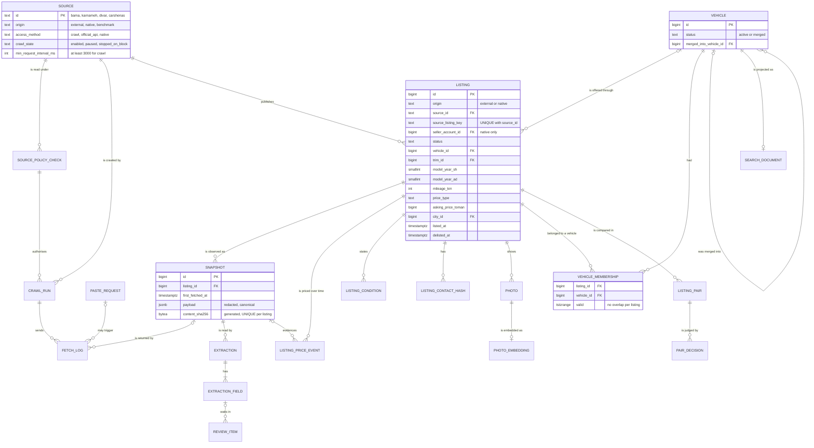
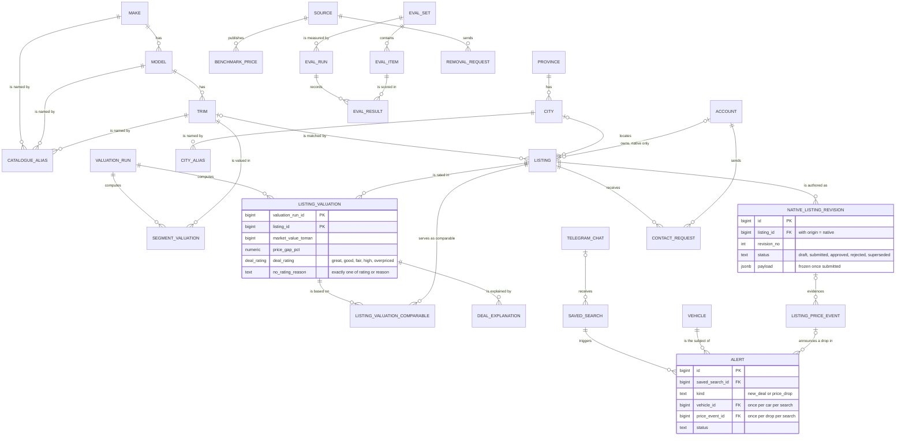

# The Carshenas data model: crawled listings now, native listings later

- Research pass F for CS-4 (question: which logical data model is right for crawling now and needs no painful rework when sellers post on Carshenas itself?)
- Date: 2026-09-27
- Status: draft for the owner; nothing in the repository was changed
- Related: ADR-0006, ADR-0007 (proposed), ADR-0008 (proposed), ADR-0010, CS-2, CS-4 to CS-20, CS-29; research pass A (`search.md` in this folder) for search
- Lab: `lab/data-model/` in this folder (DDL, seeds, tests and `run.sh`); the outputs, the saved references (`refs/`) and the diagram check (`mermaid/`) were in the research session's lab (not kept)

Conventions: every quotation is at most 25 words and carries author, title, URL and date. *Inference* marks my own reasoning where no source says it. Lab numbers were measured in Docker on this machine with PostgreSQL 17.11 and pgvector 0.8.6. Every example row is illustrative, not market data and not a real ad.

## Short answer

1. **Model three levels, not two.**
   - The *car*: a `vehicle`, which is the duplicate group, placed in the catalogue's make > model > trim (plus model year).
   - The *offer*: a `listing`, one ad on one source, with its own price history.
   - The *observation*: what a source showed at one moment. For crawled ads that is a `fetch_log` row pointing at an immutable, content-addressed `snapshot`; for native ads it is a frozen `native_listing_revision`.
   - schema.org and Google's retired vehicle-listing markup split the thing from the offer the same way (a `Car` with nested `offers`). Torob splits product from offer.
   - Cars are not fungible, so Torob's "product" maps to two levels here: the catalogue trim and year (the model page) and the physical vehicle (the "same car on three sites" group). *Inference.*
2. **One listing core for every origin.**
   - `listing.origin` is `external` or `native`, and `source_id` is always set: Carshenas itself becomes the source `carshenas`.
   - One CHECK ties the origin to its identity columns: `source_listing_key` for external ads, `seller_account_id` for native ones.
   - A composite foreign key `(source_id, origin) → source (id, origin)` stops a native ad from claiming Bama and a crawled ad from claiming Carshenas.
   - Origin-specific data lives in origin-specific tables: fetch log, snapshots and extractions for external ads; accounts, revisions and contact requests for native ones.
   - In the lab, the native migration ran as one additive transaction on top of live crawled rows. Fingerprints of `listing`, `listing_price_event` and `snapshot` were identical before and after, and every new constraint validated.
3. **Treat data in four kinds.**
   - *Immutable*: policy checks, the fetch log, snapshots, price events and duplicate verdicts. A trigger refuses UPDATE; DELETE is allowed only inside a purge for a removal request.
   - *Recorded external responses*: LLM extractions. They are kept, not recomputed, and cached by input hash (CS-8 #3), because a re-run costs money and may answer differently.
   - *Derived and rebuildable*: listing attributes, current vehicle membership, valuations and the search projection.
   - *Curated by hand*: sources' policies, the catalogue and its aliases, cities, labels and review decisions.
   - Identity rows (`listing`, `vehicle`) stay put even though their attributes are derived, so URLs, alerts and evaluation references never break on a rebuild.
4. **Keep time simple.**
   - Price history is append-only in valid time (`observed_at`), plus a `recorded_at` for record time. A full bitemporal model is not needed: Fowler advises against it unless retroactive changes drive actions.
   - The actions (a valuation, an alert) record their inputs: the price rated, the comparables used, the price event announced.
   - Vehicle membership uses `tstzrange` with an exclusion constraint. PostgreSQL 18's `WITHOUT OVERLAPS` is the same idea as a key.
5. **Entity resolution never loses history.**
   - Candidate pairs carry their evidence, and verdicts are append-only; a human verdict outranks any machine verdict.
   - Membership is type-2 history, and a merged vehicle stays as a tombstone that redirects.
   - This follows Splink (pairs to clusters by connected components), Senzing (re-decide when new evidence arrives) and Kimball (type-2 rows).
6. **The database enforces what would embarrass us in front of Torob.**
   - ADR-0008: a 3-second floor on the request interval; Divar can never be switched to crawling; a crawl run is refused on stale or negative terms; a 429 stops the source in the same transaction; Karnameh photos cannot be stored; a private seller's id cannot be stored.
   - Privacy: phone numbers only as keyed hashes; photos stored only when clean or masked.
   - Money and calendars: toman amounts must be positive and match their price type; model years are kept in both calendars and must agree.
   - Lifecycles: a transition table plus a trigger.
   - Lab: **60 of 60 cases pass**. The 7 good rows are accepted and the 53 bad rows are rejected, each by the intended constraint, trigger or index.
7. **Keys and types.**
   - `bigint` identity keys everywhere, and text codes for tiny curated vocabularies (`source.id = 'bama'`).
   - Random, hashed tokens for anything whose possession grants access: RFC 9562 says UUIDs must not be capabilities.
   - UUIDv7 is not needed today. PostgreSQL 18 has `uuidv7()` if ids ever have to be minted outside the database.
8. **The indexes are provisional, but the lab shows the shape holds.**
   - On 300,000 synthetic listings every page query ran in under 1 ms, except facet counts (17 ms) and a comparables query (6 ms).
   - Rebuilding the search projection in place took 12.8–14.6 s, mostly incremental maintenance of the trigram GIN index. Loading a shadow table and indexing it afterwards took 3.4 s.
9. **Decisions for the owner** (details in Open questions):
   - keyed HMAC rather than "salted" phone hashes (amend the wording of ADR-0008 point 7);
   - how long a pasted Divar listing is kept, and that it is never indexed;
   - redacted evaluation fixtures if the repository is public;
   - photo retention after an ad is gone;
   - days on market across relists;
   - the first migration also needs the listing identity table.

## Data needs found in the repo

| Need | Where it is stated | Entity in this model |
|---|---|---|
| Sources, their robots.txt and terms, allowed or not, photos allowed or not | ADR-0008 points 1, 2 and 4; CS-5 #1, #2 and notes; the sources note | `source`, `source_policy_check` (append-only; latest row in force), view `source_current_policy` |
| Politeness: one request at a time per host, at least 3 s apart, stop on 403, 429 or challenge | ADR-0008 points 5 and 6; CS-6 #2 | `source.min_request_interval_ms` CHECK ≥ 3000; one running `crawl_run` per source; `fetch_log` triggers stop the source |
| Crawl run reports: counts, errors, duration | CS-6 #4 | `crawl_run` counters and times |
| One immutable snapshot per listing with URL, fetch time, content hash and raw data; a new snapshot only when content changed | CS-6 #1 and #3; glossary "snapshot" | `snapshot` (UNIQUE `(listing_id, content_sha256)`, generated hash); `fetch_log` rows point at an existing snapshot on a revisit |
| Record photo URLs in the snapshot either way | CS-6 notes | `snapshot.photo_urls` |
| Normalised listing: trim, year in both calendars, mileage, body condition, insurance, price type (negotiable, installment, swap), city, seller type | glossary; vision; CS-8 #4; CS-16 #1 | `listing` columns and CHECKs; `listing_condition` |
| Model years in both calendars, never guessed silently | AGENTS.md; glossary "model year"; CS-2 #3 | `model_year_sh`, `model_year_ad`, `model_year_written`, CHECK on the 621–622 difference |
| Money as integers, billions of toman | AGENTS.md; CS-2 | `bigint` columns suffixed `_toman`, CHECK > 0 |
| Make, model and trim catalogue with Persian, Latin and spelled-out aliases; an explicit unmatched state | CS-10 #1 and #2; glossary "trim" | `make`, `model`, `trim`, `catalogue_alias`; `listing.catalogue_match` (`trim`, `model`, `make`, `none`) |
| Cities and provinces | listing patterns (city filter, "my city"); CS-11 #1 blocking by city | `province`, `city`, `city_alias` |
| Price history, price drops | glossary "price drop"; listing patterns "step chart"; CS-6 #3; CS-20 #2 | `listing_price_event` (append-only, `previous_price_toman` filled by trigger) |
| Days on market (listing or group) | glossary; CS-16 #1 | `listing.listed_at`, `delisted_at`; group minimum in `search_document.listed_at` |
| Duplicate groups across sites, reason stored for LLM verdicts, precision measured | CS-11 #1 to #4; glossary "vehicle", "duplicate group" | `vehicle`, `listing_pair`, `pair_decision`, `vehicle_membership` |
| Phone numbers only as salted hashes | ADR-0008 point 7; CS-11 #4 | `listing_contact_hash` (keyed HMAC, `key_version`) |
| Photos stored in ArvanCloud, keyed by source and listing, with source URL, fetch time and hash; phone numbers and plates masked or photo dropped; removal deletes photos | ADR-0010; CS-29 #1 to #6 | `photo` (CHECK: stored only if `clean` or `masked`), `photo_embedding`, `storage_deletion_outbox` |
| LLM extraction with strict schema, per-field confidence, review queue, cache by input hash, cost | ADR-0007 point 4; CS-8 #1 to #5 | `extraction` (UNIQUE cache key), `extraction_field` (threshold copied in, CHECKs), `review_item` |
| Labelled evaluation sets in the repository with snapshot references; per-field precision and recall; reports stored with the prompt version | CS-9 #1 to #3; CS-10 #3; CS-11 #3; CS-15 #4; CS-29 #5 | `eval_set`, `eval_item` (snapshot referenced by content hash), `eval_run`, `eval_result` |
| Market value per segment and day, with date and comparables; no rating for negotiable, installment and placeholder prices | ADR-0007 point 1; CS-12 #2 to #4; glossary "market value", "deal rating" | `valuation_run` (Tehran date), `segment_valuation`, `listing_valuation` (rating XOR reason), `listing_valuation_comparable` |
| Explanation from stored facts only | CS-17 #2; AGENTS.md | `deal_explanation.facts` beside the text |
| Benchmark against published price tables only as a check | CS-13; ADR-0008 point 2 | `benchmark_price`; `source.origin = 'benchmark'` |
| Search results: one car once, cheapest first, sources listed, sort by deal | vision; listing patterns; CS-14 #1; CS-16 #1 | `search_document` (one row per vehicle) |
| Model page trend and "what is my car worth?" | CS-18; vision | `segment_valuation` by trim, year, province and date |
| Saved searches and Telegram alerts, one message each, stop from Telegram and from the site | CS-20 #1 to #3 | `telegram_chat`, `saved_search`, `alert` (partial UNIQUE indexes) |
| Pasted links; Divar only through Kenar; five-second answer | CS-19 #1 to #4; ADR-0008 point 3 | `paste_request`; `fetch_log.method = 'official_api'`; `source.listing_visibility = 'requester_only'` for Divar |
| A source's request to remove data is honoured | ADR-0008 point 8; ADR-0010; CS-29 #3 | `removal_request`, `purge_listings()` |
| Later: seller accounts, drafts, publishing, moderation, contact requests, sold or expired | owner's brief on CS-4 (2026-09-27); vision "later, reach serious buyers" | `account`, `native_listing_revision`, `contact_request`, native statuses in `listing` |

## References and how they apply

### The thing, the offer and the observation

- **schema.org, "Vehicle", "Car" and "Offer"** (schema.org V30.1, 2026-09-16; <https://schema.org/Vehicle>, <https://schema.org/Car>, <https://schema.org/Offer>).
  - `vehicleConfiguration` is "A short text indicating the configuration of the vehicle".
  - `mileageFromOdometer` is "The total distance travelled by the particular vehicle since its initial production, as read from its odometer."
  - `Offer` is "An offer to transfer some rights to an item or to provide a service", with `itemOffered`: "An item being offered (or demanded)."
  - Applied: the listing is the offer (price, seller, validity); the vehicle claims are about the item. Mileage belongs to the particular vehicle, so two listings of one car may state it differently. We therefore store the claims per listing and cluster the listings, rather than store one mileage per vehicle (*inference*).
- **Google Search Central, "Vehicle listing (Car) structured data"** (page last updated 2025-02-04; read through the Wayback Machine copy of 2025-05-02, <https://web.archive.org/web/20250502164544/https://developers.google.com/search/docs/appearance/structured-data/vehicle-listing>).
  - `model`: "Don't include trim specifics like LX or EX." `vehicleConfiguration`: "The trim of the model, such as S, SV, or SL."
  - Price policy: Google would "exclude vehicles with prices that fall outside of the range of prices that we expect, based on similar vehicles".
  - When feed and markup disagree: "the feed data will override the conflicting markup data."
  - Applied: make, model and trim are separate levels (Carshenas's `make`, `model`, `trim`). An implausible price is flagged against comparables, not rejected by a constraint. When two channels describe one car, a precedence rule is needed; see the open question on native versus crawled (*inference*).
  - The feature is retired: Google announced the phase-out on 2025-06-12, and its updates page records "Removed documentation for the following structured data types: … vehicle listing" on 2025-09-09.
  - Henry Hsu, "Simplifying the search results page", Google Search Central Blog, 2025-06-12, updated 2025-09-08, <https://developers.google.com/search/blog/2025/06/simplifying-search-results>: "The use of these structured data types outside of Google Search (and dependent features) is not affected." The modeling lesson stands; Carshenas should not count on car rich results.
- **Torob's product and offer model** (Carshenas research note, 2026-09-26, `docs/research/2026-09-26-torob-product-and-playbook.md`).
  - A content team "merges each into one canonical product page", and each offer shows "when the price last changed".
  - Applied: `vehicle` plays the merged product for one physical car and the catalogue trim and year play the product page (CS-18). `listing_price_event` gives "when the price last changed" per offer.
- **IIPC, "The WARC Format 1.1"** (<https://iipc.github.io/warc-specifications/specifications/warc-format/warc-1.1/>, read 2026-09-27).
  - A "revisit" record may be used when "a subsequent consideration of a URI provides payload content which a strong digest function, such as SHA-1, indicates is identical to a previously archived version".
  - Applied: `fetch_log` is the capture event and `snapshot` the payload, deduplicated by SHA-256. An unchanged page is a revisit: a fetch row that points at the existing snapshot (lab: fetch 3 points at snapshot 2).
- **CarGurus Help, "What is IMV?"** (last updated 2026-05-14, <https://cargurus.helpscoutdocs.com/article/10-what-is-imv>).
  - IMV is "an estimated fair retail price for a vehicle based on a detailed analysis of comparable current and previous car listings in your market", and "We compute and update our IMV calculations daily".
  - Applied: comparables include recently delisted listings (`listing_comparables_idx` covers `delisted_at`), valuations are daily runs, and segments carry a region (`province_id`).

### Time, immutability and rebuilds

- **Martin Fowler, "Bitemporal History"** (2021-04-07, <https://martinfowler.com/articles/bitemporal-history.html>).
  - "If we can avoid using bitemporal history, then that's usually preferable as it does complicate a system quite significantly."
  - We can get away with actual history alone "if the action is recorded in such a way that it records any necessary input data."
  - Applied: price events carry valid time (`observed_at`) and a plain `recorded_at`, with no bitemporal tables. Valuations store the price they rated and the comparables they used; alerts store the price event they announced.
- **Martin Fowler, "Event Sourcing"** (2005-12-12, <https://martinfowler.com/eaaDev/EventSourcing.html>).
  - "Complete Rebuild: We can discard the application state completely and rebuild it by re-running the events from the event log"
  - External queries are hard because to rebuild "you need to do this using external query responses that were made in the past."
  - Applied: snapshots and native revisions are the log, and listings, valuations and search documents are rebuildable state. LLM answers are external query responses, so they are recorded (`extraction`) and reused, not re-asked on a rebuild.
- **PostgreSQL 17 manual, "8.17 Range Types"** (<https://www.postgresql.org/docs/17/rangetypes.html>): "Exclusion constraints allow the specification of constraints such as "non-overlapping" on a range type." Applied: `vehicle_membership_no_overlap` (a listing belongs to one vehicle at any instant).
- **PostgreSQL 18 manual, "CREATE TABLE"** (<https://www.postgresql.org/docs/18/sql-createtable.html>).
  - On `WITHOUT OVERLAPS`: "This is sometimes called a temporal key, if the column is a range of dates or timestamps".
  - Applied: on PostgreSQL 18 the membership table can declare `PRIMARY KEY (listing_id, valid WITHOUT OVERLAPS)` instead of the lab's `EXCLUDE`. PostgreSQL 18.6 and 17.11 are the current minors (<https://www.postgresql.org/support/versioning/>, read 2026-09-27).

### Entity resolution

- **UK Ministry of Justice, Splink documentation, "5. Predicting results"** (<https://moj-analytical-services.github.io/splink/demos/tutorials/05_Predicting_results.html>, read 2026-09-27): "The algorithm that converts between the pairwise results and the clusters is called connected components".
  - Applied: `listing_pair` holds the scored pairs and the clustering job derives `vehicle` membership from `match` edges. The cluster is an output, never the stored truth.
- **Jeff Jonas (Senzing), "Sequence Neutrality"** (2019-02-25, <https://senzing.com/sequence-neutrality/>): "now that I know this new information, would any of my prior assertions be different if I had known this first?"
  - Applied: merges and splits are normal operations, so `vehicle` rows are tombstoned with `merged_into_vehicle_id`, not deleted. `pair_decision` keeps every verdict so a later human or model decision can reverse an earlier one.
- **Kimball Group, "Type 2: Add New Row"** (<https://www.kimballgroup.com/data-warehouse-business-intelligence-resources/kimball-techniques/dimensional-modeling-techniques/type-2/>, read 2026-09-27): "A minimum of three additional columns should be added to the dimension row with type 2 changes".
  - Applied: `vehicle_membership.valid` (a range holds effective and expiry), and the open range marks the current row.
- **pgvector README** (<https://github.com/pgvector/pgvector>, version 0.8.6 in the lab): "With approximate indexes, filtering is applied *after* the index is scanned."
  - Applied: duplicate candidates are blocked first with B-tree filters (same trim, year and city, CS-11 #1), and photo embeddings are compared exactly inside the block. An HNSW index over all photos is not needed for entity resolution at this scale (*inference*; pass D owns pgvector tuning).

### Catalogue and aliases

- **Wikidata, "Help:Aliases"** (last edited 2026-07-10, <https://www.wikidata.org/wiki/Help:Aliases>).
  - "Like labels, aliases are language specific, but unlike labels there can be as many aliases for an item as necessary."
  - "Multiple items can have the same alias, so long as they have different descriptions."
  - Applied: each make, model and trim has one Persian and one Latin label and any number of aliases. Aliases are unique per target, not globally («تیپ ۲» exists under many models), so matching resolves by context (make > model > trim).

### Crawled now, native later

- **Martin Fowler, Patterns of Enterprise Application Architecture catalogue** (2003-03-05).
  - Single Table Inheritance "Represents an inheritance hierarchy of classes as a single table that has columns for all the fields of the various classes" (<https://martinfowler.com/eaaCatalog/singleTableInheritance.html>).
  - Class Table Inheritance uses "one table for each class" (<https://martinfowler.com/eaaCatalog/classTableInheritance.html>).
  - Concrete Table Inheritance uses "one table per concrete class in the hierarchy" (<https://martinfowler.com/eaaCatalog/concreteTableInheritance.html>).
  - Applied: the chosen design is a hybrid. The shared offer columns sit in one core (like single table), and origin-specific data sits in origin tables keyed to the core (like class table). The alternatives are compared under "Native listings later".
- **PostgreSQL 17 manual, "5.11 Inheritance", Caveats** (<https://www.postgresql.org/docs/17/ddl-inherit.html>): "indexes (including unique constraints) and foreign key constraints only apply to single tables, not to their inheritance children."
- **PostgreSQL wiki, "Don't Do This"** (last edited 2024-11-21, <https://wiki.postgresql.org/wiki/Don%27t_Do_This>): "Don't use table inheritance. If you think you want to, use foreign keys instead."
  - Applied to both: no `INHERITS`. Alerts, comparables and pairs need one foreign-key target for "a listing".
- **Divar Help, «انقضای آگهی در دیوار به چه معناست؟»** (undated; rendered in a browser on 2026-09-27, <https://divar.ir/help/articles/post-expiration>).
  - «آگهی‌های شما پس از انجام مراحل ثبت و انتشار، به مدت ۳۰ روز روی دیوار قرار می‌گیرد.» and «در صورت منقضی شدن، اطلاعات آگهی حذف شده و امکان فعال‌سازی مجدد آن وجود ندارد».
  - Applied: a local precedent for the `expired` state and a 30-day validity. Unlike Divar, Carshenas should keep expired and sold listings as comparables (*inference*; open question).
- **Divar Help, «چقدر زمان می‌برد تا آگهی من در دیوار منتشر شود؟»** (undated; rendered 2026-09-27, <https://divar.ir/help/articles/post-publication-review-period>): «این فرآیند معمولاً ۱۰ دقیقه است و حداکثر تا ۲ ساعت زمان می‌بَرَد.»
  - Applied: pre-publication review (`in_review`, then `active` or `rejected` with a reason) is what Iranian sellers already expect.
- **CarGurus Help, "I submitted a contact request but the dealer never responded. What do I do?"** (last updated 2025-10-21, <https://cargurus.helpscoutdocs.com/article/24-i-have-submitted-a-contact-request-but-the-dealer-never-responded-what-do-i-do>).
  - The article's title names the buyer-to-seller "contact request" as a product object.
  - Applied: `contact_request` relays buyers to native sellers without publishing the seller's number.
- **PostgreSQL 17 manual, "ALTER TABLE", Notes** (<https://www.postgresql.org/docs/17/sql-altertable.html>).
  - Adding a column: "If no DEFAULT is specified, NULL is used. In neither case is a rewrite of the table required."
  - Validating a constraint: "validation acquires only a SHARE UPDATE EXCLUSIVE lock on the table being altered."
  - Applied: the native migration adds nullable columns and `NOT VALID` constraints, then validates them. That is cheap on a large live table. The one exception is the new `UNIQUE (id, origin)`, which should be built `CONCURRENTLY` first on a large table (*inference* from the same page).

### Types, keys, tokens and privacy

- **PostgreSQL wiki, "Don't Do This"** (as above).
  - "For new applications, identity columns should be used instead" (of `serial`).
  - "Don't use the timestamp type to store timestamps, use timestamptz".
  - The `money` type "isn't actually very good for storing monetary values".
  - Applied: identity keys, `timestamptz` everywhere, and `bigint` toman.
- **PostgreSQL 17 manual, "8.7 Enumerated Types"** (<https://www.postgresql.org/docs/17/datatype-enum.html>).
  - "The ordering of the values in an enum type is the order in which the values were listed when the type was created."
  - "Existing values cannot be removed from an enum type".
  - Applied: `deal_rating` is the one enum, because "good or better" is `deal_rating <= 'good'` and the five CarGurus levels are stable. Every other state is `text` with a named CHECK, which a migration can widen (as `02_native.sql` does).
- **PostgreSQL 17 manual, "5.5 Constraints"** (<https://www.postgresql.org/docs/17/ddl-constraints.html>): "By default, two null values are not considered equal in this comparison."
  - Applied: `UNIQUE NULLS NOT DISTINCT` where NULL means "general" (aliases without a source, national segments without a province).
- **PostgreSQL 18 manual, "UUID Functions"** (<https://www.postgresql.org/docs/18/functions-uuid.html>): `uuidv7()` "Generates a version 7 (time-ordered) UUID." The lab image is PostgreSQL 17, which lacks it.
- **K. Davis, B. Peabody, P. Leach, RFC 9562, "Universally Unique IDentifiers (UUIDs)"** (May 2024, <https://www.rfc-editor.org/rfc/rfc9562.html>): UUIDs "MUST NOT be used as security capabilities (identifiers whose mere possession grants access)."
  - Applied: Telegram link tokens and "stop alerts" links use random tokens, and only their SHA-256 is stored (`saved_search.link_token_sha256`, `manage_token_sha256`).
- **Telegram Bot API, Chat.id** (<https://core.telegram.org/bots/api>, read 2026-09-27): the id "has at most 52 significant bits, so a signed 64-bit integer or double-precision float type are safe for storing this identifier."
  - **Telegram, "Bot Features", deep linking** (<https://core.telegram.org/bots/features>): "A-Z, a-z, 0-9, _ and - are allowed" and "The parameter can be up to 64 characters long."
  - Applied: `telegram_chat.chat_id bigint UNIQUE`. The `/start` token is base64url of 32 random bytes, 43 characters (*inference*).
- **OWASP, "Password Storage Cheat Sheet"** (<https://cheatsheetseries.owasp.org/cheatsheets/Password_Storage_Cheat_Sheet.html>, read 2026-09-27).
  - Salting means it is "impossible to determine whether two users have the same password without cracking the hashes, as the different salts will result in different hashes".
  - "A pepper is shared between stored passwords, rather than being unique to an individual password like a password salt."
  - Applied: a per-row salt would make the same phone number hash differently on Bama and Karnameh and defeat duplicate detection. So `listing_contact_hash` holds an HMAC-SHA-256 keyed by a secret pepper that never enters the database, with a `key_version` for rotation.
  - An Iranian mobile number has about 10^9 possibilities, few enough to enumerate, so an unkeyed hash would not protect it (*inference*).
- **Chris Richardson, "Pattern: Transactional outbox"** (microservices.io, <https://microservices.io/patterns/data/transactional-outbox.html>, read 2026-09-27).
  - Store the message "in the database as part of the transaction that updates the business entities"; "The Message relay might publish a message more than once."
  - Applied: `storage_deletion_outbox` queues ArvanCloud deletions in the purge transaction. For Telegram, "never duplicates" (CS-20 #2) means at-most-once sending: `pending`, then `sending` (committed before the API call), then `sent`. A stuck `sending` row is resolved by a human, never retried blindly (*inference*).

### Could not be read

- `https://kenar.divar.dev/post/get_post` answered HTTP 403 to both curl and WebFetch on 2026-09-27; the Kenar field list is for CS-19 to confirm.
- The Kenar documentation home (<https://divar-ir.github.io/kenar-docs/>) says an app can receive an ad's or a user's data «با کسب اجازهٔ کاربر» ("with the user's permission"). Whether reading a buyer-pasted post needs its owner's consent is an open question.
- eBay's Inventory API pages (offer published or unpublished) and ACM Queue ("Immutability Changes Everything") refused this client (eBay error page, Cloudflare block), so neither is cited.

## Entities and tables

Conventions used in every table:

- **Keys.** `bigint GENERATED ALWAYS AS IDENTITY` primary keys, and text codes (`CHECK (id ~ '^[a-z]…')`) for tiny curated vocabularies such as `source`, `condition_kind` and `colour`. Identity values have gaps: an `INSERT … ON CONFLICT` consumes a value even when it inserts nothing (lab: listing 2 and snapshot 3 were never used). Never rely on gapless ids.
- **Time.** `timestamptz` for instants, stored and compared in UTC. `date` only for an Asia/Tehran business day (`valuation_run.as_of_date`). Days on market are computed in `Asia/Tehran`.
- **Money.** `bigint`, the unit in the column name (`asking_price_toman`), `CHECK (> 0)`. CS-2 may still choose rial, which renames the columns. Plausibility ranges drift with inflation, so they are flags in code, not CHECKs.
- **States.** `text` with a named CHECK. Transitions for `listing` live as data in `listing_status_transition` and are enforced by a trigger. `deal_rating` is the only enum.
- **Names.** Every constraint is named so an error message is its own documentation (lab output: `23514 listing_asking_price_positive`).
- **Generated columns** where the database should own a derivation: `snapshot.content_sha256`, `*_norm` columns.
  - The lab's `normalize_fa` is a stand-in; pass A's `fa_normalize` should be the one shared normalisation function.
  - Normalising at write time matters: in the lab, `normalize_fa` cost about 20 µs a call, 4.9 s over 244,000 rows.
- **Triggers** only where a rule crosses rows or tables or protects history: append-only tables, the purge gate, lifecycle transitions, the ADR-0008 backstops and filling `previous_price_toman`. Everything expressible as CHECK, FK, UNIQUE or EXCLUDE is declarative.

### Layer 0: sources and crawl policy (curated)

| Table | Purpose | Key columns and types | Constraints (named) and ON DELETE | Lifecycle |
|---|---|---|---|---|
| `source` | A channel listings enter through: `bama`, `karnameh`, `khodro45`, `sheypoor`, `divar`, `hamrah_mechanic`, later `carshenas` | `id text PK`; `origin text` (`external`, `native`, `benchmark`); `access_method text` (`crawl`, `official_api`, `native`); `listing_visibility text` (`public`, `requester_only`); `crawl_state text`; `min_request_interval_ms int`; `policy_max_age interval` (30 days); `stopped_at timestamptz`; `stop_fetch_id bigint` | `source_crawl_interval_floor` (≥ 3000 ms for crawl sources); `source_only_crawl_sources_run` (Divar can never be `enabled`); `source_native_iff_native_access`; `source_stop_has_evidence`; `UNIQUE (id, origin)` as FK target; `stop_fetch_id → fetch_log` RESTRICT (the evidence of a stop cannot be pruned) | `crawl_state`: `paused` → `enabled` → `stopped_on_block` (set by trigger) → a human sets `enabled` or `paused` |
| `source_policy_check` | Each reading of robots.txt and terms (CS-5), append-only; the latest row is in force | `source_id text FK`; `checked_at timestamptz`; `checked_by text`; `robots_txt text`; `terms_url`, `terms_summary text`; `verdict text` (`allowed`, `allowed_with_conditions`, `not_allowed`); `conditions text`; `photos_allowed boolean` | `policy_conditions_stated`; `policy_not_allowed_no_photos`; UPDATE refused by trigger; `source_id` RESTRICT | none (append-only) |
| `crawl_run` | One crawl of one source, with the counts CS-6 #4 asks for | `source_id text`, `policy_check_id bigint`; `started_at`, `finished_at timestamptz`; `status text`; `pages_fetched`, `snapshots_new`, `price_changes`, `errors int` | FK `(policy_check_id, source_id) → source_policy_check (id, source_id)`; partial UNIQUE `crawl_run_one_running_per_source`; trigger `crawl_run_guard`: crawl sources only, `enabled` only, must cite the latest check, not `not_allowed`, not older than `policy_max_age` | `running` → `succeeded`, `failed` or `stopped_on_block` |
| `removal_request` | A source's request to remove one ad or everything (ADR-0008 point 8); kept as the record after the purge | `source_id text FK`; `scope text` (`source`, `listing`); `source_listing_key text`; `received_at`; `requested_by`; `status`; `listings_deleted int` | `removal_scope_has_key`; `removal_completed_consistent`; `purge_listings(id)` deletes listings and cascades, with the purge flag set for that transaction only | `received` → `completed` or `rejected` |

### Layer 1: raw observations (immutable)

| Table | Purpose | Key columns and types | Constraints and ON DELETE | Lifecycle |
|---|---|---|---|---|
| `fetch_log` | Every request we made, append-only: the observation event | `source_id text`; `crawl_run_id` or `paste_request_id bigint` (exactly one); `url text`; `method text` (`http_get`, `official_api`); `requested_at timestamptz`; `http_status smallint`; `outcome text` (`ok`, `not_modified`, `not_found`, `gone`, `blocked`, `rate_limited`, `challenge`, `error`); `duration_ms int`; `etag`, `last_modified text`; `listing_id`, `snapshot_id bigint` | `fetch_has_one_cause`; FK `(crawl_run_id, source_id) → crawl_run (id, source_id)` CASCADE; `listing_id`, `snapshot_id` SET NULL; triggers: refuse a crawl request while the source is not `enabled`; a `blocked`, `rate_limited` or `challenge` outcome stops the source and the run in the same transaction; UPDATE refused except inside a purge | none |
| `snapshot` | The content a source showed, content-addressed and immutable | `listing_id bigint FK`; `first_fetched_at timestamptz`; `url text`; `canonical_version smallint`; `payload jsonb COMPRESSION lz4` (redacted: no phone numbers); `content_sha256 bytea GENERATED` from the payload; `photo_urls text[]`; `raw_object_key text` | `snapshot_unique_content UNIQUE (listing_id, content_sha256)`, so a changed page is a new row and an unchanged one is not; `listing_id` CASCADE (purge only); UPDATE refused; DELETE refused outside a purge | none |

The canonical form is the crawler's job: it strips volatile fields such as view counts and "2 hours ago" and redacts phone numbers, then the database hashes what it stores. The hash therefore cannot disagree with the content. The jsonb text form is key-order-insensitive (lab: `{"b":1,"a":2}` and `{"a":2, "b":1}` hash equal). `jsonb_sha256()` wraps `convert_to`, which PostgreSQL marks STABLE; it is declared IMMUTABLE, which is safe because the database is UTF8.

### Layer 2: recorded model responses and review (kept, not recomputed)

| Table | Purpose | Key columns and types | Constraints and ON DELETE | Lifecycle |
|---|---|---|---|---|
| `extraction` | One schema-valid LLM (or parser) answer for one snapshot | `snapshot_id bigint FK`; `input_sha256 bytea`; `prompt_version text` (`extract-vN`); `model text`; `status text`; `output jsonb`; `input_tokens`, `output_tokens int`; `cost_usd_micros bigint` | `extraction_cache_key UNIQUE (input_sha256, prompt_version, model)` (CS-8 #3); `snapshot_id` CASCADE; invalid output is never stored (CS-8 #1) | `accepted` or `needs_review` |
| `extraction_field` | Each field's value, confidence, threshold and source sentence | PK `(extraction_id, field)`; `field text FK → extraction_field_def`; `value jsonb`; `confidence numeric(4,3)`; `threshold numeric(4,3)` (copied at the time, for audit); `evidence text`; `status text` | `extraction_field_accepted_meets_threshold`; `extraction_field_review_below_threshold`; `extraction_field_value_has_evidence` | `accepted` or `needs_review` → `corrected` or `rejected` after review |
| `review_item` | One human review queue for fields, catalogue matches, duplicate pairs and photo PII | `kind text`; typed subject columns (`extraction_id` + `field`, `listing_id`, `listing_pair_id`, `photo_id`); `status`; `resolved_at`, `resolved_by`, `resolution jsonb` | `review_subject_matches_kind` (exactly the subject the kind needs, real FKs, no polymorphic id); partial UNIQUE `review_item_one_open_per_subject … NULLS NOT DISTINCT`; subjects CASCADE | `open` → `resolved` or `dismissed` |

### Layer 3: normalised listings (durable identity, derived attributes)

| Table | Purpose | Key columns and types | Constraints and ON DELETE | Lifecycle |
|---|---|---|---|---|
| `listing` | The offer: one ad on one source, any origin | `id bigint PK`; `origin text`; `source_id text`; `source_listing_key text`; `url text`; `status text`; `listed_at`, `delisted_at`, `last_seen_at timestamptz`; `vehicle_id bigint` (NULL until entity resolution); `make_id`, `model_id`, `trim_id bigint`; `catalogue_match text`; `model_year_sh`, `model_year_ad smallint`; `model_year_written text` (`sh`, `ad`); `mileage_km int`; `fuel`, `gearbox`, `body_condition text`; `exterior_colour text FK`; `insurance_months_left smallint`; `price_type text` (`asking`, `negotiable`, `installment`, `placeholder`); `asking_price_toman bigint`; `accepts_swap boolean`; `city_id bigint`; `district_text`; `seller_type text`; `source_dealer_key text`; `title`, `title_norm` (generated), `description_redacted text`; `latest_snapshot_id`, `extraction_id bigint`; `review_pending boolean`. Added by the native migration: `seller_account_id`, `current_revision_id bigint` | `listing_source_fk (source_id, origin) → source (id, origin)` RESTRICT; `listing_source_key_unique`; `listing_model_make_fk (model_id, make_id) → model (id, make_id)`; `listing_trim_model_fk (trim_id, model_id) → trim (id, model_id)` (a trim cannot sit under the wrong model); `listing_catalogue_match_consistent`; `listing_price_matches_type`; `listing_asking_price_positive`; `listing_model_year_written_present`; `listing_model_year_calendars_agree` (AD − SH ∈ {621, 622}); `listing_private_seller_has_no_key`; `listing_active_is_listed`; `listing_off_market_has_date`; `listing_market_dates_ordered`; `listing_external_identity`; `listing_owner_matches_origin` (native migration); `listing_native_active_is_complete` (native migration); status trigger | External: `new` → `active` or `gone`; `active` → `sold`, `expired`, `gone` or `removed`; `gone`, `expired` or `sold` → `active` (relisted under the same key). Native: `new` → `draft` → `in_review` → `active` or `rejected`; `rejected` → `in_review`; `active` → `sold`, `expired`, `withdrawn` or `removed`; a discarded draft is deleted. The origin never changes. |
| `listing_price_event` | Price history, append-only; valid time runs from `observed_at` to the next event | `listing_id bigint`; `observed_at timestamptz`; `price_type text`; `asking_price_toman bigint`; `previous_price_toman bigint` (filled by trigger); `snapshot_id bigint` (evidence); `native_revision_id bigint` (native migration); `recorded_at timestamptz` | `price_event_one_per_instant UNIQUE (listing_id, observed_at)` (idempotent re-derivation); `price_event_price_positive`; `price_event_price_matches_type`; `price_event_is_a_change`; evidence: snapshot only now, then exactly one of snapshot or revision; CASCADE from listing and evidence; UPDATE refused | none |
| `listing_condition` | Extracted condition items (the Persian condition vocabulary) with their sentence | `listing_id`; `kind text FK → condition_kind`; `panel text` (hood, roof, fenders, doors, pillar, chassis …); `spot_count smallint`; `evidence text`; `extraction_id` | `listing_condition_unique UNIQUE NULLS NOT DISTINCT (listing_id, kind, panel)`; CASCADE | none |
| `listing_contact_hash` | Keyed phone hashes for duplicate detection only | PK `(listing_id, phone_hmac)`; `phone_hmac bytea` (32 bytes); `key_version smallint` | `contact_hmac_length`; CASCADE | none |
| `photo` | A listing photo and its PII check; only a clean or masked copy is stored | `listing_id`; `position smallint`; `source_url`; `fetched_at`; `original_sha256 bytea`; `pii_status text`; `pii_detector_version`; `stored_object_key text UNIQUE`; `stored_sha256`; `width`, `height int`; `phash bigint` | `photo_stored_only_when_safe` (stored iff `clean` or `masked`); `photo_checked_names_detector`; `photo_stored_has_facts`; `photo_position_unique` DEFERRABLE (reordering); trigger `photo_source_allows` (latest policy must allow photos for external listings); after DELETE, the object key goes to the outbox | `pending` → `clean`, `masked`, `dropped` or `review` → (`clean`, `masked` or `dropped`) |
| `photo_embedding` | Image embedding for duplicate detection | `photo_id PK FK`; `model text`; `embedding vector(768)` (dimension provisional) | CASCADE | none |
| `storage_deletion_outbox` | ArvanCloud objects to delete, queued in the deleting transaction | `object_key text`; `reason`; `enqueued_at`; `done_at` | none (a worker marks `done_at`) | pending → done |

### Layer 4: catalogue and geography (curated)

| Table | Purpose | Key columns | Constraints |
|---|---|---|---|
| `make`, `model`, `trim` | The canonical hierarchy (CS-10); one row per make, model and trim, with one Persian and one Latin label | `slug`, `name_fa`, `name_en`, `name_norm` (generated); `trim.body_type`, `first_year_sh`, `last_year_sh` | Unique slugs per parent; `UNIQUE (id, make_id)` and `UNIQUE (id, model_id)` as targets for the consistency FKs; parents RESTRICT (merge trims by re-pointing, never by deleting) |
| `catalogue_alias` | Persian, Latin-typed and spelled-out aliases («۲۰۶», "206", «دویست و شش», «تيپ دو», "T2") | `alias text`; `alias_norm` (generated); `script text`; exactly one of `make_id`, `model_id`, `trim_id`; `source_id` (a label one source uses); `status` (`curated`, `suggested`, `rejected`) | `catalogue_alias_one_target`; `catalogue_alias_unique UNIQUE NULLS NOT DISTINCT (alias_norm, make_id, model_id, trim_id, source_id)` |
| `body_type`, `colour`, `condition_kind`, `extraction_field_def` | Code tables with Farsi labels; `condition_kind.severity`; `extraction_field_def.min_confidence` (per-field threshold) | `code text PK`, `label_fa` | Code format CHECKs, unique labels |
| `province`, `city`, `city_alias` | Where the car is; aliases per source («تهران - پونک») | `city.province_id`, `slug`, `name_fa`; `city_alias.alias_norm`, `source_id` | Unique names per province; `UNIQUE (id, province_id)`; alias unique per source |

### Layer 5: entity resolution (derived, history kept)

| Table | Purpose | Key columns | Constraints | Lifecycle |
|---|---|---|---|---|
| `vehicle` | The physical car. A vehicle *is* the duplicate group: the listings pointing at it | `status text`; `merged_into_vehicle_id bigint`; `merged_at`, `created_at timestamptz` | `vehicle_merge_consistent`; `vehicle_not_merged_into_itself`; never deleted | `active` → `merged` (a tombstone that redirects) |
| `listing_pair` | A candidate pair with its evidence (CS-11 #1, #2) | `listing_a_id < listing_b_id`; `blocking_key text`; `text_similarity`, `photo_similarity real`; `phone_match boolean` | `listing_pair_ordered`; `listing_pair_unique`; CASCADE | none |
| `pair_decision` | Every verdict, append-only; view `pair_current_decision` (a human outranks later machines) | `decision text` (`match`, `non_match`, `uncertain`); `decided_by text` (`rule`, `model`, `llm`, `human`); `decider_version text`; `score real`; `reason text`; `decided_at` | `pair_decision_reason_stored` (LLM and human verdicts carry a reason); UPDATE refused | none |
| `vehicle_membership` | Which vehicle a listing belonged to, when (type-2) | `listing_id`, `vehicle_id bigint`; `valid tstzrange`; `cause text` (`first_resolution`, `merge`, `split`, `manual`) | `vehicle_membership_no_overlap EXCLUDE USING gist (listing_id WITH =, valid WITH &&)`; bounded, non-empty ranges; vehicle RESTRICT | The open range is current; merge or split closes it and opens another |

`listing.vehicle_id` is the denormalised current membership, updated in the same transaction as the open range. A deferred constraint trigger could assert that they agree at commit; the lab checks it by query (*inference* that the trigger is worth adding once the clustering job exists).

### Layer 6: derived analytics (rebuildable)

| Table | Purpose | Key columns | Constraints | Lifecycle |
|---|---|---|---|---|
| `valuation_run` | One daily computation (CS-12) | `as_of_date date` (Tehran day); `method_version text`; `status`; `params`, `metrics jsonb` (MdAPE on held-out listings) | partial UNIQUE `valuation_run_one_success_per_day (as_of_date, method_version)`; `UNIQUE (id, as_of_date)` | `running` → `succeeded` or `failed`; `succeeded` → `superseded` |
| `segment_valuation` | Market value per trim, model year, province and day (model page, "what is my car worth?") | `valuation_run_id`, `as_of_date` (copied; composite FK keeps it honest); `trim_id`; `model_year_sh`; `province_id` (NULL = national); `n_comparables`; `market_value_toman`, `p25_toman`, `p75_toman bigint` | `segment_run_fk (valuation_run_id, as_of_date)` CASCADE; `segment_range_ordered`; `UNIQUE NULLS NOT DISTINCT` per run and segment | none |
| `listing_valuation` | Each listing's market value, gap and deal rating in one run | PK `(valuation_run_id, listing_id)`; `asking_price_toman` (the input rated); `market_value_toman`; `range_low_toman`, `range_high_toman`; `price_gap_pct numeric(7,2)`; `deal_rating deal_rating`; `no_rating_reason text`; `n_comparables` | `lv_rating_xor_reason` (exactly one); `lv_rated_has_numbers`; `lv_range_brackets_value`; CASCADE from run and listing | none |
| `listing_valuation_comparable` | The comparables behind a value (CS-12 #2, CS-17 #3) | PK `(run, listing, comparable_listing_id)`; `comparable_price_toman`, `adjusted_price_toman bigint`; `weight numeric(6,5)` | `lvc_not_itself`; CASCADE | none |
| `deal_explanation` | Farsi explanation with the facts it was given | PK `(run, listing, prompt_version)`; `facts jsonb`; `text_fa`; `numbers_verified boolean` | CASCADE from the valuation; pages show verified rows only | none |
| `benchmark_price` | Published price tables, used only to check our values (CS-13) | `source_id`; `as_of_date`; `label_raw`; `trim_id`; `model_year_sh`; `price_toman`; `fetch_id` | `UNIQUE (source_id, as_of_date, label_raw)`; positive price | none |
| `search_document` | One row per vehicle with an active, public listing: the unit a buyer sees, cheapest first, sources listed | `vehicle_id PK`; `representative_listing_id`; catalogue ids; year; mileage; city; price; `deal_rating`; `price_gap_pct`; `deal_sort_key`; condition, fuel, gearbox, seller type; `source_ids text[]`; `listing_count`; `listed_at` (group earliest); `has_photo`; `search_text` | FKs CASCADE (the purge removes stale rows); rebuilt by `rebuild_search_documents()`; excludes `requester_only` sources (pasted Divar ads) and non-active listings | none (a projection) |

Pass A recommends PostgreSQL alone for search. This projection is then the search table: pass A's stored `tsvector` belongs on it, and its facet-count table is another derived table refreshed after each crawl batch.

### Layer 7: labelled evaluation sets (curated; the repository file is the truth)

| Table | Purpose | Key columns | Constraints |
|---|---|---|---|
| `eval_set` | One labelled set per AI step (extraction, catalogue match, duplicate pairs, query parsing, photo PII, valuation hold-out) | `name UNIQUE`; `task`; `guideline_version`; `repo_path`; `frozen_at` | task CHECK |
| `eval_item` | One labelled item, loaded from the repository file | `item_key`; `snapshot_sha256 bytea` (a stable reference across database rebuilds); `input jsonb`; `labels jsonb`; `labelled_by`, `labelled_at` | `UNIQUE (eval_set_id, item_key)`; `eval_item_has_input` |
| `eval_run` | One scored run of a prompt, rule or model version (CS-9 #3) | `subject_version`; `model`; `metrics jsonb`; `cost_usd_micros` | set RESTRICT (runs keep their set) |
| `eval_result` | Per item and field: expected, predicted, confidence, correct | PK `(run, item, field)` | CASCADE |

### Layer 8: buyers, alerts and pasted links

| Table | Purpose | Key columns | Constraints | Lifecycle |
|---|---|---|---|---|
| `telegram_chat` | A Telegram chat linked through the bot | `chat_id bigint UNIQUE`; `linked_at`; `blocked_at` | unique chat | linked → blocked (the user blocked the bot) |
| `saved_search` | A stored query that alerts run against (CS-20) | `telegram_chat_id FK` (CASCADE); `status`; `link_token_sha256`, `manage_token_sha256 bytea` (hashes of random tokens); `filters jsonb` (same schema as the filter UI and CS-15); indexable columns `make_id`, `model_id`, `trim_id`, `city_id`, `max_price_toman`, `min_model_year_sh`, `max_mileage_km`; `min_deal_rating deal_rating`; `notify_new_deals`, `notify_price_drops`; `matched_through` (watermark) | `saved_search_linked_unless_pending`; `saved_search_pending_has_token`; `saved_search_stop_recorded`; `saved_search_notifies_something`; catalogue consistency FKs | `pending_link` → `active` → `stopped` (from Telegram or the site) |
| `alert` | One message owed to one saved search | `kind` (`new_deal`, `price_drop`); `vehicle_id`; `listing_id`; `price_event_id`; `status`; `sent_at`; `telegram_message_id bigint` | partial UNIQUE `alert_once_per_new_vehicle (saved_search_id, vehicle_id)` and `alert_once_per_price_drop (saved_search_id, price_event_id)`; the matcher inserts `ON CONFLICT … DO NOTHING`; `alert_price_drop_has_event`; `alert_sent_recorded` | `pending` → `sending` → `sent` or `failed`; `pending` → `suppressed` |
| `paste_request` | A pasted link and its answer (CS-19) | `pasted_url`; `source_id`; `requested_at`; `outcome`; `listing_id`; `answered_at` (latency = answered − requested; CS-19 #4) | `paste_answer_consistent`; `paste_rated_has_listing` | `pending` → one of `rated_from_database`, `fetched_and_rated`, `unsupported_source`, `divar_access_pending`, `broken_link`, `source_blocked`, `error` |

### Layer 9: native listings later (added by one migration)

| Table | Purpose | Key columns | Constraints | Lifecycle |
|---|---|---|---|---|
| `account` | A seller (later also a buyer) who signs in with a phone number | `phone_e164 text UNIQUE` (our own user's login; never shown); `phone_hmac bytea UNIQUE` (the same keyed hash as `listing_contact_hash`, so a seller's crawled ads can be matched); `display_name`; `status`; `deleted_at` | `account_phone_format` (`+989…`); `account_live_has_phone`; `account_deleted_is_scrubbed` | `active` ⇄ `suspended`; → `deleted` (personal data scrubbed) |
| `native_listing_revision` | What the seller wrote, version by version: the native counterpart of a snapshot | `listing_id` + `origin` (always `native`); `revision_no int`; `status`; `payload jsonb`; `submitted_at`; `decided_at`, `decided_by`, `rejection_reason` | FK `(listing_id, origin) → listing (id, origin)` (only native listings); `revision_no_unique`; one open draft and one pending submission per listing (partial UNIQUE); trigger `revision_freeze` (payload frozen once submitted; legal status moves only) | `draft` → `submitted` → `approved` or `rejected`; `approved` → `superseded` |
| `contact_request` | A buyer's message relayed to a native seller | `listing_id` + `origin` (`native`); `buyer_account_id`; `message text` (1–1000 characters); `share_buyer_phone boolean` (consent per request); `status` | FK `(listing_id, origin) → listing (id, origin)`, so there are no contact requests on crawled ads; one open request per buyer and listing | `sent` → `read` → `replied` → `closed`; any → `reported_spam` |

### What is immutable, recorded, derived or curated

| Kind | Tables | How it is enforced or rebuilt |
|---|---|---|
| Immutable facts | `source_policy_check`, `fetch_log`, `snapshot`, `listing_price_event`, `pair_decision`, submitted `native_listing_revision` | `forbid_update` trigger. `snapshot` DELETE only when `carshenas.purge = 'on'` (set transaction-locally by `purge_listings`). The owner of the tables can still bypass triggers, so the application role should also lose UPDATE and DELETE (*inference*; pass C owns roles). |
| Recorded external responses | `extraction`, `extraction_field`, `deal_explanation`, LLM rows in `pair_decision` | Kept and reused through their cache keys; re-running a prompt version creates new rows beside the old. |
| Derived, rebuildable | `listing` attributes (not its identity), `listing_condition`, `listing_contact_hash`, `vehicle_membership` and `listing.vehicle_id`, `valuation_*`, `listing_valuation*`, `segment_valuation`, `search_document` | Re-derived from snapshots and revisions plus the recorded responses; `rebuild_search_documents()` rebuilds the projection from scratch. |
| Durable identities | `listing.id` (natural key `(source_id, source_listing_key)`), `vehicle.id` (tombstones), `telegram_chat`, `saved_search`, `alert` | Never re-minted: upserts on the natural key keep ids stable. |
| Curated by hand | `source`, `source_policy_check`, catalogue, aliases, geography, code tables, `eval_set`/`eval_item` (from the repository), human `pair_decision` and `review_item` resolutions, `removal_request` | Reviewed changes only; `eval_item` is reloaded from the repository file. |

## Native listings later

**How they slot in** (`lab/data-model/02_native.sql`, applied in one transaction on top of live crawled data):

1. `CREATE TABLE account`.
2. `INSERT INTO source ('carshenas', origin 'native', access_method 'native', visibility 'public')`. Every per-source rule keeps working, because every listing still has a source.
3. `ALTER TABLE listing ADD COLUMN seller_account_id bigint REFERENCES account`. Nullable, so no table rewrite.
4. Replace the temporary `listing_only_external_for_now` CHECK with `listing_owner_matches_origin` (external: key present and no owner; native: owner present and no key), added `NOT VALID` and then validated.
5. Widen `listing_status_valid` to the native states and add `listing_native_active_is_complete`: a native ad may be half-filled as a draft but never on the market without trim, year, mileage, price type and city.
6. Add `UNIQUE (id, origin)` as the target for native-only children, and nine native rows to `listing_status_transition`. On a large table, build the unique index `CONCURRENTLY` first, then attach it with `ADD CONSTRAINT … UNIQUE USING INDEX`.
7. `CREATE TABLE native_listing_revision` and `contact_request`. Both reference `listing (id, origin)` with `origin` fixed to `native`.
8. `listing_price_event` gains `native_revision_id`, and its evidence rule becomes "exactly one of snapshot or revision".

**What native listings reuse unchanged:**

- the listing core, `listing_price_event`, `listing_condition`, `photo` (seller uploads are still checked for plates and phone numbers);
- `vehicle` and the duplicate machinery: a seller who also posts on Bama is matched through `account.phone_hmac` against `listing_contact_hash`;
- valuations (native ads are comparables too), `search_document`, `saved_search` and `alert`;
- `removal_request` and purge for a takedown; account deletion scrubs personal data.

The listing core of a native ad is projected from its latest approved revision, just as a crawled ad's core is projected from its latest snapshot, so "listings are derived" stays true for both origins.

**Evidence from the lab:**

- `04-migrate-native.txt`: fingerprints (md5 over every row as JSON, minus the new all-NULL columns) of `listing` (5 rows), `listing_price_event` (3) and `snapshot` (3) are identical before and after, and the four new or changed constraints report `convalidated = t`.
- `05-seed-native.txt`: a Dena Plus goes draft → submitted → approved → `active` and appears in `search_document` beside the crawled cars with `source_ids = {carshenas}`. Its price history row points at `native_revision_id = 1`. A second car stays a draft (`catalogue_match = 'none'`, no price) and never reaches search.
- `06-tests.txt`: all of these are rejected by the intended constraint or trigger:
  - a native ad without an owner, a native ad claiming Bama, a crawled ad claiming Carshenas, a crawled ad with an owner;
  - a draft marked sold, a draft published while incomplete, a change of origin;
  - an edit to a submitted revision, a second open draft;
  - a contact request on a crawled ad.

**Why this beats the alternatives:**

| Option | What it looks like | Problems for Carshenas |
|---|---|---|
| **Chosen: one core with `origin` + origin tables** (hybrid of single-table and class-table inheritance) | `listing` holds every offer column; `snapshot`, `fetch_log` and `extraction` hang off external rows; `native_listing_revision` and `contact_request` off native rows, enforced by `(id, origin)` FKs | Some columns are meaningful for one origin only, guarded by CHECKs. Accepted. |
| Separate tables, `external_listing` and `native_listing` (concrete table inheritance) | Two tables with the same 30 offer columns | Every consumer needs a UNION or two code paths: search, comparables, duplicate pairs, alerts, price history. A foreign key cannot point at "a listing", so `alert.listing_id`, `listing_pair`, `listing_valuation_comparable` and `vehicle_membership` would each need two nullable columns or a polymorphic id without an FK. The cross-origin duplicate "the same car on Bama and on Carshenas" becomes awkward. |
| One wide table with every native column (single table) | Drafts, moderation fields, contact settings and crawl bookkeeping all in `listing` | Drafts' half-filled rows and moderation history bloat the hot table. Revisions (history) do not fit in one row, and constraints become long `CASE` chains. |
| PostgreSQL `INHERITS` | `listing` parent, children per origin | Unique constraints and FKs do not span the hierarchy (manual caveat quoted above); the wiki says not to. |
| A native "product" separate from `listing`, linked 1:1 | A second object for native ads | Duplicates what the core already holds; the 1:1 link itself needs the same discriminator. |

## Indexes

Constraint-backed indexes (PK, UNIQUE, EXCLUDE) come with their tables. The query-serving ones are in `lab/data-model/03_indexes.sql`, and **all are provisional until measured on real data**.

The table below was measured on synthetic volume: 300,000 listings, of which 254,867 are active and 244,090 distinct cars; 200 trims skewed so that a few dominate; 100 cities, one of which holds 45 %. Setup and plans are in `outputs/08-volume.txt` and `09-volume-rare.txt`.

| Query | Index | Plan in the lab | Time |
|---|---|---|---|
| Search: best deal first, first page, no filter | `search_doc_deal_idx (deal_sort_key ASC NULLS LAST, vehicle_id)` | Index Scan, Limit 30 | 0.026 ms |
| Search: popular model (30,996 docs) + city + price ceiling, best deal first | same | Index Scan with filter (1,029 rows removed) | 0.26 ms |
| Search: rare model (2,828 docs) + city + price ceiling | `search_doc_model_deal_idx (model_id, deal_sort_key, vehicle_id)` | Index Scan on `model_id` | 0.26 ms |
| Search: small city (1,364 docs), best deal first | `search_doc_city_deal_idx (city_id, deal_sort_key, vehicle_id)` | Index Scan on `city_id` | 0.094 ms |
| Search: one model, cheapest first | `search_doc_model_price_idx (model_id, asking_price_toman)` | Index Scan | 0.039 ms |
| Facet counts: cities for one model (31,000 docs) | same, bitmap | Bitmap Heap Scan + HashAggregate | 16.5 ms |
| Comparables: trim, year ±1, asking prices, current or delisted within 60 days | `listing_comparables_idx (trim_id, model_year_sh) INCLUDE (…) WHERE price_type = 'asking'` | Bitmap Index Scan, 7,508 rows | 6.2 ms |
| Duplicate candidates: trim, year, city, mileage ±5,000 km, active | `listing_dedupe_block_idx (trim_id, model_year_sh, city_id, mileage_km) WHERE status = 'active'` | Index Scan, all conditions in the index | 0.073 ms |
| Listing page: the car's other listings, cheapest first | `listing_vehicle_idx (vehicle_id)` | Index Scan | 0.042 ms |
| Listing page: latest valuation | `listing_valuation_listing_idx (listing_id, valuation_run_id DESC)` | Index Scan (the view's `DISTINCT ON` is pushed down) | 0.071 ms |
| Price history | `price_event_one_per_instant UNIQUE (listing_id, observed_at)` | by construction | not measured |
| Saved-search matcher: price drops since the watermark | `price_event_drops_idx (observed_at) WHERE asking_price_toman < previous_price_toman` | small partial index | not measured |
| Saved-search matcher: new cars since the watermark | `listing_listed_at_idx (listed_at) WHERE status = 'active'`; `saved_search_active_model_idx` | | not measured |
| Catalogue matching | `catalogue_alias_norm_idx (alias_norm) WHERE status = 'curated'`; `catalogue_alias_trgm_idx` (GIN trigram) | | not measured |
| Duplicate evidence | `listing_contact_hash_phone_idx (phone_hmac)`; `photo_phash_idx`; `listing_pair_b_idx` | | not measured |
| Fetch log over time | `fetch_log_requested_brin` (BRIN on an append-only table); `fetch_log_listing_time_idx`; `fetch_log_snapshot_idx` | | not measured |
| FK lookups used by purge cascades | `lv_comparable_listing_idx`, `alert_listing_idx`, `alert_price_event_idx`, `price_event_snapshot_idx`, `extraction_snapshot_idx` | | not measured |

Findings from the volume lab:

- **The planner picks a different index by selectivity.** For a popular model it walks the global deal order and filters; for a rare model or a small city it uses the composite index. Keep all three until real distributions say otherwise.
- **Facet counts are the expensive read**, as pass A also found. Serve broad counts from a refreshed table.
- **Rebuilding the whole projection:**

  | Method | Time for 244,090 rows |
  |---|---|
  | `rebuild_search_documents()` in place (DELETE, then INSERT … SELECT) | 12.8–14.6 s |
  | The SELECT part alone | 1.7–3.5 s |
  | In place, trigram GIN dropped | 4.1 s |
  | In place, GIN with `fastupdate = off` | 31.4 s |
  | In place, with the projection's two FKs | 10.6 s, the same as without them (9.8–14.2 s) |
  | Shadow table: load 0.37 s, then build all six indexes 3.0 s, then swap names | 3.4 s |

  Recommendation (*inference* from these numbers): refresh the rows of changed cars incrementally during normal work, and do a full rebuild (CS-14 #3) as a shadow table plus a swap.
- **Bulk inserts into `listing`** took 27 s for 300,000 rows, about 90 µs a row with the status trigger, 4 FKs, CHECKs and 7 indexes. That is fine for crawls of a few thousand ads.
- **Normalise at write time:** `normalize_fa` cost 4.9 s per 244,000 calls, so the catalogue's `name_norm` and the listing's `title_norm` are generated columns.

## ER diagram

Two diagrams keep each readable. Both were parsed and rendered with Mermaid 11 in headless Chromium (`mermaid/validate.cjs`).

Observations, offers, cars and duplicates:



Catalogue, valuations, buyers, native listings and evaluation:



## Lab (DDL, inserts, outputs)

**Environment.**

- Container `carshenas-lab-model` from `pgvector/pgvector:pg17` (PostgreSQL 17.11, Debian 17.11-1.pgdg12+2; pgvector 0.8.6), published on port 55435, removed after the run.
- Extensions: `btree_gist`, `vector`, `pg_trgm`, `pgcrypto`. `pgcrypto` is for the lab only, to fake HMACs; in production the worker computes the HMAC and the key never enters SQL.

**Files** (kept in `lab/data-model/`, except the volume scripts `50_*.sql` to `52_*.sql` and `run_volume.sh`, and the `outputs/`):

| File | What it does |
|---|---|
| `00_extensions.sql` | extensions |
| `01_core.sql` | the crawled-now schema: 47 tables, views, functions and triggers; 962 lines |
| `02_native.sql` | the additive native migration: 3 tables and the `listing` changes |
| `03_indexes.sql` | provisional query indexes |
| `10_seed_crawled.sql` | the crawled story |
| `11_queries_crawled.sql` | read the story back as the pages would |
| `12_before_native.sql` and `13_after_native.sql` | migration fingerprints |
| `20_seed_native.sql` | native listings |
| `30_tests.sql` | 60 constraint cases |
| `40_purge.sql` | a removal request |
| `50_*.sql` to `52_*.sql` | synthetic volume |
| `run.sh` | recreates `carshenas_lab` and writes every step to `outputs/01-schema.txt` … `07-purge.txt`; every step exited 0 |
| `run_volume.sh` | recreates `carshenas_volume` for the volume check |

**The story in the inserts** (illustrative numbers):

- **2026-09-25.** A Peugeot 206 T2 (1400, 62,000 km, Punak, Tehran) is crawled on Bama at 845,000,000 toman.
  - Fetch 1 creates snapshot 1.
  - The extraction accepts five fields and queues `insurance_months_left` (confidence 0.70 under its threshold of 0.80) for review.
  - The photo showed a plate, so the stored copy is masked.
  - The listing becomes vehicle 1.
- **2026-09-26.** The Bama price drops to 815,000,000. Fetch 2 creates snapshot 2 and price event 2 (−30,000,000).
- **2026-09-27.** The page is unchanged. `INSERT … ON CONFLICT DO NOTHING` stores nothing, and fetch 3 points at snapshot 2: a revisit.
- **Karnameh, 2026-09-26.** The same car at 845,000,000 (62,500 km), with photo URLs recorded but no download allowed. It becomes vehicle 2.
  - A pair is scored (text 0.81, same phone hash, photos not compared). A model says `uncertain` 0.71, then an LLM says `match` 0.93 with a reason.
  - Vehicle 2 is merged into vehicle 1 without losing history.
- **Valuation for 2026-09-27.** Three comparables set the market value at 860,000,000. Bama rates `good` (−5.23 %) and Karnameh `fair` (−1.74 %). A Farsi explanation is stored with its facts.
- **A saved search** (206, Tehran, up to 900,000,000, good or better) gets one `new_deal` and one `price_drop` alert. Re-running the matcher inserts nothing.
- **A pasted Divar link** is recorded as answered `divar_access_pending`. The 180 ms answer time is a seeded value, not a measurement.

**Outputs** (from `outputs/03-queries-crawled.txt`):

```text
== fetch log: three Bama visits, two snapshots (the third visit is a revisit of snapshot 2)
 fetch_id | source_id |      requested_at      | outcome | snapshot_id |  snapshot_first_seen   | sha256_prefix
        1 | bama      | 2026-09-25 06:00:05+00 | ok      |           1 | 2026-09-25 06:00:05+00 | 3bdf78bc1bbf
        2 | bama      | 2026-09-26 06:00:04+00 | ok      |           2 | 2026-09-26 06:00:04+00 | 7d36f9cf89d8
        4 | karnameh  | 2026-09-26 07:00:06+00 | ok      |           4 | 2026-09-26 07:00:06+00 | 7fa2a20e612d
        3 | bama      | 2026-09-27 06:00:03+00 | ok      |           2 | 2026-09-26 06:00:04+00 | 7d36f9cf89d8

== price history of the Bama listing (valid time: from observed_at until the next event)
       valid_from       |        valid_to        | price_type | asking_price_toman | previous_price_toman | change_toman
 2026-09-25 06:00:05+00 | 2026-09-26 06:00:04+00 | asking     |          845000000 |                      |
 2026-09-26 06:00:04+00 |                        | asking     |          815000000 |            845000000 |    -30000000

== listing page: «همین خودرو در منابع دیگر», cheapest first, with days on market of the listing and of the car
 source_id | asking_price_toman | deal_rating | price_gap_pct | valued_on  | days_on_market_listing | days_on_market_car
 bama      |          815000000 | good        |         -5.23 | 2026-09-27 |                      2 |                  2
 karnameh  |          845000000 | fair        |         -1.74 | 2026-09-27 |                      1 |                  2

== membership history: the Karnameh listing moved from vehicle 2 to vehicle 1 on merge; vehicle 2 is a tombstone
 listing_id | source_id | vehicle_id |                        valid                        |      cause       | vehicle_status | merged_into_vehicle_id
          1 | bama      |          1 | ["2026-09-25 07:00:00+00",)                         | first_resolution | active         |
          3 | karnameh  |          2 | ["2026-09-26 07:30:00+00","2026-09-26 08:00:00+00") | first_resolution | merged         |                      1
          3 | karnameh  |          1 | ["2026-09-26 08:00:00+00",)                         | merge            | active         |

== match evidence: every verdict kept; the current one comes from the view
       decided_at       | decided_by | decider_version | decision  | score | reason
 2026-09-26 07:40:00+00 | model      | dedupe-score-v1 | uncertain |  0.71 |
 2026-09-26 07:45:00+00 | llm        | dedupe-llm-v1   | match     |  0.93 | Same white 206 T2 of 1400 in Punak, 62,000 vs 62,500 km, bot…
 current: listing_pair 1 → match (llm)

== search projection: one row per car, cheapest listing first, sources listed
 vehicle_id | representative_listing_id | asking_price_toman | deal_rating | price_gap_pct |   source_ids    | listing_count |       listed_at        | has_photo
          1 |                         1 |          815000000 | good        |         -5.23 | {bama,karnameh} |             2 | 2026-09-25 06:00:05+00 | t
          3 |                         4 |          850000000 |             |               | {bama}          |             1 | 2026-09-21 09:00:00+00 | f
          4 |                         5 |          862000000 |             |               | {bama}          |             1 | 2026-09-22 09:00:00+00 | f
          5 |                         6 |          875000000 |             |               | {bama}          |             1 | 2026-09-23 09:00:00+00 | f

== alerts created by the matcher (a second run inserts nothing)
    kind    | vehicle_id | listing_id | price_event_id | status
 new_deal   |          1 |          1 |                | pending
 price_drop |          1 |          1 |              2 | pending
INSERT 0 0

== sources and their crawl state
       id        |  origin   | access_method | crawl_state | listing_visibility |         verdict         | photos_allowed |       checked_at
 bama            | external  | crawl         | enabled     | public             | allowed                 | t              | 2026-09-26 08:00:00+00
 divar           | external  | official_api  | paused      | requester_only     | not_allowed             | f              | 2026-09-26 08:20:00+00
 hamrah_mechanic | benchmark | crawl         | paused      | public             |                         |                |
 karnameh        | external  | crawl         | enabled     | public             | allowed_with_conditions | f              | 2026-09-26 08:10:00+00
 khodro45        | external  | crawl         | paused      | public             |                         |                |
 sheypoor        | external  | crawl         | enabled     | public             | allowed_with_conditions | f              | 2026-07-01 08:00:00+00
```

**Native migration** (from `outputs/04-migrate-native.txt`; each ALTER took under 5 ms here):

```text
         tbl         | n_rows | n_rows_after | unchanged
 listing             |      5 |            5 | t
 listing_price_event |      3 |            3 | t
 snapshot            |      3 |            3 | t
              conname              | convalidated
 listing_id_origin_key             | t
 listing_native_active_is_complete | t
 listing_owner_matches_origin      | t
 listing_status_valid              | t
  origin  | transitions
 external |           9
 native   |           9
```

**Native listings** (from `outputs/05-seed-native.txt`):

```text
 id |  origin  | source_id | status | has_owner | catalogue_match | asking_price_toman |       listed_at
  1 | external | bama      | active | f         | trim            |          815000000 | 2026-09-25 06:00:05+00
  3 | external | karnameh  | active | f         | trim            |          845000000 | 2026-09-26 07:00:06+00
  4 | external | bama      | active | f         | trim            |          850000000 | 2026-09-21 09:00:00+00
  5 | external | bama      | active | f         | trim            |          862000000 | 2026-09-22 09:00:00+00
  6 | external | bama      | active | f         | trim            |          875000000 | 2026-09-23 09:00:00+00
  7 | native   | carshenas | active | t         | trim            |         1150000000 | 2026-10-01 09:30:00+00
  8 | native   | carshenas | draft  | t         | none            |                    |
 search_document: vehicle 6 → listing 7, source_ids {carshenas}, 1150000000; the draft (8) is absent
 native price history: listing 7, 2026-10-01 09:30, 1150000000, snapshot_id NULL, native_revision_id 1
 revisions: listing 7 rev 1 approved by moderator-1 (mileage edited 48000 → 48500 while still a draft); listing 8 rev 1 draft
```

**Constraint cases** (from `outputs/06-tests.txt`). Each case runs in its own subtransaction and is rolled back. **60 passed, 0 failed.**

| # | Case | Result |
|---|---|---|
| 1 | another Bama listing with a price | accepted |
| 2 | a negotiable (توافقی) listing has no price | accepted |
| 3 | an imported car stating a Gregorian year only | accepted |
| 4 | a native draft needs only its owner | accepted |
| 5 | a crawled listing goes gone, then reappears | accepted |
| 6 | the snapshot of an unchanged page is skipped (ON CONFLICT DO NOTHING) | accepted, 0 rows |
| 7 | the purge path may delete snapshots | accepted |
| 8 | negative asking price | `23514 listing_asking_price_positive` |
| 9 | zero price in the price history | `23514 price_event_price_positive` |
| 10 | a "change" to the same price | `23514 price_event_is_a_change` |
| 11 | negotiable (توافقی) with a price | `23514 listing_price_matches_type` |
| 12 | Solar and Gregorian model years that disagree | `23514 listing_model_year_calendars_agree` |
| 13 | year said to be written in Gregorian but none stored | `23514 listing_model_year_written_present` |
| 14 | a listing without a source | `23502` null value in column "source_id" |
| 15 | a crawled listing without the source's key | `23514 listing_external_identity` |
| 16 | a native listing without an owner | `23514 listing_owner_matches_origin` |
| 17 | a native listing claiming to come from Bama | `23503 listing_source_fk` |
| 18 | a crawled listing claiming Carshenas as its source | `23503 listing_source_fk` |
| 19 | a crawled listing with an owner account | `23514 listing_owner_matches_origin` |
| 20 | the same Bama ad twice | `23505 listing_source_key_unique` |
| 21 | a private seller with a dealer id | `23514 listing_private_seller_has_no_key` |
| 22 | trim «۲۰۶ تیپ ۲» filed under the Dena model | `23503 listing_trim_model_fk` |
| 23 | matched to a trim but the trim is missing | `23514 listing_catalogue_match_consistent` |
| 24 | an alias pointing at a model and a trim at once | `23514 catalogue_alias_one_target` |
| 25 | deleting a trim that listings use | `23503 listing_trim_model_fk` |
| 26 | the same snapshot content twice (plain INSERT) | `23505 snapshot_unique_content` |
| 27 | editing a snapshot | trigger: snapshot is append-only |
| 28 | deleting a snapshot outside a purge | trigger: DELETE only inside a purge |
| 29 | rewriting price history | trigger: append-only |
| 30 | rewriting a duplicate verdict | trigger: append-only |
| 31 | a listing in two vehicles at the same time | `23P01 vehicle_membership_no_overlap` |
| 32 | a pair stored in both orders | `23514 listing_pair_ordered` |
| 33 | an LLM verdict without its reason | `23514 pair_decision_reason_stored` |
| 34 | a crawled listing turned into a draft | trigger (23514): cannot go from active to draft |
| 35 | a native draft marked sold without being published | trigger (23514): cannot go from draft to sold |
| 36 | a native draft published while incomplete | `23514 listing_native_active_is_complete` |
| 37 | an active listing with a delisting date | `23514 listing_active_is_listed` |
| 38 | changing a listing's origin | trigger: origin cannot change |
| 39 | editing a submitted revision | trigger: submitted and frozen |
| 40 | a second open draft for the same listing | `23505 revision_one_draft_per_listing` |
| 41 | a contact request on a crawled listing | `23503 contact_listing_is_native` |
| 42 | a crawl interval under three seconds | `23514 source_crawl_interval_floor` |
| 43 | switching on a Divar crawl | `23514 source_only_crawl_sources_run` |
| 44 | a crawl run for Divar | trigger: read through official_api, never crawled |
| 45 | a crawl run on terms read three months ago | trigger: last read 2026-07-01; re-check before crawling |
| 46 | a crawl run citing another source's policy | trigger: must cite its latest policy check |
| 47 | two crawls of one source at once | `23505 crawl_run_one_running_per_source` |
| 48 | another request after a 429 stopped the source | trigger: source bama is not enabled: request … must not be sent |
| 49 | a photo downloaded from Karnameh | trigger: source does not allow downloading its photos |
| 50 | a photo stored before the plate and phone check | `23514 photo_stored_only_when_safe` |
| 51 | a photo marked dropped that is still stored | `23514 photo_stored_only_when_safe` |
| 52 | an extracted field accepted below its threshold | `23514 extraction_field_accepted_meets_threshold` |
| 53 | the same model input sent twice (cache key) | `23505 extraction_cache_key` |
| 54 | a deal rating and a no-rating reason together | `23514 lv_rating_xor_reason` |
| 55 | a listing used as its own comparable | `23514 lvc_not_itself` |
| 56 | a second valuation run published for the same day and method | `23505 valuation_run_one_success_per_day` |
| 57 | a second "new deal" message for the same car | `23505 alert_once_per_new_vehicle` |
| 58 | a price-drop alert without its price event | `23514 alert_price_drop_has_event` |
| 59 | an active saved search with no Telegram chat | `23514 saved_search_linked_unless_pending` |
| 60 | a review item whose subject does not match its kind | `23514 review_subject_matches_kind` |

One case first "failed" on a bug in the test itself: the draft's id was re-read after its status had changed. Fixing the test, not the model, made it pass.

**Purge** (from `outputs/07-purge.txt`): Bama asks us to remove `lab-0001`, and one call removes everything derived from it.

```text
                    tbl                     | before | after
 alert                                      |      2 |     0
 extraction                                 |      1 |     0
 fetch_log (rows kept, links nulled)        |      4 |     4
 fetch_log rows still pointing at a listing |      4 |     1
 listing                                    |      7 |     6
 listing_pair                               |      1 |     0
 listing_price_event                        |      4 |     2
 listing_valuation                          |      2 |     1
 listing_valuation_comparable               |      6 |     3
 photo                                      |      1 |     0
 snapshot                                   |      3 |     1
 storage_deletion_outbox                    |      0 |     1   (bama/lab-0001/0-masked.webp)
 vehicle_membership                         |      7 |     6
 removal_request 1: bama, listing, lab-0001, completed, listings_deleted = 1
 search after rebuild: vehicle 1 is still found, now through its Karnameh listing (845000000, fair)
```

**Full DDL and inserts** (as applied with `ON_ERROR_STOP` in `outputs/01-schema.txt`, `04-migrate-native.txt`, `02-seed-crawled.txt` and `05-seed-native.txt`; the tests are in `lab/data-model/30_tests.sql`):

<details>
<summary><code>00_extensions.sql</code></summary>

```sql
-- Carshenas data-model lab (research pass F for CS-4). PostgreSQL 17.11 + pgvector 0.8.6.
-- Scratch database only; nothing here is a migration of the repository.
CREATE EXTENSION IF NOT EXISTS btree_gist;  -- EXCLUDE (listing_id WITH =, valid WITH &&) on vehicle_membership
CREATE EXTENSION IF NOT EXISTS vector;      -- photo embeddings (ADR-0007)
CREATE EXTENSION IF NOT EXISTS pg_trgm;     -- fuzzy alias lookups (provisional)
CREATE EXTENSION IF NOT EXISTS pgcrypto;    -- LAB ONLY: hmac() and gen_random_bytes() to fake phone HMACs and tokens.
                                            -- In production the worker computes HMACs; the key never enters SQL.
```

</details>

<details>
<summary><code>01_core.sql (crawled now)</code></summary>

```sql
-- 01_core.sql: the crawled-now model (external listings only).
-- Conventions: bigint identity keys; text code keys for tiny curated vocabularies; timestamptz everywhere;
-- `date` only for Asia/Tehran business days; money as bigint toman with the unit in the column name;
-- states as text + CHECK (easy to extend), one ordered enum (deal_rating); every constraint named.
BEGIN;

-- ---------------------------------------------------------------- helpers
-- Persian normalisation for matching (not for display): Arabic yeh/kaf/alef maksura to Persian, heh forms to heh,
-- Persian and Arabic-Indic digits to Latin, ZWNJ/ZWJ to space, Latin to lower case, whitespace collapsed.
CREATE FUNCTION normalize_fa(t text) RETURNS text
LANGUAGE sql IMMUTABLE STRICT PARALLEL SAFE
RETURN btrim(regexp_replace(lower(translate(
         regexp_replace(t, '[ً-ٰٟ]', '', 'g'),            -- strip harakat
         'يكىۀة۰۱۲۳۴۵۶۷۸۹٠١٢٣٤٥٦٧٨٩' || chr(8204) || chr(8205),
         'یکیهه01234567890123456789  ')), '\s+', ' ', 'g'));

-- sha256 of a jsonb value's canonical text. convert_to() is STABLE only because of encoding conversion;
-- in a UTF8 database converting to UTF8 is the identity, so declaring this wrapper IMMUTABLE is safe here.
CREATE FUNCTION jsonb_sha256(j jsonb) RETURNS bytea
LANGUAGE sql IMMUTABLE STRICT PARALLEL SAFE
RETURN sha256(convert_to(j::text, 'UTF8'));

CREATE FUNCTION forbid_update() RETURNS trigger LANGUAGE plpgsql AS $$
BEGIN
  IF coalesce(current_setting('carshenas.purge', true), '') = 'on' THEN
    RETURN NEW;   -- a purge may null out references here (ON DELETE SET NULL) while it deletes a source's data
  END IF;
  RAISE EXCEPTION '% is append-only: UPDATE is not allowed', TG_TABLE_NAME
    USING HINT = 'Insert a new row; a purge (removal request) is the only way rows leave this table.';
END $$;

CREATE FUNCTION forbid_delete_unless_purge() RETURNS trigger LANGUAGE plpgsql AS $$
BEGIN
  IF coalesce(current_setting('carshenas.purge', true), '') <> 'on' THEN
    RAISE EXCEPTION '% rows are immutable: DELETE only inside a purge', TG_TABLE_NAME
      USING HINT = 'Run the removal request through purge_listings(), which sets carshenas.purge for its transaction.';
  END IF;
  RETURN OLD;
END $$;

-- ---------------------------------------------------------------- layer 0: sources and crawl policy (curated)
CREATE TABLE source (
  id                      text PRIMARY KEY CONSTRAINT source_id_format CHECK (id ~ '^[a-z][a-z0-9_]{1,30}$'),
  origin                  text NOT NULL CONSTRAINT source_origin_valid CHECK (origin IN ('external', 'native', 'benchmark')),
  access_method           text NOT NULL CONSTRAINT source_access_method_valid CHECK (access_method IN ('crawl', 'official_api', 'native')),
  name_fa                 text NOT NULL,
  base_url                text NOT NULL,
  listing_visibility      text NOT NULL CONSTRAINT source_visibility_valid CHECK (listing_visibility IN ('public', 'requester_only')),
  crawl_state             text NOT NULL DEFAULT 'paused'
                          CONSTRAINT source_crawl_state_valid CHECK (crawl_state IN ('enabled', 'paused', 'stopped_on_block')),
  min_request_interval_ms integer,
  policy_max_age          interval NOT NULL DEFAULT '30 days',
  stopped_at              timestamptz,
  stop_fetch_id           bigint,           -- FK to fetch_log added below (circular)
  created_at              timestamptz NOT NULL DEFAULT now(),
  CONSTRAINT source_native_iff_native_access CHECK ((origin = 'native') = (access_method = 'native')),
  CONSTRAINT source_crawl_interval_floor CHECK (access_method <> 'crawl' OR min_request_interval_ms >= 3000), -- ADR-0008 point 5
  CONSTRAINT source_only_crawl_sources_run CHECK (crawl_state = 'paused' OR access_method = 'crawl'),           -- Divar is never crawled
  CONSTRAINT source_stop_has_evidence CHECK ((crawl_state = 'stopped_on_block') = (stopped_at IS NOT NULL AND stop_fetch_id IS NOT NULL)),
  CONSTRAINT source_id_origin_key UNIQUE (id, origin)  -- target of listing (source_id, origin)
);

-- Append-only record of each robots.txt and terms reading (CS-5; ADR-0008 point 1). The latest row is in force.
CREATE TABLE source_policy_check (
  id             bigint GENERATED ALWAYS AS IDENTITY PRIMARY KEY,
  source_id      text NOT NULL REFERENCES source (id) ON DELETE RESTRICT,
  checked_at     timestamptz NOT NULL,
  checked_by     text NOT NULL,
  robots_txt     text,
  terms_url      text,
  terms_summary  text NOT NULL,
  verdict        text NOT NULL CONSTRAINT policy_verdict_valid CHECK (verdict IN ('allowed', 'allowed_with_conditions', 'not_allowed')),
  conditions     text,
  photos_allowed boolean NOT NULL,  -- may we download and re-host this source's photos (ADR-0010)?
  CONSTRAINT policy_conditions_stated CHECK (verdict <> 'allowed_with_conditions' OR conditions IS NOT NULL),
  CONSTRAINT policy_not_allowed_no_photos CHECK (verdict <> 'not_allowed' OR NOT photos_allowed),
  CONSTRAINT policy_check_id_source_key UNIQUE (id, source_id)
);
CREATE TRIGGER source_policy_check_append_only BEFORE UPDATE ON source_policy_check
  FOR EACH ROW EXECUTE FUNCTION forbid_update();

CREATE VIEW source_current_policy AS
SELECT DISTINCT ON (source_id) *
FROM source_policy_check
ORDER BY source_id, checked_at DESC, id DESC;

-- ---------------------------------------------------------------- curated vocabularies (code tables)
CREATE TABLE body_type (
  code     text PRIMARY KEY CONSTRAINT body_type_code_format CHECK (code ~ '^[a-z_]+$'),
  label_fa text NOT NULL UNIQUE
);
CREATE TABLE colour (
  code     text PRIMARY KEY CONSTRAINT colour_code_format CHECK (code ~ '^[a-z_]+$'),
  label_fa text NOT NULL UNIQUE
);
CREATE TABLE condition_kind (
  code        text PRIMARY KEY CONSTRAINT condition_kind_code_format CHECK (code ~ '^[a-z_]+$'),
  label_fa    text NOT NULL UNIQUE,
  severity    smallint NOT NULL CONSTRAINT condition_kind_severity_range CHECK (severity BETWEEN 0 AND 5),
  needs_panel boolean NOT NULL DEFAULT false
);
-- Every extracted field with its review threshold (CS-8 #2).
CREATE TABLE extraction_field_def (
  code           text PRIMARY KEY CONSTRAINT extraction_field_code_format CHECK (code ~ '^[a-z_]+$'),
  min_confidence numeric(4,3) NOT NULL CONSTRAINT field_def_threshold_range CHECK (min_confidence > 0 AND min_confidence <= 1),
  description    text NOT NULL
);

-- ---------------------------------------------------------------- geography (curated)
CREATE TABLE province (
  id      bigint GENERATED ALWAYS AS IDENTITY PRIMARY KEY,
  slug    text NOT NULL UNIQUE CONSTRAINT province_slug_format CHECK (slug ~ '^[a-z][a-z0-9-]*$'),
  name_fa text NOT NULL UNIQUE
);
CREATE TABLE city (
  id          bigint GENERATED ALWAYS AS IDENTITY PRIMARY KEY,
  province_id bigint NOT NULL REFERENCES province (id) ON DELETE RESTRICT,
  slug        text NOT NULL CONSTRAINT city_slug_format CHECK (slug ~ '^[a-z][a-z0-9-]*$'),
  name_fa     text NOT NULL,
  CONSTRAINT city_slug_unique UNIQUE (province_id, slug),
  CONSTRAINT city_name_unique UNIQUE (province_id, name_fa),
  CONSTRAINT city_id_province_key UNIQUE (id, province_id)
);
CREATE TABLE city_alias (
  id         bigint GENERATED ALWAYS AS IDENTITY PRIMARY KEY,
  city_id    bigint NOT NULL REFERENCES city (id) ON DELETE CASCADE,
  alias      text NOT NULL,
  alias_norm text GENERATED ALWAYS AS (normalize_fa(alias)) STORED,
  source_id  text REFERENCES source (id) ON DELETE CASCADE,  -- NULL: a general alias; set: how one source writes it
  CONSTRAINT city_alias_unique UNIQUE NULLS NOT DISTINCT (alias_norm, source_id)
);

-- ---------------------------------------------------------------- catalogue: make > model > trim (curated, CS-10)
CREATE TABLE make (
  id      bigint GENERATED ALWAYS AS IDENTITY PRIMARY KEY,
  slug    text NOT NULL UNIQUE CONSTRAINT make_slug_format CHECK (slug ~ '^[a-z0-9][a-z0-9-]*$'),
  name_fa text NOT NULL UNIQUE,
  name_en text NOT NULL UNIQUE,
  name_norm text GENERATED ALWAYS AS (normalize_fa(name_fa || ' ' || name_en)) STORED
);
CREATE TABLE model (
  id      bigint GENERATED ALWAYS AS IDENTITY PRIMARY KEY,
  make_id bigint NOT NULL REFERENCES make (id) ON DELETE RESTRICT,
  slug    text NOT NULL CONSTRAINT model_slug_format CHECK (slug ~ '^[a-z0-9][a-z0-9-]*$'),
  name_fa text NOT NULL,
  name_en text NOT NULL,
  name_norm text GENERATED ALWAYS AS (normalize_fa(name_fa || ' ' || name_en)) STORED,
  CONSTRAINT model_slug_unique UNIQUE (make_id, slug),
  CONSTRAINT model_id_make_key UNIQUE (id, make_id)   -- lets child rows carry a consistent (model_id, make_id)
);
CREATE TABLE trim (
  id            bigint GENERATED ALWAYS AS IDENTITY PRIMARY KEY,
  model_id      bigint NOT NULL REFERENCES model (id) ON DELETE RESTRICT,
  slug          text NOT NULL CONSTRAINT trim_slug_format CHECK (slug ~ '^[a-z0-9][a-z0-9-]*$'),
  name_fa       text NOT NULL,
  name_en       text NOT NULL,
  name_norm     text GENERATED ALWAYS AS (normalize_fa(name_fa || ' ' || name_en)) STORED,
  body_type     text REFERENCES body_type (code),
  first_year_sh smallint CONSTRAINT trim_first_year_range CHECK (first_year_sh BETWEEN 1300 AND 1500),
  last_year_sh  smallint CONSTRAINT trim_last_year_range CHECK (last_year_sh BETWEEN 1300 AND 1500),
  CONSTRAINT trim_years_ordered CHECK (first_year_sh IS NULL OR last_year_sh IS NULL OR first_year_sh <= last_year_sh),
  CONSTRAINT trim_slug_unique UNIQUE (model_id, slug),
  CONSTRAINT trim_id_model_key UNIQUE (id, model_id)
);
-- Aliases: Persian, Latin-typed and spelled-out names. Like Wikidata aliases they need not be unique across
-- targets («تیپ ۲» exists under many models); matching resolves ambiguity by context (make > model > trim).
CREATE TABLE catalogue_alias (
  id         bigint GENERATED ALWAYS AS IDENTITY PRIMARY KEY,
  alias      text NOT NULL CONSTRAINT catalogue_alias_not_blank CHECK (btrim(alias) <> ''),
  alias_norm text GENERATED ALWAYS AS (normalize_fa(alias)) STORED,
  script     text NOT NULL CONSTRAINT catalogue_alias_script_valid CHECK (script IN ('fa', 'latin', 'spelled_number', 'mixed')),
  make_id    bigint REFERENCES make (id) ON DELETE CASCADE,
  model_id   bigint REFERENCES model (id) ON DELETE CASCADE,
  trim_id    bigint REFERENCES trim (id) ON DELETE CASCADE,
  source_id  text REFERENCES source (id) ON DELETE CASCADE,
  status     text NOT NULL DEFAULT 'curated' CONSTRAINT catalogue_alias_status_valid CHECK (status IN ('curated', 'suggested', 'rejected')),
  created_at timestamptz NOT NULL DEFAULT now(),
  CONSTRAINT catalogue_alias_one_target CHECK (num_nonnulls(make_id, model_id, trim_id) = 1),
  CONSTRAINT catalogue_alias_unique UNIQUE NULLS NOT DISTINCT (alias_norm, make_id, model_id, trim_id, source_id)
);

-- ---------------------------------------------------------------- the physical car (entity-resolution cluster)
-- A vehicle IS the duplicate group: the set of listings whose vehicle_id points here. Merged vehicles stay as
-- tombstones so old references (alerts, links) still resolve.
CREATE TABLE vehicle (
  id                     bigint GENERATED ALWAYS AS IDENTITY PRIMARY KEY,
  status                 text NOT NULL DEFAULT 'active' CONSTRAINT vehicle_status_valid CHECK (status IN ('active', 'merged')),
  merged_into_vehicle_id bigint REFERENCES vehicle (id) ON DELETE RESTRICT,
  merged_at              timestamptz,
  created_at             timestamptz NOT NULL DEFAULT now(),
  CONSTRAINT vehicle_merge_consistent CHECK ((status = 'merged') = (merged_into_vehicle_id IS NOT NULL AND merged_at IS NOT NULL)),
  CONSTRAINT vehicle_not_merged_into_itself CHECK (merged_into_vehicle_id <> id)
);

-- ---------------------------------------------------------------- the offer: listing core (any origin)
CREATE TABLE listing (
  id                    bigint GENERATED ALWAYS AS IDENTITY PRIMARY KEY,
  origin                text NOT NULL DEFAULT 'external' CONSTRAINT listing_origin_valid CHECK (origin IN ('external', 'native')),
  source_id             text NOT NULL,
  source_listing_key    text,              -- the source's own ad id or token; NULL only for native listings
  url                   text,              -- click-out target for external listings
  status                text NOT NULL,
  listed_at             timestamptz,       -- first time on the market (days on market start here)
  delisted_at           timestamptz,       -- left the market (gone, sold, expired, ...)
  last_seen_at          timestamptz,       -- external: last fetch that showed it
  vehicle_id            bigint REFERENCES vehicle (id) ON DELETE RESTRICT,  -- NULL until entity resolution runs
  -- catalogue match (CS-10): denormalised ids kept consistent by composite foreign keys
  make_id               bigint,
  model_id              bigint,
  trim_id               bigint,
  catalogue_match       text NOT NULL DEFAULT 'none'
                        CONSTRAINT listing_catalogue_match_valid CHECK (catalogue_match IN ('trim', 'model', 'make', 'none')),
  -- vehicle claims as this listing states them (two listings of one car may disagree)
  model_year_sh         smallint CONSTRAINT listing_model_year_sh_range CHECK (model_year_sh BETWEEN 1300 AND 1500),
  model_year_ad         smallint CONSTRAINT listing_model_year_ad_range CHECK (model_year_ad BETWEEN 1920 AND 2100),
  model_year_written    text CONSTRAINT listing_model_year_written_valid CHECK (model_year_written IN ('sh', 'ad')),
  mileage_km            integer CONSTRAINT listing_mileage_range CHECK (mileage_km >= 0 AND mileage_km < 3000000),
  fuel                  text CONSTRAINT listing_fuel_valid CHECK (fuel IN ('petrol', 'dual_fuel', 'hybrid', 'electric', 'diesel')),
  gearbox               text CONSTRAINT listing_gearbox_valid CHECK (gearbox IN ('manual', 'automatic')),
  body_condition        text CONSTRAINT listing_body_condition_valid
                        CHECK (body_condition IN ('paint_free', 'spot_paint', 'partly_repainted', 'fully_repainted', 'accident_damaged')),
  exterior_colour       text REFERENCES colour (code),
  insurance_months_left smallint CONSTRAINT listing_insurance_range CHECK (insurance_months_left BETWEEN 0 AND 12),
  -- the offer itself
  price_type            text CONSTRAINT listing_price_type_valid CHECK (price_type IN ('asking', 'negotiable', 'installment', 'placeholder')),
  asking_price_toman    bigint CONSTRAINT listing_asking_price_positive CHECK (asking_price_toman > 0),
  accepts_swap          boolean,           -- NULL: the ad does not say
  city_id               bigint REFERENCES city (id) ON DELETE RESTRICT,
  district_text         text,
  seller_type           text CONSTRAINT listing_seller_type_valid CHECK (seller_type IN ('dealer', 'private')),
  source_dealer_key     text,              -- a dealer's id on the source; never stored for private sellers
  title                 text,
  title_norm            text GENERATED ALWAYS AS (normalize_fa(title)) STORED,   -- normalised once, at write time
  description_redacted  text,              -- phone numbers removed before storage (ADR-0008 point 7)
  -- provenance of the derived attributes
  latest_snapshot_id    bigint,            -- FK added after snapshot
  extraction_id         bigint,            -- FK added after extraction
  review_pending        boolean NOT NULL DEFAULT false,
  attributes_updated_at timestamptz,
  created_at            timestamptz NOT NULL DEFAULT now(),

  CONSTRAINT listing_source_fk FOREIGN KEY (source_id, origin) REFERENCES source (id, origin) ON DELETE RESTRICT,
  CONSTRAINT listing_source_key_unique UNIQUE (source_id, source_listing_key),
  CONSTRAINT listing_make_fk FOREIGN KEY (make_id) REFERENCES make (id) ON DELETE RESTRICT,
  CONSTRAINT listing_model_make_fk FOREIGN KEY (model_id, make_id) REFERENCES model (id, make_id) ON DELETE RESTRICT,
  CONSTRAINT listing_trim_model_fk FOREIGN KEY (trim_id, model_id) REFERENCES trim (id, model_id) ON DELETE RESTRICT,
  CONSTRAINT listing_only_external_for_now CHECK (origin = 'external'),               -- dropped by 02_native.sql
  CONSTRAINT listing_external_identity CHECK (origin <> 'external' OR (source_listing_key IS NOT NULL AND url IS NOT NULL)),
  CONSTRAINT listing_status_valid CHECK (status IN ('active', 'sold', 'expired', 'gone', 'removed')), -- 02 widens
  CONSTRAINT listing_catalogue_match_consistent CHECK (
        (catalogue_match = 'trim'  AND trim_id IS NOT NULL AND model_id IS NOT NULL AND make_id IS NOT NULL)
     OR (catalogue_match = 'model' AND trim_id IS NULL AND model_id IS NOT NULL AND make_id IS NOT NULL)
     OR (catalogue_match = 'make'  AND trim_id IS NULL AND model_id IS NULL AND make_id IS NOT NULL)
     OR (catalogue_match = 'none'  AND trim_id IS NULL AND model_id IS NULL AND make_id IS NULL)),
  CONSTRAINT listing_model_year_written_present CHECK (
        model_year_written IS NULL
     OR (model_year_written = 'sh' AND model_year_sh IS NOT NULL)
     OR (model_year_written = 'ad' AND model_year_ad IS NOT NULL)),
  CONSTRAINT listing_model_year_calendars_agree CHECK (
        model_year_sh IS NULL OR model_year_ad IS NULL OR model_year_ad - model_year_sh BETWEEN 621 AND 622),
  CONSTRAINT listing_price_matches_type CHECK (
        (price_type IS NULL AND asking_price_toman IS NULL)
     OR (price_type = 'negotiable' AND asking_price_toman IS NULL)
     OR (price_type IN ('asking', 'installment', 'placeholder') AND asking_price_toman IS NOT NULL)),
  CONSTRAINT listing_private_seller_has_no_key CHECK (source_dealer_key IS NULL OR seller_type = 'dealer'),
  CONSTRAINT listing_active_is_listed CHECK (status <> 'active' OR (listed_at IS NOT NULL AND delisted_at IS NULL)),
  CONSTRAINT listing_off_market_has_date CHECK ((status IN ('sold', 'expired', 'gone', 'withdrawn', 'removed')) = (delisted_at IS NOT NULL)),
  CONSTRAINT listing_market_dates_ordered CHECK (delisted_at IS NULL OR (listed_at IS NOT NULL AND delisted_at >= listed_at))
);

-- Lifecycle as data: which status changes each origin allows ('new' = the first status on insert).
CREATE TABLE listing_status_transition (
  origin      text NOT NULL CONSTRAINT transition_origin_valid CHECK (origin IN ('external', 'native')),
  from_status text NOT NULL,
  to_status   text NOT NULL,
  PRIMARY KEY (origin, from_status, to_status)
);
INSERT INTO listing_status_transition (origin, from_status, to_status) VALUES
  ('external', 'new', 'active'), ('external', 'new', 'gone'),          -- a pasted link may already be gone
  ('external', 'active', 'sold'), ('external', 'active', 'expired'),
  ('external', 'active', 'gone'), ('external', 'active', 'removed'),
  ('external', 'gone', 'active'), ('external', 'expired', 'active'), ('external', 'sold', 'active');

CREATE FUNCTION listing_status_guard() RETURNS trigger LANGUAGE plpgsql AS $$
DECLARE
  v_from text := CASE WHEN TG_OP = 'INSERT' THEN 'new' ELSE OLD.status END;
BEGIN
  IF TG_OP = 'UPDATE' AND NEW.origin IS DISTINCT FROM OLD.origin THEN
    RAISE EXCEPTION 'listing %: origin cannot change', OLD.id;
  END IF;
  IF TG_OP = 'UPDATE' AND NEW.status = OLD.status THEN
    RETURN NEW;
  END IF;
  IF NOT EXISTS (SELECT 1 FROM listing_status_transition t
                 WHERE t.origin = NEW.origin AND t.from_status = v_from AND t.to_status = NEW.status) THEN
    RAISE EXCEPTION 'listing %: % listing cannot go from % to %', NEW.id, NEW.origin, v_from, NEW.status
      USING ERRCODE = 'check_violation';
  END IF;
  RETURN NEW;
END $$;
CREATE TRIGGER listing_status_guard BEFORE INSERT OR UPDATE OF status, origin ON listing
  FOR EACH ROW EXECUTE FUNCTION listing_status_guard();

-- ---------------------------------------------------------------- layer 1: raw observations (immutable)
CREATE TABLE crawl_run (
  id              bigint GENERATED ALWAYS AS IDENTITY PRIMARY KEY,
  source_id       text NOT NULL REFERENCES source (id) ON DELETE RESTRICT,
  policy_check_id bigint NOT NULL,
  started_at      timestamptz NOT NULL DEFAULT now(),
  finished_at     timestamptz,
  status          text NOT NULL DEFAULT 'running'
                  CONSTRAINT crawl_run_status_valid CHECK (status IN ('running', 'succeeded', 'failed', 'stopped_on_block')),
  pages_fetched   integer NOT NULL DEFAULT 0 CONSTRAINT crawl_run_pages_nonneg CHECK (pages_fetched >= 0),
  snapshots_new   integer NOT NULL DEFAULT 0 CONSTRAINT crawl_run_snapshots_nonneg CHECK (snapshots_new >= 0),
  price_changes   integer NOT NULL DEFAULT 0 CONSTRAINT crawl_run_price_changes_nonneg CHECK (price_changes >= 0),
  errors          integer NOT NULL DEFAULT 0 CONSTRAINT crawl_run_errors_nonneg CHECK (errors >= 0),
  CONSTRAINT crawl_run_policy_same_source FOREIGN KEY (policy_check_id, source_id)
    REFERENCES source_policy_check (id, source_id) ON DELETE RESTRICT,
  CONSTRAINT crawl_run_finished_consistent CHECK ((status = 'running') = (finished_at IS NULL)),
  CONSTRAINT crawl_run_time_ordered CHECK (finished_at IS NULL OR finished_at >= started_at),
  CONSTRAINT crawl_run_id_source_key UNIQUE (id, source_id)
);
-- One crawl at a time per source (ADR-0008 point 5: one request at a time per host).
CREATE UNIQUE INDEX crawl_run_one_running_per_source ON crawl_run (source_id) WHERE status = 'running';

CREATE FUNCTION crawl_run_guard() RETURNS trigger LANGUAGE plpgsql AS $$
DECLARE
  s source%ROWTYPE;
  p record;
BEGIN
  SELECT * INTO s FROM source WHERE id = NEW.source_id;
  IF s.access_method <> 'crawl' THEN
    RAISE EXCEPTION 'source % is read through %, never crawled (ADR-0008)', s.id, s.access_method;
  END IF;
  IF s.crawl_state <> 'enabled' THEN
    RAISE EXCEPTION 'source % is %; a human re-enables it after reading the stop evidence', s.id, s.crawl_state;
  END IF;
  SELECT * INTO p FROM source_current_policy WHERE source_id = NEW.source_id;
  IF NOT FOUND OR p.id <> NEW.policy_check_id THEN
    RAISE EXCEPTION 'crawl of % must cite its latest policy check', NEW.source_id;
  END IF;
  IF p.verdict = 'not_allowed' THEN
    RAISE EXCEPTION 'the terms of % do not allow crawling (policy check %)', NEW.source_id, p.id;
  END IF;
  IF p.checked_at < now() - s.policy_max_age THEN
    RAISE EXCEPTION 'robots.txt and terms of % were last read %; re-check before crawling', NEW.source_id, p.checked_at;
  END IF;
  RETURN NEW;
END $$;
CREATE TRIGGER crawl_run_guard BEFORE INSERT ON crawl_run FOR EACH ROW EXECUTE FUNCTION crawl_run_guard();

-- One row per request we made (append-only). Identical content is a revisit: it points at an existing snapshot.
CREATE TABLE fetch_log (
  id               bigint GENERATED ALWAYS AS IDENTITY PRIMARY KEY,
  source_id        text NOT NULL,
  crawl_run_id     bigint,
  paste_request_id bigint,   -- FK added after paste_request
  url              text NOT NULL,
  method           text NOT NULL DEFAULT 'http_get' CONSTRAINT fetch_method_valid CHECK (method IN ('http_get', 'official_api')),
  requested_at     timestamptz NOT NULL DEFAULT now(),
  http_status      smallint CONSTRAINT fetch_http_status_range CHECK (http_status BETWEEN 100 AND 599),
  outcome          text NOT NULL CONSTRAINT fetch_outcome_valid
                   CHECK (outcome IN ('ok', 'not_modified', 'not_found', 'gone', 'blocked', 'rate_limited', 'challenge', 'error')),
  duration_ms      integer CONSTRAINT fetch_duration_nonneg CHECK (duration_ms >= 0),
  etag             text,
  last_modified    text,
  listing_id       bigint REFERENCES listing (id) ON DELETE SET NULL,
  snapshot_id      bigint,   -- FK added after snapshot
  CONSTRAINT fetch_source_fk FOREIGN KEY (source_id) REFERENCES source (id) ON DELETE RESTRICT,
  CONSTRAINT fetch_run_same_source FOREIGN KEY (crawl_run_id, source_id) REFERENCES crawl_run (id, source_id) ON DELETE CASCADE,
  CONSTRAINT fetch_has_one_cause CHECK (num_nonnulls(crawl_run_id, paste_request_id) = 1)
);
CREATE TRIGGER fetch_log_append_only BEFORE UPDATE ON fetch_log FOR EACH ROW EXECUTE FUNCTION forbid_update();

ALTER TABLE source ADD CONSTRAINT source_stop_fetch_fk FOREIGN KEY (stop_fetch_id) REFERENCES fetch_log (id) ON DELETE RESTRICT;

-- Backstop for ADR-0008 point 6: a block stops the source in the same transaction that records it,
-- and no further crawl request can be logged until a human re-enables the source.
CREATE FUNCTION fetch_log_before() RETURNS trigger LANGUAGE plpgsql AS $$
BEGIN
  IF NEW.crawl_run_id IS NOT NULL THEN
    IF (SELECT crawl_state FROM source WHERE id = NEW.source_id) <> 'enabled' THEN
      RAISE EXCEPTION 'source % is not enabled: request to % must not be sent (ADR-0008 point 6)', NEW.source_id, NEW.url;
    END IF;
    IF (SELECT status FROM crawl_run WHERE id = NEW.crawl_run_id) <> 'running' THEN
      RAISE EXCEPTION 'crawl run % is not running', NEW.crawl_run_id;
    END IF;
  END IF;
  RETURN NEW;
END $$;
CREATE TRIGGER fetch_log_before BEFORE INSERT ON fetch_log FOR EACH ROW EXECUTE FUNCTION fetch_log_before();

CREATE FUNCTION fetch_log_after() RETURNS trigger LANGUAGE plpgsql AS $$
BEGIN
  IF NEW.outcome IN ('blocked', 'rate_limited', 'challenge') AND NEW.crawl_run_id IS NOT NULL THEN
    UPDATE source SET crawl_state = 'stopped_on_block', stopped_at = NEW.requested_at, stop_fetch_id = NEW.id
     WHERE id = NEW.source_id;
    UPDATE crawl_run SET status = 'stopped_on_block', finished_at = greatest(NEW.requested_at, started_at)
     WHERE id = NEW.crawl_run_id AND status = 'running';
  END IF;
  RETURN NULL;
END $$;
CREATE TRIGGER fetch_log_after AFTER INSERT ON fetch_log FOR EACH ROW EXECUTE FUNCTION fetch_log_after();

-- Content-addressed, immutable copies of what a source showed. The hash is computed by the database from the
-- canonical payload, so the dedupe key can never disagree with the content.
CREATE TABLE snapshot (
  id                bigint GENERATED ALWAYS AS IDENTITY PRIMARY KEY,
  listing_id        bigint NOT NULL REFERENCES listing (id) ON DELETE CASCADE,
  first_fetched_at  timestamptz NOT NULL,
  url               text NOT NULL,
  canonical_version smallint NOT NULL CONSTRAINT snapshot_canonical_version_positive CHECK (canonical_version > 0),
  payload           jsonb COMPRESSION lz4 NOT NULL,   -- redacted: no phone numbers (ADR-0008 point 7)
  content_sha256    bytea GENERATED ALWAYS AS (jsonb_sha256(payload)) STORED,
  photo_urls        text[] NOT NULL DEFAULT '{}',     -- recorded even when photos may not be downloaded (CS-6)
  raw_object_key    text,                             -- optional compressed raw page in object storage
  CONSTRAINT snapshot_unique_content UNIQUE (listing_id, content_sha256)
);
CREATE TRIGGER snapshot_immutable BEFORE UPDATE ON snapshot FOR EACH ROW EXECUTE FUNCTION forbid_update();
CREATE TRIGGER snapshot_delete_only_in_purge BEFORE DELETE ON snapshot FOR EACH ROW EXECUTE FUNCTION forbid_delete_unless_purge();

ALTER TABLE fetch_log ADD CONSTRAINT fetch_snapshot_fk FOREIGN KEY (snapshot_id) REFERENCES snapshot (id) ON DELETE SET NULL;
ALTER TABLE listing ADD CONSTRAINT listing_latest_snapshot_fk FOREIGN KEY (latest_snapshot_id) REFERENCES snapshot (id) ON DELETE SET NULL;

-- ---------------------------------------------------------------- LLM extraction: recorded external responses
-- Kept, not recomputed: a re-run costs money and may answer differently (Fowler's "external query").
CREATE TABLE extraction (
  id              bigint GENERATED ALWAYS AS IDENTITY PRIMARY KEY,
  snapshot_id     bigint NOT NULL REFERENCES snapshot (id) ON DELETE CASCADE,
  input_sha256    bytea NOT NULL CONSTRAINT extraction_input_sha256_length CHECK (octet_length(input_sha256) = 32),
  prompt_version  text NOT NULL CONSTRAINT extraction_prompt_version_format CHECK (prompt_version ~ '^extract-v[0-9]+(\.[0-9]+)*$'),
  model           text NOT NULL,
  status          text NOT NULL CONSTRAINT extraction_status_valid CHECK (status IN ('accepted', 'needs_review')),
  output          jsonb NOT NULL,   -- schema-valid output only; invalid output is retried or queued, never stored (CS-8 #1)
  input_tokens    integer NOT NULL CONSTRAINT extraction_input_tokens_nonneg CHECK (input_tokens >= 0),
  output_tokens   integer NOT NULL CONSTRAINT extraction_output_tokens_nonneg CHECK (output_tokens >= 0),
  cost_usd_micros bigint NOT NULL CONSTRAINT extraction_cost_nonneg CHECK (cost_usd_micros >= 0),
  created_at      timestamptz NOT NULL DEFAULT now(),
  CONSTRAINT extraction_cache_key UNIQUE (input_sha256, prompt_version, model)   -- CS-8 #3: no second model call
);
CREATE TABLE extraction_field (
  extraction_id bigint NOT NULL REFERENCES extraction (id) ON DELETE CASCADE,
  field         text NOT NULL REFERENCES extraction_field_def (code),
  value         jsonb,               -- NULL: the ad does not say
  confidence    numeric(4,3) NOT NULL CONSTRAINT extraction_field_confidence_range CHECK (confidence BETWEEN 0 AND 1),
  threshold     numeric(4,3) NOT NULL CONSTRAINT extraction_field_threshold_range CHECK (threshold > 0 AND threshold <= 1),
  evidence      text,                -- the sentence the value was read from (condition chips show it)
  status        text NOT NULL CONSTRAINT extraction_field_status_valid CHECK (status IN ('accepted', 'needs_review', 'corrected', 'rejected')),
  PRIMARY KEY (extraction_id, field),
  CONSTRAINT extraction_field_value_has_evidence CHECK (value IS NULL OR evidence IS NOT NULL),
  CONSTRAINT extraction_field_accepted_meets_threshold CHECK (status <> 'accepted' OR confidence >= threshold),
  CONSTRAINT extraction_field_review_below_threshold CHECK (status <> 'needs_review' OR confidence < threshold)
);
ALTER TABLE listing ADD CONSTRAINT listing_extraction_fk FOREIGN KEY (extraction_id) REFERENCES extraction (id) ON DELETE SET NULL;

-- ---------------------------------------------------------------- listing details (derived from extraction)
CREATE TABLE listing_condition (
  id            bigint GENERATED ALWAYS AS IDENTITY PRIMARY KEY,
  listing_id    bigint NOT NULL REFERENCES listing (id) ON DELETE CASCADE,
  kind          text NOT NULL REFERENCES condition_kind (code),
  panel         text CONSTRAINT listing_condition_panel_valid CHECK (panel IN (
                  'hood', 'roof', 'trunk', 'front_bumper', 'rear_bumper', 'front_left_fender', 'front_right_fender',
                  'rear_left_fender', 'rear_right_fender', 'front_left_door', 'front_right_door', 'rear_left_door',
                  'rear_right_door', 'pillar', 'chassis')),
  spot_count    smallint CONSTRAINT listing_condition_spot_count_positive CHECK (spot_count > 0),
  evidence      text NOT NULL,
  extraction_id bigint REFERENCES extraction (id) ON DELETE CASCADE,
  CONSTRAINT listing_condition_unique UNIQUE NULLS NOT DISTINCT (listing_id, kind, panel)
);

-- Keyed hashes of phone numbers for duplicate detection only (ADR-0008 point 7). A per-row random salt would make
-- equal numbers hash differently and defeat matching, so this is an HMAC with a secret key kept outside the database.
CREATE TABLE listing_contact_hash (
  listing_id  bigint NOT NULL REFERENCES listing (id) ON DELETE CASCADE,
  phone_hmac  bytea NOT NULL CONSTRAINT contact_hmac_length CHECK (octet_length(phone_hmac) = 32),
  key_version smallint NOT NULL CONSTRAINT contact_key_version_positive CHECK (key_version > 0),
  PRIMARY KEY (listing_id, phone_hmac)
);

-- Price history: append-only; valid time = observed_at (first observation at this price), the next event ends it.
CREATE TABLE listing_price_event (
  id                   bigint GENERATED ALWAYS AS IDENTITY PRIMARY KEY,
  listing_id           bigint NOT NULL REFERENCES listing (id) ON DELETE CASCADE,
  observed_at          timestamptz NOT NULL,
  price_type           text NOT NULL CONSTRAINT price_event_type_valid CHECK (price_type IN ('asking', 'negotiable', 'installment', 'placeholder')),
  asking_price_toman   bigint CONSTRAINT price_event_price_positive CHECK (asking_price_toman > 0),
  previous_price_toman bigint CONSTRAINT price_event_previous_positive CHECK (previous_price_toman > 0),
  snapshot_id          bigint REFERENCES snapshot (id) ON DELETE CASCADE,
  recorded_at          timestamptz NOT NULL DEFAULT now(),   -- record time: differs from observed_at on re-derivation
  CONSTRAINT price_event_price_matches_type CHECK (
        (price_type = 'negotiable' AND asking_price_toman IS NULL)
     OR (price_type <> 'negotiable' AND asking_price_toman IS NOT NULL)),
  CONSTRAINT price_event_is_a_change CHECK (
        previous_price_toman IS NULL OR asking_price_toman IS NULL OR previous_price_toman <> asking_price_toman),
  CONSTRAINT price_event_from_snapshot CHECK (snapshot_id IS NOT NULL),            -- 02 widens to native revisions
  CONSTRAINT price_event_one_per_instant UNIQUE (listing_id, observed_at)
);
CREATE TRIGGER listing_price_event_append_only BEFORE UPDATE ON listing_price_event
  FOR EACH ROW EXECUTE FUNCTION forbid_update();

CREATE FUNCTION price_event_fill_previous() RETURNS trigger LANGUAGE plpgsql AS $$
BEGIN
  SELECT e.asking_price_toman INTO NEW.previous_price_toman
    FROM listing_price_event e
   WHERE e.listing_id = NEW.listing_id AND e.observed_at < NEW.observed_at
   ORDER BY e.observed_at DESC
   LIMIT 1;
  RETURN NEW;
END $$;
CREATE TRIGGER price_event_fill_previous BEFORE INSERT ON listing_price_event
  FOR EACH ROW EXECUTE FUNCTION price_event_fill_previous();

-- ---------------------------------------------------------------- photos (ADR-0010) and the deletion outbox
CREATE TABLE photo (
  id                   bigint GENERATED ALWAYS AS IDENTITY PRIMARY KEY,
  listing_id           bigint NOT NULL REFERENCES listing (id) ON DELETE CASCADE,
  position             smallint NOT NULL CONSTRAINT photo_position_nonneg CHECK (position >= 0),
  source_url           text,
  fetched_at           timestamptz,
  original_sha256      bytea CONSTRAINT photo_original_sha256_length CHECK (octet_length(original_sha256) = 32),
  pii_status           text NOT NULL DEFAULT 'pending'
                       CONSTRAINT photo_pii_status_valid CHECK (pii_status IN ('pending', 'clean', 'masked', 'dropped', 'review')),
  pii_detector_version text,
  stored_object_key    text UNIQUE,
  stored_sha256        bytea CONSTRAINT photo_stored_sha256_length CHECK (octet_length(stored_sha256) = 32),
  width                integer CONSTRAINT photo_width_positive CHECK (width > 0),
  height               integer CONSTRAINT photo_height_positive CHECK (height > 0),
  phash                bigint,   -- 64-bit perceptual hash for near-duplicate photos across sites
  CONSTRAINT photo_position_unique UNIQUE (listing_id, position) DEFERRABLE INITIALLY IMMEDIATE,
  -- only a clean or masked copy is ever stored; a photo with a phone number or plate is masked or dropped
  CONSTRAINT photo_stored_only_when_safe CHECK ((pii_status IN ('clean', 'masked')) = (stored_object_key IS NOT NULL)),
  CONSTRAINT photo_checked_names_detector CHECK (pii_status = 'pending' OR pii_detector_version IS NOT NULL),
  CONSTRAINT photo_stored_has_facts CHECK (stored_object_key IS NULL OR (stored_sha256 IS NOT NULL AND width IS NOT NULL AND height IS NOT NULL))
);
CREATE TABLE photo_embedding (
  photo_id  bigint PRIMARY KEY REFERENCES photo (id) ON DELETE CASCADE,
  model     text NOT NULL,
  embedding vector(768) NOT NULL   -- dimension follows the chosen image model (provisional)
);

CREATE FUNCTION photo_source_allows() RETURNS trigger LANGUAGE plpgsql AS $$
DECLARE
  listing_origin text;
  allowed boolean;
BEGIN
  SELECT l.origin, coalesce(p.photos_allowed, false) INTO listing_origin, allowed
    FROM listing l LEFT JOIN source_current_policy p ON p.source_id = l.source_id
   WHERE l.id = NEW.listing_id;
  IF listing_origin = 'external' AND NOT allowed THEN
    RAISE EXCEPTION 'the source of listing % does not allow downloading its photos (ADR-0008 point 4)', NEW.listing_id;
  END IF;
  RETURN NEW;
END $$;
CREATE TRIGGER photo_source_allows BEFORE INSERT ON photo FOR EACH ROW EXECUTE FUNCTION photo_source_allows();

-- Transactional outbox: object-storage deletions are queued in the same transaction that deletes the row.
CREATE TABLE storage_deletion_outbox (
  id          bigint GENERATED ALWAYS AS IDENTITY PRIMARY KEY,
  object_key  text NOT NULL,
  reason      text NOT NULL,
  enqueued_at timestamptz NOT NULL DEFAULT now(),
  done_at     timestamptz
);
CREATE FUNCTION photo_enqueue_deletion() RETURNS trigger LANGUAGE plpgsql AS $$
BEGIN
  IF OLD.stored_object_key IS NOT NULL THEN
    INSERT INTO storage_deletion_outbox (object_key, reason) VALUES (OLD.stored_object_key, 'photo row deleted');
  END IF;
  RETURN NULL;
END $$;
CREATE TRIGGER photo_enqueue_deletion AFTER DELETE ON photo FOR EACH ROW EXECUTE FUNCTION photo_enqueue_deletion();

-- ---------------------------------------------------------------- entity resolution: evidence, decisions, membership history
CREATE TABLE listing_pair (
  id               bigint GENERATED ALWAYS AS IDENTITY PRIMARY KEY,
  listing_a_id     bigint NOT NULL REFERENCES listing (id) ON DELETE CASCADE,
  listing_b_id     bigint NOT NULL REFERENCES listing (id) ON DELETE CASCADE,
  blocking_key     text NOT NULL,   -- CS-11 #1: same trim, year band, city and mileage band
  text_similarity  real CONSTRAINT listing_pair_text_sim_range CHECK (text_similarity BETWEEN 0 AND 1),
  photo_similarity real CONSTRAINT listing_pair_photo_sim_range CHECK (photo_similarity BETWEEN 0 AND 1),
  phone_match      boolean,
  created_at       timestamptz NOT NULL DEFAULT now(),
  CONSTRAINT listing_pair_ordered CHECK (listing_a_id < listing_b_id),
  CONSTRAINT listing_pair_unique UNIQUE (listing_a_id, listing_b_id)
);
CREATE TABLE pair_decision (   -- append-only: every machine and human verdict is kept
  id              bigint GENERATED ALWAYS AS IDENTITY PRIMARY KEY,
  listing_pair_id bigint NOT NULL REFERENCES listing_pair (id) ON DELETE CASCADE,
  decision        text NOT NULL CONSTRAINT pair_decision_valid CHECK (decision IN ('match', 'non_match', 'uncertain')),
  decided_by      text NOT NULL CONSTRAINT pair_decider_valid CHECK (decided_by IN ('rule', 'model', 'llm', 'human')),
  decider_version text NOT NULL,
  score           real CONSTRAINT pair_decision_score_range CHECK (score BETWEEN 0 AND 1),
  reason          text,
  decided_at      timestamptz NOT NULL DEFAULT now(),
  CONSTRAINT pair_decision_reason_stored CHECK (decided_by NOT IN ('llm', 'human') OR reason IS NOT NULL)  -- CS-11 #2
);
CREATE TRIGGER pair_decision_append_only BEFORE UPDATE ON pair_decision FOR EACH ROW EXECUTE FUNCTION forbid_update();
CREATE VIEW pair_current_decision AS   -- a human verdict outranks any later machine verdict
SELECT DISTINCT ON (listing_pair_id) *
FROM pair_decision
ORDER BY listing_pair_id, (decided_by = 'human') DESC, decided_at DESC, id DESC;

-- Which vehicle a listing belonged to, when (type-2 history). One vehicle per listing at any instant.
CREATE TABLE vehicle_membership (
  id         bigint GENERATED ALWAYS AS IDENTITY PRIMARY KEY,
  listing_id bigint NOT NULL REFERENCES listing (id) ON DELETE CASCADE,
  vehicle_id bigint NOT NULL REFERENCES vehicle (id) ON DELETE RESTRICT,
  valid      tstzrange NOT NULL CONSTRAINT vehicle_membership_valid_bounded CHECK (NOT isempty(valid) AND lower(valid) IS NOT NULL),
  cause      text NOT NULL CONSTRAINT vehicle_membership_cause_valid CHECK (cause IN ('first_resolution', 'merge', 'split', 'manual')),
  CONSTRAINT vehicle_membership_no_overlap EXCLUDE USING gist (listing_id WITH =, valid WITH &&)
);

-- ---------------------------------------------------------------- derived analytics: valuations (rebuildable)
CREATE TYPE deal_rating AS ENUM ('great', 'good', 'fair', 'high', 'overpriced');  -- ordered: great < good < ...

CREATE TABLE valuation_run (
  id             bigint GENERATED ALWAYS AS IDENTITY PRIMARY KEY,
  as_of_date     date NOT NULL,    -- the Asia/Tehran calendar day the values describe
  method_version text NOT NULL,
  status         text NOT NULL DEFAULT 'running'
                 CONSTRAINT valuation_run_status_valid CHECK (status IN ('running', 'succeeded', 'failed', 'superseded')),
  started_at     timestamptz NOT NULL DEFAULT now(),
  finished_at    timestamptz,
  params         jsonb NOT NULL DEFAULT '{}',
  metrics        jsonb,            -- e.g. median absolute percentage error on held-out listings (CS-12 #5)
  CONSTRAINT valuation_run_finished_consistent CHECK ((status = 'running') = (finished_at IS NULL)),
  CONSTRAINT valuation_run_id_date_key UNIQUE (id, as_of_date)
);
CREATE UNIQUE INDEX valuation_run_one_success_per_day ON valuation_run (as_of_date, method_version) WHERE status = 'succeeded';

CREATE TABLE segment_valuation (
  id                 bigint GENERATED ALWAYS AS IDENTITY PRIMARY KEY,
  valuation_run_id   bigint NOT NULL,
  as_of_date         date NOT NULL,   -- copied from the run for trend queries; the composite FK keeps it honest
  trim_id            bigint NOT NULL REFERENCES trim (id) ON DELETE RESTRICT,
  model_year_sh      smallint NOT NULL CONSTRAINT segment_year_range CHECK (model_year_sh BETWEEN 1300 AND 1500),
  province_id        bigint REFERENCES province (id) ON DELETE RESTRICT,   -- NULL: national
  n_comparables      integer NOT NULL CONSTRAINT segment_n_nonneg CHECK (n_comparables >= 0),
  market_value_toman bigint CONSTRAINT segment_value_positive CHECK (market_value_toman > 0),
  p25_toman          bigint CONSTRAINT segment_p25_positive CHECK (p25_toman > 0),
  p75_toman          bigint CONSTRAINT segment_p75_positive CHECK (p75_toman > 0),
  CONSTRAINT segment_run_fk FOREIGN KEY (valuation_run_id, as_of_date) REFERENCES valuation_run (id, as_of_date) ON DELETE CASCADE,
  CONSTRAINT segment_range_ordered CHECK (p25_toman IS NULL OR p75_toman IS NULL OR p25_toman <= p75_toman),
  CONSTRAINT segment_valuation_unique UNIQUE NULLS NOT DISTINCT (valuation_run_id, trim_id, model_year_sh, province_id)
);

CREATE TABLE listing_valuation (
  valuation_run_id   bigint NOT NULL REFERENCES valuation_run (id) ON DELETE CASCADE,
  listing_id         bigint NOT NULL REFERENCES listing (id) ON DELETE CASCADE,
  asking_price_toman bigint CONSTRAINT lv_asking_positive CHECK (asking_price_toman > 0),  -- the input rated, recorded
  market_value_toman bigint CONSTRAINT lv_value_positive CHECK (market_value_toman > 0),
  range_low_toman    bigint CONSTRAINT lv_low_positive CHECK (range_low_toman > 0),
  range_high_toman   bigint CONSTRAINT lv_high_positive CHECK (range_high_toman > 0),
  price_gap_pct      numeric(7,2),
  deal_rating        deal_rating,
  no_rating_reason   text CONSTRAINT lv_no_rating_reason_valid CHECK (no_rating_reason IN (
                       'no_price', 'negotiable', 'installment', 'placeholder', 'too_few_comparables',
                       'unmatched_trim', 'missing_year', 'missing_mileage')),
  n_comparables      integer NOT NULL CONSTRAINT lv_n_nonneg CHECK (n_comparables >= 0),
  PRIMARY KEY (valuation_run_id, listing_id),
  CONSTRAINT lv_rating_xor_reason CHECK ((deal_rating IS NULL) <> (no_rating_reason IS NULL)),
  CONSTRAINT lv_rated_has_numbers CHECK (deal_rating IS NULL OR (market_value_toman IS NOT NULL AND asking_price_toman IS NOT NULL AND price_gap_pct IS NOT NULL)),
  CONSTRAINT lv_range_brackets_value CHECK (range_low_toman IS NULL OR range_high_toman IS NULL OR market_value_toman IS NULL
                                            OR (range_low_toman <= market_value_toman AND market_value_toman <= range_high_toman))
);
CREATE TABLE listing_valuation_comparable (
  valuation_run_id       bigint NOT NULL,
  listing_id             bigint NOT NULL,
  comparable_listing_id  bigint NOT NULL REFERENCES listing (id) ON DELETE CASCADE,
  comparable_price_toman bigint NOT NULL CONSTRAINT lvc_price_positive CHECK (comparable_price_toman > 0),
  adjusted_price_toman   bigint NOT NULL CONSTRAINT lvc_adjusted_positive CHECK (adjusted_price_toman > 0),
  weight                 numeric(6,5) NOT NULL CONSTRAINT lvc_weight_range CHECK (weight > 0 AND weight <= 1),
  PRIMARY KEY (valuation_run_id, listing_id, comparable_listing_id),
  CONSTRAINT lvc_valuation_fk FOREIGN KEY (valuation_run_id, listing_id) REFERENCES listing_valuation ON DELETE CASCADE,
  CONSTRAINT lvc_not_itself CHECK (comparable_listing_id <> listing_id)
);
-- Words from the model, numbers from the database (CS-17 #2): the facts given to the model are stored with the text.
CREATE TABLE deal_explanation (
  valuation_run_id bigint NOT NULL,
  listing_id       bigint NOT NULL,
  prompt_version   text NOT NULL,
  model            text NOT NULL,
  facts            jsonb NOT NULL,
  text_fa          text NOT NULL,
  numbers_verified boolean NOT NULL,   -- every number in text_fa was found in facts; pages show verified rows only
  created_at       timestamptz NOT NULL DEFAULT now(),
  PRIMARY KEY (valuation_run_id, listing_id, prompt_version),
  CONSTRAINT deal_explanation_valuation_fk FOREIGN KEY (valuation_run_id, listing_id) REFERENCES listing_valuation ON DELETE CASCADE
);
-- Published price tables used only as a benchmark (CS-13).
CREATE TABLE benchmark_price (
  id            bigint GENERATED ALWAYS AS IDENTITY PRIMARY KEY,
  source_id     text NOT NULL REFERENCES source (id) ON DELETE RESTRICT,
  as_of_date    date NOT NULL,
  label_raw     text NOT NULL,
  trim_id       bigint REFERENCES trim (id) ON DELETE RESTRICT,
  model_year_sh smallint CONSTRAINT benchmark_year_range CHECK (model_year_sh BETWEEN 1300 AND 1500),
  price_toman   bigint NOT NULL CONSTRAINT benchmark_price_positive CHECK (price_toman > 0),
  fetch_id      bigint REFERENCES fetch_log (id) ON DELETE SET NULL,
  CONSTRAINT benchmark_price_unique UNIQUE (source_id, as_of_date, label_raw)
);

-- ---------------------------------------------------------------- human review queue (one queue, typed subjects)
CREATE TABLE review_item (
  id              bigint GENERATED ALWAYS AS IDENTITY PRIMARY KEY,
  kind            text NOT NULL CONSTRAINT review_kind_valid CHECK (kind IN ('extraction_field', 'catalogue_match', 'duplicate_pair', 'photo_pii')),
  extraction_id   bigint,
  field           text,
  listing_id      bigint REFERENCES listing (id) ON DELETE CASCADE,
  listing_pair_id bigint REFERENCES listing_pair (id) ON DELETE CASCADE,
  photo_id        bigint REFERENCES photo (id) ON DELETE CASCADE,
  status          text NOT NULL DEFAULT 'open' CONSTRAINT review_status_valid CHECK (status IN ('open', 'resolved', 'dismissed')),
  created_at      timestamptz NOT NULL DEFAULT now(),
  resolved_at     timestamptz,
  resolved_by     text,
  resolution      jsonb,
  CONSTRAINT review_field_fk FOREIGN KEY (extraction_id, field) REFERENCES extraction_field (extraction_id, field) ON DELETE CASCADE,
  CONSTRAINT review_subject_matches_kind CHECK (
        (kind = 'extraction_field' AND extraction_id IS NOT NULL AND field IS NOT NULL AND num_nonnulls(listing_id, listing_pair_id, photo_id) = 0)
     OR (kind = 'catalogue_match'  AND listing_id IS NOT NULL AND num_nonnulls(extraction_id, field, listing_pair_id, photo_id) = 0)
     OR (kind = 'duplicate_pair'   AND listing_pair_id IS NOT NULL AND num_nonnulls(extraction_id, field, listing_id, photo_id) = 0)
     OR (kind = 'photo_pii'        AND photo_id IS NOT NULL AND num_nonnulls(extraction_id, field, listing_id, listing_pair_id) = 0)),
  CONSTRAINT review_resolution_consistent CHECK ((status = 'open') = (resolved_at IS NULL)),
  CONSTRAINT review_resolver_named CHECK (status = 'open' OR resolved_by IS NOT NULL)
);
CREATE UNIQUE INDEX review_item_one_open_per_subject
  ON review_item (kind, extraction_id, field, listing_id, listing_pair_id, photo_id) NULLS NOT DISTINCT
  WHERE status = 'open';

-- ---------------------------------------------------------------- labelled evaluation sets (curated; the repository file is the truth)
CREATE TABLE eval_set (
  id                bigint GENERATED ALWAYS AS IDENTITY PRIMARY KEY,
  name              text NOT NULL UNIQUE,
  task              text NOT NULL CONSTRAINT eval_set_task_valid CHECK (task IN (
                      'extraction', 'catalogue_match', 'duplicate_pairs', 'query_parse', 'photo_pii', 'valuation_holdout')),
  guideline_version text NOT NULL,
  repo_path         text NOT NULL,   -- CS-9 #1: labels live in the repository; these rows are a loaded copy
  frozen_at         timestamptz,
  created_at        timestamptz NOT NULL DEFAULT now()
);
CREATE TABLE eval_item (
  id              bigint GENERATED ALWAYS AS IDENTITY PRIMARY KEY,
  eval_set_id     bigint NOT NULL REFERENCES eval_set (id) ON DELETE CASCADE,
  item_key        text NOT NULL,
  snapshot_sha256 bytea CONSTRAINT eval_item_sha256_length CHECK (octet_length(snapshot_sha256) = 32), -- survives database rebuilds
  input           jsonb,
  labels          jsonb NOT NULL,
  labelled_by     text NOT NULL,
  labelled_at     timestamptz NOT NULL,
  CONSTRAINT eval_item_key_unique UNIQUE (eval_set_id, item_key),
  CONSTRAINT eval_item_has_input CHECK (num_nonnulls(snapshot_sha256, input) >= 1)
);
CREATE TABLE eval_run (
  id              bigint GENERATED ALWAYS AS IDENTITY PRIMARY KEY,
  eval_set_id     bigint NOT NULL REFERENCES eval_set (id) ON DELETE RESTRICT,
  subject_version text NOT NULL,   -- prompt, rule or model version under test (CS-9 #3)
  model           text,
  started_at      timestamptz NOT NULL DEFAULT now(),
  finished_at     timestamptz,
  metrics         jsonb,
  cost_usd_micros bigint CONSTRAINT eval_run_cost_nonneg CHECK (cost_usd_micros >= 0),
  CONSTRAINT eval_run_time_ordered CHECK (finished_at IS NULL OR finished_at >= started_at)
);
CREATE TABLE eval_result (
  eval_run_id  bigint NOT NULL REFERENCES eval_run (id) ON DELETE CASCADE,
  eval_item_id bigint NOT NULL REFERENCES eval_item (id) ON DELETE CASCADE,
  field        text NOT NULL,
  expected     jsonb,
  predicted    jsonb,
  confidence   numeric(4,3) CONSTRAINT eval_result_confidence_range CHECK (confidence BETWEEN 0 AND 1),
  correct      boolean NOT NULL,
  PRIMARY KEY (eval_run_id, eval_item_id, field)
);

-- ---------------------------------------------------------------- buyers: saved searches and Telegram alerts (CS-20)
CREATE TABLE telegram_chat (
  id         bigint GENERATED ALWAYS AS IDENTITY PRIMARY KEY,
  chat_id    bigint NOT NULL CONSTRAINT telegram_chat_id_unique UNIQUE,  -- Telegram: at most 52 significant bits
  linked_at  timestamptz NOT NULL DEFAULT now(),
  blocked_at timestamptz   -- the user blocked the bot: stop sending
);
CREATE TABLE saved_search (
  id                    bigint GENERATED ALWAYS AS IDENTITY PRIMARY KEY,
  telegram_chat_id      bigint REFERENCES telegram_chat (id) ON DELETE CASCADE,
  status                text NOT NULL DEFAULT 'pending_link'
                        CONSTRAINT saved_search_status_valid CHECK (status IN ('pending_link', 'active', 'stopped')),
  link_token_sha256     bytea CONSTRAINT saved_search_link_token_unique UNIQUE
                        CONSTRAINT saved_search_link_token_length CHECK (octet_length(link_token_sha256) = 32),
  link_token_expires_at timestamptz,
  manage_token_sha256   bytea NOT NULL CONSTRAINT saved_search_manage_token_unique UNIQUE
                        CONSTRAINT saved_search_manage_token_length CHECK (octet_length(manage_token_sha256) = 32),
  filters               jsonb NOT NULL,   -- same schema as the filter UI and the plain-Farsi parser (CS-15)
  make_id               bigint REFERENCES make (id) ON DELETE RESTRICT,
  model_id              bigint,
  trim_id               bigint,
  city_id               bigint REFERENCES city (id) ON DELETE RESTRICT,
  max_price_toman       bigint CONSTRAINT saved_search_max_price_positive CHECK (max_price_toman > 0),
  min_model_year_sh     smallint CONSTRAINT saved_search_year_range CHECK (min_model_year_sh BETWEEN 1300 AND 1500),
  max_mileage_km        integer CONSTRAINT saved_search_mileage_nonneg CHECK (max_mileage_km >= 0),
  notify_new_deals      boolean NOT NULL DEFAULT true,
  min_deal_rating       deal_rating NOT NULL DEFAULT 'good',
  notify_price_drops    boolean NOT NULL DEFAULT true,
  matched_through       timestamptz NOT NULL DEFAULT now(),   -- watermark of the matcher
  created_at            timestamptz NOT NULL DEFAULT now(),
  stopped_at            timestamptz,
  stopped_via           text CONSTRAINT saved_search_stopped_via_valid CHECK (stopped_via IN ('telegram', 'site')),
  CONSTRAINT saved_search_model_make_fk FOREIGN KEY (model_id, make_id) REFERENCES model (id, make_id) ON DELETE RESTRICT,
  CONSTRAINT saved_search_trim_model_fk FOREIGN KEY (trim_id, model_id) REFERENCES trim (id, model_id) ON DELETE RESTRICT,
  CONSTRAINT saved_search_linked_unless_pending CHECK (status = 'pending_link' OR telegram_chat_id IS NOT NULL),
  CONSTRAINT saved_search_pending_has_token CHECK (status <> 'pending_link' OR (link_token_sha256 IS NOT NULL AND link_token_expires_at IS NOT NULL)),
  CONSTRAINT saved_search_stop_recorded CHECK ((status = 'stopped') = (stopped_at IS NOT NULL AND stopped_via IS NOT NULL)),
  CONSTRAINT saved_search_notifies_something CHECK (notify_new_deals OR notify_price_drops)
);
CREATE TABLE alert (
  id                  bigint GENERATED ALWAYS AS IDENTITY PRIMARY KEY,
  saved_search_id     bigint NOT NULL REFERENCES saved_search (id) ON DELETE CASCADE,
  kind                text NOT NULL CONSTRAINT alert_kind_valid CHECK (kind IN ('new_deal', 'price_drop')),
  vehicle_id          bigint NOT NULL REFERENCES vehicle (id) ON DELETE RESTRICT,
  listing_id          bigint NOT NULL REFERENCES listing (id) ON DELETE CASCADE,
  price_event_id      bigint REFERENCES listing_price_event (id) ON DELETE CASCADE,
  status              text NOT NULL DEFAULT 'pending'
                      CONSTRAINT alert_status_valid CHECK (status IN ('pending', 'sending', 'sent', 'failed', 'suppressed')),
  created_at          timestamptz NOT NULL DEFAULT now(),
  sent_at             timestamptz,
  telegram_message_id bigint,
  CONSTRAINT alert_price_drop_has_event CHECK ((kind = 'price_drop') = (price_event_id IS NOT NULL)),
  CONSTRAINT alert_sent_recorded CHECK ((status = 'sent') = (sent_at IS NOT NULL))
);
-- CS-20 #2: one message per car per saved search, and one per price drop; the matcher inserts with ON CONFLICT DO NOTHING.
CREATE UNIQUE INDEX alert_once_per_new_vehicle ON alert (saved_search_id, vehicle_id) WHERE kind = 'new_deal';
CREATE UNIQUE INDEX alert_once_per_price_drop ON alert (saved_search_id, price_event_id) WHERE kind = 'price_drop';

-- ---------------------------------------------------------------- pasted links (CS-19)
CREATE TABLE paste_request (
  id           bigint GENERATED ALWAYS AS IDENTITY PRIMARY KEY,
  pasted_url   text NOT NULL,
  source_id    text REFERENCES source (id) ON DELETE RESTRICT,
  requested_at timestamptz NOT NULL DEFAULT now(),
  outcome      text NOT NULL DEFAULT 'pending' CONSTRAINT paste_outcome_valid CHECK (outcome IN (
                 'pending', 'rated_from_database', 'fetched_and_rated', 'unsupported_source',
                 'divar_access_pending', 'broken_link', 'source_blocked', 'error')),
  listing_id   bigint REFERENCES listing (id) ON DELETE SET NULL,
  answered_at  timestamptz,   -- answered_at - requested_at is the latency CS-19 #4 bounds at five seconds
  CONSTRAINT paste_answer_consistent CHECK ((outcome = 'pending') = (answered_at IS NULL)),
  CONSTRAINT paste_rated_has_listing CHECK (outcome NOT IN ('rated_from_database', 'fetched_and_rated') OR listing_id IS NOT NULL)
);
ALTER TABLE fetch_log ADD CONSTRAINT fetch_paste_fk FOREIGN KEY (paste_request_id) REFERENCES paste_request (id) ON DELETE CASCADE;

-- ---------------------------------------------------------------- removal requests and the purge path (ADR-0008 point 8)
CREATE TABLE removal_request (
  id                 bigint GENERATED ALWAYS AS IDENTITY PRIMARY KEY,
  source_id          text NOT NULL REFERENCES source (id) ON DELETE RESTRICT,
  scope              text NOT NULL CONSTRAINT removal_scope_valid CHECK (scope IN ('source', 'listing')),
  source_listing_key text,
  received_at        timestamptz NOT NULL,
  requested_by       text NOT NULL,
  status             text NOT NULL DEFAULT 'received' CONSTRAINT removal_status_valid CHECK (status IN ('received', 'completed', 'rejected')),
  completed_at       timestamptz,
  listings_deleted   integer,
  CONSTRAINT removal_scope_has_key CHECK ((scope = 'listing') = (source_listing_key IS NOT NULL)),
  CONSTRAINT removal_completed_consistent CHECK ((status = 'completed') = (completed_at IS NOT NULL AND listings_deleted IS NOT NULL))
);
CREATE FUNCTION purge_listings(request_id bigint) RETURNS integer LANGUAGE plpgsql AS $$
DECLARE
  r removal_request%ROWTYPE;
  n integer;
BEGIN
  SELECT * INTO r FROM removal_request WHERE id = request_id FOR UPDATE;
  IF r.status <> 'received' THEN
    RAISE EXCEPTION 'removal request % is already %', request_id, r.status;
  END IF;
  PERFORM set_config('carshenas.purge', 'on', true);   -- transaction-local
  DELETE FROM listing
   WHERE source_id = r.source_id
     AND (r.scope = 'source' OR source_listing_key = r.source_listing_key);
  GET DIAGNOSTICS n = ROW_COUNT;
  PERFORM set_config('carshenas.purge', 'off', true);
  UPDATE removal_request SET status = 'completed', completed_at = now(), listings_deleted = n WHERE id = request_id;
  RETURN n;
END $$;

-- ---------------------------------------------------------------- search projection (derived, rebuildable with one call)
-- One row per vehicle with at least one active, public listing: the unit a buyer sees (cheapest listing first).
-- Rebuilt in place here for clarity. In the volume lab (244,090 rows) an in-place reload took 10-14 s, almost all of it
-- incremental maintenance of the trigram GIN index; loading a shadow table and building its indexes afterwards took 3.4 s.
CREATE TABLE search_document (
  vehicle_id                bigint PRIMARY KEY REFERENCES vehicle (id) ON DELETE CASCADE,
  representative_listing_id bigint NOT NULL REFERENCES listing (id) ON DELETE CASCADE,
  make_id                   bigint NOT NULL,
  model_id                  bigint NOT NULL,
  trim_id                   bigint,
  model_year_sh             smallint,
  mileage_km                integer,
  city_id                   bigint,
  price_type                text,
  asking_price_toman        bigint,
  deal_rating               deal_rating,
  price_gap_pct             numeric(7,2),
  deal_sort_key             numeric,     -- lower is a better deal; NULL (no rating) sorts last
  body_condition            text,
  fuel                      text,
  gearbox                   text,
  seller_type               text,
  source_ids                text[] NOT NULL,
  listing_count             integer NOT NULL CONSTRAINT search_doc_count_positive CHECK (listing_count >= 1),
  listed_at                 timestamptz NOT NULL,   -- earliest in the group: days on market
  has_photo                 boolean NOT NULL,
  search_text               text NOT NULL,
  refreshed_at              timestamptz NOT NULL DEFAULT now()
);

CREATE VIEW listing_latest_valuation AS
SELECT DISTINCT ON (lv.listing_id) lv.*, vr.as_of_date
FROM listing_valuation lv
JOIN valuation_run vr ON vr.id = lv.valuation_run_id AND vr.status = 'succeeded'
ORDER BY lv.listing_id, vr.as_of_date DESC, vr.id DESC;

CREATE FUNCTION rebuild_search_documents() RETURNS integer LANGUAGE plpgsql AS $$
DECLARE
  n integer;
BEGIN
  DELETE FROM search_document;
  INSERT INTO search_document (
    vehicle_id, representative_listing_id, make_id, model_id, trim_id, model_year_sh, mileage_km, city_id,
    price_type, asking_price_toman, deal_rating, price_gap_pct, deal_sort_key, body_condition, fuel, gearbox,
    seller_type, source_ids, listing_count, listed_at, has_photo, search_text)
  WITH active AS (
    SELECT l.*, v.deal_rating AS rating, v.price_gap_pct AS gap
    FROM listing l
    JOIN source s ON s.id = l.source_id AND s.listing_visibility = 'public'
    LEFT JOIN listing_latest_valuation v ON v.listing_id = l.id
    WHERE l.status = 'active' AND l.vehicle_id IS NOT NULL AND l.model_id IS NOT NULL
  ), rep AS (   -- cheapest priced listing first, as on Torob's product page
    SELECT DISTINCT ON (vehicle_id) *
    FROM active
    ORDER BY vehicle_id, (price_type = 'asking') DESC NULLS LAST, asking_price_toman NULLS LAST, listed_at, id
  ), grp AS (
    SELECT vehicle_id, array_agg(DISTINCT source_id ORDER BY source_id) AS source_ids,
           count(*)::integer AS listing_count, min(listed_at) AS listed_at
    FROM active GROUP BY vehicle_id
  )
  SELECT r.vehicle_id, r.id, r.make_id, r.model_id, r.trim_id, r.model_year_sh, r.mileage_km, r.city_id,
         r.price_type, r.asking_price_toman, r.rating, r.gap, r.gap, r.body_condition, r.fuel, r.gearbox,
         r.seller_type, g.source_ids, g.listing_count, g.listed_at,
         EXISTS (SELECT 1 FROM photo p JOIN listing m ON m.id = p.listing_id
                  WHERE m.vehicle_id = r.vehicle_id AND p.stored_object_key IS NOT NULL),
         concat_ws(' ', mk.name_norm, md.name_norm, t.name_norm, r.title_norm)
  FROM rep r
  JOIN grp g USING (vehicle_id)
  JOIN make mk ON mk.id = r.make_id
  JOIN model md ON md.id = r.model_id
  LEFT JOIN trim t ON t.id = r.trim_id;
  GET DIAGNOSTICS n = ROW_COUNT;
  RETURN n;
END $$;

COMMIT;
```

</details>

<details>
<summary><code>02_native.sql (native later, additive migration)</code></summary>

```sql
-- 02_native.sql: native listings later, as one additive migration applied on top of live crawled data.
-- Nothing existing is rewritten: new tables, one new source row, new nullable columns, widened CHECKs
-- (added NOT VALID, then validated), and new rows in the lifecycle table.
BEGIN;

-- Sellers (and later buyers) who sign in with a phone number and a one-time code.
CREATE TABLE account (
  id           bigint GENERATED ALWAYS AS IDENTITY PRIMARY KEY,
  phone_e164   text CONSTRAINT account_phone_unique UNIQUE
               CONSTRAINT account_phone_format CHECK (phone_e164 ~ '^\+989[0-9]{9}$'),   -- our own user's login; never shown
  phone_hmac   bytea CONSTRAINT account_phone_hmac_unique UNIQUE
               CONSTRAINT account_phone_hmac_length CHECK (octet_length(phone_hmac) = 32), -- same keyed hash as listing_contact_hash
  display_name text,
  status       text NOT NULL DEFAULT 'active' CONSTRAINT account_status_valid CHECK (status IN ('active', 'suspended', 'deleted')),
  created_at   timestamptz NOT NULL DEFAULT now(),
  deleted_at   timestamptz,
  CONSTRAINT account_live_has_phone CHECK (status = 'deleted' OR (phone_e164 IS NOT NULL AND phone_hmac IS NOT NULL)),
  CONSTRAINT account_deleted_is_scrubbed CHECK (status <> 'deleted' OR (deleted_at IS NOT NULL AND phone_e164 IS NULL AND display_name IS NULL))
);

-- Carshenas itself becomes a source: native listings keep source_id NOT NULL and every per-source rule still applies.
INSERT INTO source (id, origin, access_method, name_fa, base_url, listing_visibility)
VALUES ('carshenas', 'native', 'native', 'کارشناس', 'https://carshenas.example', 'public');

-- The listing core learns about owners. Existing external rows already satisfy every new rule.
ALTER TABLE listing ADD COLUMN seller_account_id bigint REFERENCES account (id) ON DELETE RESTRICT;
ALTER TABLE listing DROP CONSTRAINT listing_only_external_for_now;
ALTER TABLE listing ADD CONSTRAINT listing_owner_matches_origin CHECK (
      (origin = 'external' AND source_listing_key IS NOT NULL AND seller_account_id IS NULL)
   OR (origin = 'native'   AND source_listing_key IS NULL     AND seller_account_id IS NOT NULL)) NOT VALID;
ALTER TABLE listing VALIDATE CONSTRAINT listing_owner_matches_origin;

ALTER TABLE listing DROP CONSTRAINT listing_status_valid;
ALTER TABLE listing ADD CONSTRAINT listing_status_valid CHECK (status IN (
  'draft', 'in_review', 'active', 'rejected', 'sold', 'expired', 'withdrawn', 'gone', 'removed')) NOT VALID;
ALTER TABLE listing VALIDATE CONSTRAINT listing_status_valid;

-- A native listing may be half-filled while it is a draft, but never on the market.
ALTER TABLE listing ADD CONSTRAINT listing_native_active_is_complete CHECK (
  origin <> 'native' OR status <> 'active' OR (
    catalogue_match = 'trim' AND model_year_sh IS NOT NULL AND mileage_km IS NOT NULL
    AND price_type IS NOT NULL AND city_id IS NOT NULL)) NOT VALID;
ALTER TABLE listing VALIDATE CONSTRAINT listing_native_active_is_complete;
ALTER TABLE listing ADD CONSTRAINT listing_id_origin_key UNIQUE (id, origin);   -- target for native-only child tables

INSERT INTO listing_status_transition (origin, from_status, to_status) VALUES
  ('native', 'new', 'draft'),
  ('native', 'draft', 'in_review'),                  -- a discarded draft is deleted: it was never on the market
  ('native', 'in_review', 'active'), ('native', 'in_review', 'rejected'),
  ('native', 'rejected', 'in_review'),
  ('native', 'active', 'sold'), ('native', 'active', 'expired'), ('native', 'active', 'withdrawn'), ('native', 'active', 'removed');

-- What the seller wrote, version by version. A draft is mutable; a submitted revision is frozen.
-- The listing core is projected from the latest approved revision, as it is projected from snapshots for crawled ads.
CREATE TABLE native_listing_revision (
  id               bigint GENERATED ALWAYS AS IDENTITY PRIMARY KEY,
  listing_id       bigint NOT NULL,
  origin           text NOT NULL DEFAULT 'native' CONSTRAINT revision_origin_native CHECK (origin = 'native'),
  revision_no      integer NOT NULL CONSTRAINT revision_no_positive CHECK (revision_no >= 1),
  status           text NOT NULL DEFAULT 'draft'
                   CONSTRAINT revision_status_valid CHECK (status IN ('draft', 'submitted', 'approved', 'rejected', 'superseded')),
  payload          jsonb NOT NULL DEFAULT '{}',   -- the form: trim, year, mileage, price, city, condition, description, photo order
  created_at       timestamptz NOT NULL DEFAULT now(),
  submitted_at     timestamptz,
  decided_at       timestamptz,
  decided_by       text,
  rejection_reason text,
  CONSTRAINT revision_listing_is_native FOREIGN KEY (listing_id, origin) REFERENCES listing (id, origin) ON DELETE CASCADE,
  CONSTRAINT revision_no_unique UNIQUE (listing_id, revision_no),
  CONSTRAINT revision_submitted_consistent CHECK ((status = 'draft') = (submitted_at IS NULL)),
  CONSTRAINT revision_decision_recorded CHECK (status NOT IN ('approved', 'rejected') OR (decided_at IS NOT NULL AND decided_by IS NOT NULL)),
  CONSTRAINT revision_rejection_has_reason CHECK (status <> 'rejected' OR rejection_reason IS NOT NULL)
);
CREATE UNIQUE INDEX revision_one_draft_per_listing ON native_listing_revision (listing_id) WHERE status = 'draft';
CREATE UNIQUE INDEX revision_one_pending_per_listing ON native_listing_revision (listing_id) WHERE status = 'submitted';

CREATE FUNCTION revision_freeze() RETURNS trigger LANGUAGE plpgsql AS $$
BEGIN
  IF OLD.status <> 'draft' AND (NEW.payload IS DISTINCT FROM OLD.payload OR NEW.revision_no <> OLD.revision_no) THEN
    RAISE EXCEPTION 'revision % of listing % was submitted and is frozen; start a new draft', OLD.revision_no, OLD.listing_id;
  END IF;
  IF NOT ((OLD.status, NEW.status) IN (('draft', 'draft'), ('draft', 'submitted'), ('submitted', 'approved'),
                                        ('submitted', 'rejected'), ('approved', 'superseded'), ('approved', 'approved'),
                                        ('rejected', 'rejected'), ('superseded', 'superseded'), ('submitted', 'submitted'))) THEN
    RAISE EXCEPTION 'revision cannot go from % to %', OLD.status, NEW.status;
  END IF;
  RETURN NEW;
END $$;
CREATE TRIGGER revision_freeze BEFORE UPDATE ON native_listing_revision FOR EACH ROW EXECUTE FUNCTION revision_freeze();

ALTER TABLE listing ADD COLUMN current_revision_id bigint REFERENCES native_listing_revision (id) ON DELETE SET NULL;
ALTER TABLE listing ADD CONSTRAINT listing_revision_only_native CHECK (origin = 'native' OR current_revision_id IS NULL);

-- Price history of native listings comes from approved revisions instead of snapshots.
ALTER TABLE listing_price_event ADD COLUMN native_revision_id bigint REFERENCES native_listing_revision (id) ON DELETE CASCADE;
ALTER TABLE listing_price_event DROP CONSTRAINT price_event_from_snapshot;
ALTER TABLE listing_price_event ADD CONSTRAINT price_event_has_one_evidence CHECK (num_nonnulls(snapshot_id, native_revision_id) = 1) NOT VALID;
ALTER TABLE listing_price_event VALIDATE CONSTRAINT price_event_has_one_evidence;

-- Buyers reach a native seller through Carshenas; the seller's number is never published.
CREATE TABLE contact_request (
  id                bigint GENERATED ALWAYS AS IDENTITY PRIMARY KEY,
  listing_id        bigint NOT NULL,
  origin            text NOT NULL DEFAULT 'native' CONSTRAINT contact_origin_native CHECK (origin = 'native'),
  buyer_account_id  bigint NOT NULL REFERENCES account (id) ON DELETE CASCADE,
  message           text NOT NULL CONSTRAINT contact_message_length CHECK (length(message) BETWEEN 1 AND 1000),
  share_buyer_phone boolean NOT NULL DEFAULT false,   -- the buyer's explicit consent, per request
  status            text NOT NULL DEFAULT 'sent'
                    CONSTRAINT contact_status_valid CHECK (status IN ('sent', 'read', 'replied', 'closed', 'reported_spam')),
  created_at        timestamptz NOT NULL DEFAULT now(),
  CONSTRAINT contact_listing_is_native FOREIGN KEY (listing_id, origin) REFERENCES listing (id, origin) ON DELETE CASCADE
);
CREATE UNIQUE INDEX contact_request_one_open ON contact_request (listing_id, buyer_account_id) WHERE status IN ('sent', 'read');

CREATE INDEX listing_seller_account_idx ON listing (seller_account_id) WHERE seller_account_id IS NOT NULL;
CREATE INDEX contact_request_buyer_idx ON contact_request (buyer_account_id);

COMMIT;
```

</details>

<details>
<summary><code>03_indexes.sql (provisional indexes)</code></summary>

```sql
-- 03_indexes.sql: query-serving indexes. PROVISIONAL until measured with EXPLAIN (ANALYZE, BUFFERS) on realistic volume.
-- Constraint-backed indexes (PK, UNIQUE, EXCLUDE) are declared with their tables and are not repeated here.
BEGIN;
-- listing: group members (listing page «همین خودرو در …», search rebuild)
CREATE INDEX listing_vehicle_idx ON listing (vehicle_id) WHERE vehicle_id IS NOT NULL;
-- comparables for valuation: same trim and year, a real asking price, current or recently delisted
CREATE INDEX listing_comparables_idx ON listing (trim_id, model_year_sh)
  INCLUDE (asking_price_toman, mileage_km, city_id, body_condition, listed_at, delisted_at)
  WHERE price_type = 'asking';
-- duplicate candidates (blocking, CS-11 #1): same trim, year and city, mileage range scan
CREATE INDEX listing_dedupe_block_idx ON listing (trim_id, model_year_sh, city_id, mileage_km) WHERE status = 'active';
-- saved-search matcher: listings new since the watermark
CREATE INDEX listing_listed_at_idx ON listing (listed_at) WHERE status = 'active';
-- fetch log: per run, per listing (last seen), per snapshot (FK SET NULL on purge), and time ranges on an append-only table
CREATE INDEX fetch_log_run_idx ON fetch_log (crawl_run_id) WHERE crawl_run_id IS NOT NULL;
CREATE INDEX fetch_log_listing_time_idx ON fetch_log (listing_id, requested_at DESC) WHERE listing_id IS NOT NULL;
CREATE INDEX fetch_log_snapshot_idx ON fetch_log (snapshot_id) WHERE snapshot_id IS NOT NULL;
CREATE INDEX fetch_log_requested_brin ON fetch_log USING brin (requested_at);
-- price drops since the watermark (alerts); history itself is served by UNIQUE (listing_id, observed_at)
CREATE INDEX price_event_drops_idx ON listing_price_event (observed_at) WHERE asking_price_toman < previous_price_toman;
CREATE INDEX price_event_snapshot_idx ON listing_price_event (snapshot_id);
-- extraction and review queue
CREATE INDEX extraction_snapshot_idx ON extraction (snapshot_id);
CREATE INDEX extraction_field_review_idx ON extraction_field (field) WHERE status = 'needs_review';
CREATE INDEX review_item_open_idx ON review_item (kind, created_at) WHERE status = 'open';
-- catalogue matching: exact alias lookups, then fuzzy candidates
CREATE INDEX catalogue_alias_norm_idx ON catalogue_alias (alias_norm) WHERE status = 'curated';
CREATE INDEX catalogue_alias_trgm_idx ON catalogue_alias USING gin (alias_norm gin_trgm_ops);
-- duplicate evidence
CREATE INDEX listing_contact_hash_phone_idx ON listing_contact_hash (phone_hmac);
CREATE INDEX photo_phash_idx ON photo (phash) WHERE phash IS NOT NULL;
CREATE INDEX listing_pair_b_idx ON listing_pair (listing_b_id);
CREATE INDEX pair_decision_pair_idx ON pair_decision (listing_pair_id, decided_at DESC);
CREATE INDEX vehicle_membership_vehicle_idx ON vehicle_membership (vehicle_id);
-- valuations: latest per listing, segment trend (model page), comparables by the other side (purge cascade)
CREATE INDEX listing_valuation_listing_idx ON listing_valuation (listing_id, valuation_run_id DESC);
CREATE INDEX segment_valuation_trend_idx ON segment_valuation (trim_id, model_year_sh, as_of_date);
CREATE INDEX lv_comparable_listing_idx ON listing_valuation_comparable (comparable_listing_id);
-- search projection: best deal first, optionally within a model or a city; price sort within a model
CREATE INDEX search_doc_deal_idx ON search_document (deal_sort_key ASC NULLS LAST, vehicle_id);
CREATE INDEX search_doc_model_deal_idx ON search_document (model_id, deal_sort_key ASC NULLS LAST, vehicle_id);
CREATE INDEX search_doc_city_deal_idx ON search_document (city_id, deal_sort_key ASC NULLS LAST, vehicle_id);
CREATE INDEX search_doc_model_price_idx ON search_document (model_id, asking_price_toman);
CREATE INDEX search_doc_text_trgm_idx ON search_document USING gin (search_text gin_trgm_ops);
-- alerts: active saved searches by model, the sender's queue, and FK lookups used by purge cascades
CREATE INDEX saved_search_active_model_idx ON saved_search (model_id) WHERE status = 'active';
CREATE INDEX alert_outbox_idx ON alert (created_at) WHERE status IN ('pending', 'sending');
CREATE INDEX alert_listing_idx ON alert (listing_id);
CREATE INDEX alert_price_event_idx ON alert (price_event_id) WHERE price_event_id IS NOT NULL;
COMMIT;
```

</details>

<details>
<summary><code>10_seed_crawled.sql (the crawled story)</code></summary>

```sql
-- 10_seed_crawled.sql: illustrative Carshenas rows (not market data, not real ads).
-- Story: a Peugeot 206 T2 (1400) is crawled on Bama twice with a price drop, re-fetched unchanged (a revisit),
-- found again on Karnameh, matched as the same car, valued, explained, alerted and projected for search.
\set ON_ERROR_STOP on
\pset pager off
SET TIME ZONE 'UTC';

-- ---------------------------------------------------------------- curated reference data
INSERT INTO source (id, origin, access_method, name_fa, base_url, listing_visibility, min_request_interval_ms) VALUES
  ('bama',            'external',  'crawl',        'باما',         'https://bama.ir',              'public',         5000),
  ('karnameh',        'external',  'crawl',        'کارنامه',      'https://karnameh.com',         'public',         5000),
  ('khodro45',        'external',  'crawl',        'خودرو۴۵',      'https://khodro45.com',         'public',         5000),
  ('sheypoor',        'external',  'crawl',        'شیپور',        'https://www.sheypoor.com',     'public',         5000),
  ('divar',           'external',  'official_api', 'دیوار',        'https://divar.ir',             'requester_only', NULL),
  ('hamrah_mechanic', 'benchmark', 'crawl',        'همراه مکانیک', 'https://www.hamrah-mechanic.com', 'public',      5000);

INSERT INTO source_policy_check (source_id, checked_at, checked_by, terms_url, terms_summary, verdict, conditions, photos_allowed) VALUES
  ('bama', '2026-09-26 08:00+00', 'pedrum', 'https://bama.ir/terms', 'LAB PLACEHOLDER: robots.txt allows car pages', 'allowed', NULL, true),
  ('karnameh', '2026-09-26 08:10+00', 'pedrum', 'https://karnameh.com/terms', 'LAB PLACEHOLDER', 'allowed_with_conditions',
   'robots.txt disallows /pictures/car-posts: no photo downloads', false),
  ('sheypoor', '2026-07-01 08:00+00', 'pedrum', 'https://www.sheypoor.com/terms', 'LAB PLACEHOLDER (stale on purpose)', 'allowed_with_conditions',
   'category paths with page_num only', false),
  ('divar', '2026-09-26 08:20+00', 'pedrum', 'https://divar.ir/__contact_terms/', 'terms forbid copying ads; Kenar API only', 'not_allowed', NULL, false);
SELECT id AS bama_policy FROM source_current_policy WHERE source_id = 'bama' \gset
SELECT id AS karnameh_policy FROM source_current_policy WHERE source_id = 'karnameh' \gset

UPDATE source SET crawl_state = 'enabled' WHERE id IN ('bama', 'karnameh', 'sheypoor');

INSERT INTO body_type (code, label_fa) VALUES ('hatchback', 'هاچ‌بک'), ('sedan', 'سدان');
INSERT INTO colour (code, label_fa) VALUES ('white', 'سفید'), ('black', 'مشکی'), ('silver', 'نقره‌ای');
INSERT INTO condition_kind (code, label_fa, severity, needs_panel) VALUES
  ('paint_free', 'بدون رنگ', 0, false), ('paint_spot', 'لکه رنگ', 1, false), ('repainted_panel', 'رنگ‌شدگی قطعه', 2, true),
  ('repainted_around', 'دور رنگ', 4, false), ('replaced_panel', 'تعویض قطعه', 3, true), ('chassis_intact', 'شاسی سالم', 0, false);
INSERT INTO extraction_field_def (code, min_confidence, description) VALUES
  ('trim', 0.900, 'make, model and trim as written'), ('model_year', 0.950, 'model year and its calendar'),
  ('mileage_km', 0.950, 'odometer in km'), ('price', 0.970, 'asking price and price type'),
  ('body_condition', 0.850, 'paint and replaced panels'), ('city', 0.900, 'city and district'),
  ('fuel', 0.900, 'fuel'), ('gearbox', 0.900, 'gearbox'), ('insurance_months_left', 0.800, 'third-party insurance left');

INSERT INTO province (slug, name_fa) VALUES ('tehran', 'تهران') RETURNING id AS tehran_province \gset
INSERT INTO city (province_id, slug, name_fa) VALUES (:tehran_province, 'tehran', 'تهران') RETURNING id AS tehran \gset
INSERT INTO city_alias (city_id, alias) VALUES (:tehran, 'تهران'), (:tehran, 'Tehran');

INSERT INTO make (slug, name_fa, name_en) VALUES ('peugeot', 'پژو', 'Peugeot') RETURNING id AS peugeot \gset
INSERT INTO make (slug, name_fa, name_en) VALUES ('ikco', 'ایران خودرو', 'Iran Khodro') RETURNING id AS ikco \gset
INSERT INTO model (make_id, slug, name_fa, name_en) VALUES (:peugeot, '206', '۲۰۶', '206') RETURNING id AS m206 \gset
INSERT INTO model (make_id, slug, name_fa, name_en) VALUES (:ikco, 'dena', 'دنا', 'Dena') RETURNING id AS mdena \gset
INSERT INTO trim (model_id, slug, name_fa, name_en, body_type, first_year_sh, last_year_sh)
VALUES (:m206, 't2', 'تیپ ۲', 'Type 2', 'hatchback', 1381, 1403) RETURNING id AS t206t2 \gset
INSERT INTO trim (model_id, slug, name_fa, name_en, body_type) VALUES (:m206, 't5', 'تیپ ۵', 'Type 5', 'hatchback') RETURNING id AS t206t5 \gset
INSERT INTO trim (model_id, slug, name_fa, name_en, body_type) VALUES (:mdena, 'plus', 'پلاس', 'Plus', 'sedan') RETURNING id AS tdenaplus \gset
INSERT INTO catalogue_alias (alias, script, make_id) VALUES ('پژو', 'fa', :peugeot), ('peugeot', 'latin', :peugeot);
INSERT INTO catalogue_alias (alias, script, model_id) VALUES ('۲۰۶', 'fa', :m206), ('دویست و شش', 'spelled_number', :m206), ('دنا', 'fa', :mdena);
INSERT INTO catalogue_alias (alias, script, trim_id) VALUES
  ('تیپ ۲', 'fa', :t206t2), ('تيپ دو', 'fa', :t206t2), ('T2', 'latin', :t206t2), ('تیپ ۵', 'fa', :t206t5), ('پلاس', 'fa', :tdenaplus);

-- ---------------------------------------------------------------- Bama, 2026-09-25: first sight
INSERT INTO crawl_run (source_id, policy_check_id, started_at) VALUES ('bama', :bama_policy, '2026-09-25 06:00+00') RETURNING id AS run1 \gset
INSERT INTO listing (source_id, source_listing_key, url, status, listed_at, last_seen_at)
VALUES ('bama', 'lab-0001', 'https://bama.ir/car/lab-0001', 'active', '2026-09-25 06:00:05+00', '2026-09-25 06:00:05+00')
ON CONFLICT (source_id, source_listing_key) DO UPDATE SET last_seen_at = EXCLUDED.last_seen_at
RETURNING id AS l1 \gset
INSERT INTO snapshot (listing_id, first_fetched_at, url, canonical_version, payload, photo_urls)
VALUES (:l1, '2026-09-25 06:00:05+00', 'https://bama.ir/car/lab-0001', 1,
  '{"code": "lab-0001", "title": "پژو ۲۰۶ تیپ ۲ مدل ۱۴۰۰", "price": 845000000, "price_label": "۸۴۵٬۰۰۰٬۰۰۰ تومان",
    "mileage": "۶۲٬۰۰۰", "year": "۱۴۰۰", "city": "تهران", "district": "پونک", "color": "سفید", "gearbox": "دنده‌ای",
    "fuel": "بنزینی", "body": "بدون رنگ، شاسی سالم", "insurance": "۸ ماه", "seller": "private",
    "description": "بدون رنگ، فنی سالم، بیمه ۸ ماه. تماس: [phone removed]"}',
  ARRAY['https://bama.ir/lab/photos/lab-0001-1.jpg'])
ON CONFLICT (listing_id, content_sha256) DO NOTHING
RETURNING id AS s1 \gset
INSERT INTO fetch_log (source_id, crawl_run_id, url, requested_at, http_status, outcome, duration_ms, listing_id, snapshot_id)
VALUES ('bama', :run1, 'https://bama.ir/car/lab-0001', '2026-09-25 06:00:05+00', 200, 'ok', 812, :l1, :s1);

-- extraction (a recorded LLM response): accepted fields only reach the listing
INSERT INTO extraction (snapshot_id, input_sha256, prompt_version, model, status, output, input_tokens, output_tokens, cost_usd_micros)
SELECT :s1, sha256(convert_to('extract-v1|' || payload::text, 'UTF8')), 'extract-v1', 'lab-model', 'accepted',
       '{"trim": "peugeot/206/t2", "model_year_sh": 1400, "mileage_km": 62000, "price_type": "asking", "asking_price_toman": 845000000}',
       1850, 240, 410
FROM snapshot WHERE id = :s1
RETURNING id AS e1 \gset
INSERT INTO extraction_field (extraction_id, field, value, confidence, threshold, evidence, status) VALUES
  (:e1, 'trim', '"peugeot/206/t2"', 0.990, 0.900, 'پژو ۲۰۶ تیپ ۲ مدل ۱۴۰۰', 'accepted'),
  (:e1, 'model_year', '{"sh": 1400}', 0.980, 0.950, 'مدل ۱۴۰۰', 'accepted'),
  (:e1, 'mileage_km', '62000', 0.990, 0.950, '۶۲٬۰۰۰', 'accepted'),
  (:e1, 'price', '{"type": "asking", "toman": 845000000}', 0.995, 0.970, '۸۴۵٬۰۰۰٬۰۰۰ تومان', 'accepted'),
  (:e1, 'body_condition', '"paint_free"', 0.930, 0.850, 'بدون رنگ، شاسی سالم', 'accepted'),
  (:e1, 'insurance_months_left', '8', 0.700, 0.800, 'بیمه ۸ ماه', 'needs_review');
INSERT INTO review_item (kind, extraction_id, field) VALUES ('extraction_field', :e1, 'insurance_months_left');

UPDATE listing SET
  make_id = :peugeot, model_id = :m206, trim_id = :t206t2, catalogue_match = 'trim',
  model_year_sh = 1400, model_year_written = 'sh', mileage_km = 62000, fuel = 'petrol', gearbox = 'manual',
  body_condition = 'paint_free', exterior_colour = 'white', price_type = 'asking', asking_price_toman = 845000000,
  city_id = :tehran, district_text = 'پونک', seller_type = 'private',
  title = 'پژو ۲۰۶ تیپ ۲ مدل ۱۴۰۰', description_redacted = 'بدون رنگ، فنی سالم، بیمه ۸ ماه. تماس: [phone removed]',
  latest_snapshot_id = :s1, extraction_id = :e1, review_pending = true, attributes_updated_at = '2026-09-25 06:05+00'
WHERE id = :l1;
INSERT INTO listing_condition (listing_id, kind, evidence, extraction_id) VALUES
  (:l1, 'paint_free', 'بدون رنگ، شاسی سالم', :e1), (:l1, 'chassis_intact', 'بدون رنگ، شاسی سالم', :e1);
INSERT INTO listing_contact_hash (listing_id, phone_hmac, key_version)
VALUES (:l1, hmac('+989120000000', 'lab-only-key', 'sha256'), 1);
INSERT INTO listing_price_event (listing_id, observed_at, price_type, asking_price_toman, snapshot_id)
VALUES (:l1, '2026-09-25 06:00:05+00', 'asking', 845000000, :s1);

-- the photo showed a plate: the stored copy is masked (ADR-0010)
INSERT INTO photo (listing_id, position, source_url, fetched_at, original_sha256, pii_status, pii_detector_version,
                   stored_object_key, stored_sha256, width, height, phash)
VALUES (:l1, 0, 'https://bama.ir/lab/photos/lab-0001-1.jpg', '2026-09-25 06:00:09+00', sha256('original bytes'), 'masked',
        'pii-detect-v1', 'bama/lab-0001/0-masked.webp', sha256('masked bytes'), 1200, 900, 1234567890123)
RETURNING id AS p1 \gset
INSERT INTO photo_embedding (photo_id, model, embedding) VALUES (:p1, 'lab-image-model', array_fill(0.01, ARRAY[768])::vector);
UPDATE crawl_run SET status = 'succeeded', finished_at = '2026-09-25 06:02+00', pages_fetched = 1, snapshots_new = 1 WHERE id = :run1;

-- entity resolution, first pass: the Bama listing is its own vehicle
INSERT INTO vehicle (created_at) VALUES ('2026-09-25 07:00+00') RETURNING id AS v1 \gset
UPDATE listing SET vehicle_id = :v1 WHERE id = :l1;
INSERT INTO vehicle_membership (listing_id, vehicle_id, valid, cause) VALUES (:l1, :v1, tstzrange('2026-09-25 07:00+00', NULL), 'first_resolution');

-- ---------------------------------------------------------------- Bama, 2026-09-26: the price drops (new content, new snapshot)
INSERT INTO crawl_run (source_id, policy_check_id, started_at) VALUES ('bama', :bama_policy, '2026-09-26 06:00+00') RETURNING id AS run2 \gset
INSERT INTO listing (source_id, source_listing_key, url, status, listed_at, last_seen_at)
VALUES ('bama', 'lab-0001', 'https://bama.ir/car/lab-0001', 'active', '2026-09-26 06:00:04+00', '2026-09-26 06:00:04+00')
ON CONFLICT (source_id, source_listing_key) DO UPDATE SET last_seen_at = EXCLUDED.last_seen_at
RETURNING id AS l1_again \gset
INSERT INTO snapshot (listing_id, first_fetched_at, url, canonical_version, payload, photo_urls)
VALUES (:l1, '2026-09-26 06:00:04+00', 'https://bama.ir/car/lab-0001', 1,
  '{"code": "lab-0001", "title": "پژو ۲۰۶ تیپ ۲ مدل ۱۴۰۰", "price": 815000000, "price_label": "۸۱۵٬۰۰۰٬۰۰۰ تومان",
    "mileage": "۶۲٬۰۰۰", "year": "۱۴۰۰", "city": "تهران", "district": "پونک", "color": "سفید", "gearbox": "دنده‌ای",
    "fuel": "بنزینی", "body": "بدون رنگ، شاسی سالم", "insurance": "۸ ماه", "seller": "private",
    "description": "بدون رنگ، فنی سالم، بیمه ۸ ماه. تماس: [phone removed]"}',
  ARRAY['https://bama.ir/lab/photos/lab-0001-1.jpg'])
ON CONFLICT (listing_id, content_sha256) DO NOTHING
RETURNING id AS s2 \gset
INSERT INTO fetch_log (source_id, crawl_run_id, url, requested_at, http_status, outcome, duration_ms, listing_id, snapshot_id)
VALUES ('bama', :run2, 'https://bama.ir/car/lab-0001', '2026-09-26 06:00:04+00', 200, 'ok', 790, :l1, :s2);
INSERT INTO listing_price_event (listing_id, observed_at, price_type, asking_price_toman, snapshot_id)
VALUES (:l1, '2026-09-26 06:00:04+00', 'asking', 815000000, :s2)
RETURNING id AS pe_drop \gset
UPDATE listing SET asking_price_toman = 815000000, latest_snapshot_id = :s2, attributes_updated_at = '2026-09-26 06:05+00' WHERE id = :l1;
UPDATE crawl_run SET status = 'succeeded', finished_at = '2026-09-26 06:02+00', pages_fetched = 1, snapshots_new = 1, price_changes = 1 WHERE id = :run2;

-- ---------------------------------------------------------------- Bama, 2026-09-27: unchanged content is a revisit, not a new snapshot
INSERT INTO crawl_run (source_id, policy_check_id, started_at) VALUES ('bama', :bama_policy, '2026-09-27 06:00+00') RETURNING id AS run3 \gset
INSERT INTO snapshot (listing_id, first_fetched_at, url, canonical_version, payload, photo_urls)
SELECT listing_id, '2026-09-27 06:00:03+00', url, canonical_version, payload, photo_urls FROM snapshot WHERE id = :s2
ON CONFLICT (listing_id, content_sha256) DO NOTHING;
INSERT INTO fetch_log (source_id, crawl_run_id, url, requested_at, http_status, outcome, duration_ms, listing_id, snapshot_id)
VALUES ('bama', :run3, 'https://bama.ir/car/lab-0001', '2026-09-27 06:00:03+00', 200, 'ok', 640, :l1, :s2);
UPDATE listing SET last_seen_at = '2026-09-27 06:00:03+00' WHERE id = :l1;
UPDATE crawl_run SET status = 'succeeded', finished_at = '2026-09-27 06:01+00', pages_fetched = 1 WHERE id = :run3;

-- ---------------------------------------------------------------- Karnameh, 2026-09-26: the same car, 30 million dearer, no photos allowed
INSERT INTO crawl_run (source_id, policy_check_id, started_at) VALUES ('karnameh', :karnameh_policy, '2026-09-26 07:00+00') RETURNING id AS krun \gset
INSERT INTO listing (source_id, source_listing_key, url, status, listed_at, last_seen_at)
VALUES ('karnameh', 'lab-k-77', 'https://karnameh.com/car/lab-k-77', 'active', '2026-09-26 07:00:06+00', '2026-09-26 07:00:06+00')
RETURNING id AS l2 \gset
INSERT INTO snapshot (listing_id, first_fetched_at, url, canonical_version, payload, photo_urls)
VALUES (:l2, '2026-09-26 07:00:06+00', 'https://karnameh.com/car/lab-k-77', 1,
  '{"id": "lab-k-77", "name": "پژو 206 تیپ 2", "year": 1400, "km": 62500, "price": 845000000, "city": "تهران - پونک",
    "color": "سفید", "body_status": "بی رنگ", "description": "خودرو بی‌رنگ و بدون تصادف [phone removed]"}',
  ARRAY['https://karnameh.com/pictures/car-posts/lab-k-77-1.jpg'])
RETURNING id AS k1 \gset
INSERT INTO fetch_log (source_id, crawl_run_id, url, requested_at, http_status, outcome, duration_ms, listing_id, snapshot_id)
VALUES ('karnameh', :krun, 'https://karnameh.com/car/lab-k-77', '2026-09-26 07:00:06+00', 200, 'ok', 1100, :l2, :k1);
UPDATE listing SET
  make_id = :peugeot, model_id = :m206, trim_id = :t206t2, catalogue_match = 'trim', model_year_sh = 1400, model_year_written = 'sh',
  mileage_km = 62500, fuel = 'petrol', body_condition = 'paint_free', exterior_colour = 'white',
  price_type = 'asking', asking_price_toman = 845000000, city_id = :tehran, district_text = 'پونک', title = 'پژو 206 تیپ 2',
  description_redacted = 'خودرو بی‌رنگ و بدون تصادف [phone removed]', latest_snapshot_id = :k1, attributes_updated_at = '2026-09-26 07:05+00'
WHERE id = :l2;
INSERT INTO listing_contact_hash (listing_id, phone_hmac, key_version)
VALUES (:l2, hmac('+989120000000', 'lab-only-key', 'sha256'), 1);
INSERT INTO listing_price_event (listing_id, observed_at, price_type, asking_price_toman, snapshot_id)
VALUES (:l2, '2026-09-26 07:00:06+00', 'asking', 845000000, :k1);
UPDATE crawl_run SET status = 'succeeded', finished_at = '2026-09-26 07:01+00', pages_fetched = 1, snapshots_new = 1 WHERE id = :krun;

INSERT INTO vehicle (created_at) VALUES ('2026-09-26 07:30+00') RETURNING id AS v2 \gset
UPDATE listing SET vehicle_id = :v2 WHERE id = :l2;
INSERT INTO vehicle_membership (listing_id, vehicle_id, valid, cause) VALUES (:l2, :v2, tstzrange('2026-09-26 07:30+00', NULL), 'first_resolution');

-- ---------------------------------------------------------------- duplicate detection: evidence, decisions, merge
INSERT INTO listing_pair (listing_a_id, listing_b_id, blocking_key, text_similarity, photo_similarity, phone_match)
VALUES (least(:l1, :l2), greatest(:l1, :l2), format('trim:%s|y:1400|city:%s|km:60-65k', :t206t2, :tehran), 0.81, NULL, true)
RETURNING id AS pair12 \gset
INSERT INTO pair_decision (listing_pair_id, decision, decided_by, decider_version, score, reason, decided_at) VALUES
  (:pair12, 'uncertain', 'model', 'dedupe-score-v1', 0.71, NULL, '2026-09-26 07:40+00'),
  (:pair12, 'match', 'llm', 'dedupe-llm-v1', 0.93,
   'Same white 206 T2 of 1400 in Punak, 62,000 vs 62,500 km, both paint-free, same phone hash; Karnameh photos not compared (not allowed).',
   '2026-09-26 07:45+00');
-- merge vehicle 2 into vehicle 1 without losing history
BEGIN;
UPDATE vehicle_membership SET valid = tstzrange(lower(valid), '2026-09-26 08:00+00') WHERE listing_id = :l2 AND upper_inf(valid);
INSERT INTO vehicle_membership (listing_id, vehicle_id, valid, cause) VALUES (:l2, :v1, tstzrange('2026-09-26 08:00+00', NULL), 'merge');
UPDATE listing SET vehicle_id = :v1 WHERE id = :l2;
UPDATE vehicle SET status = 'merged', merged_into_vehicle_id = :v1, merged_at = '2026-09-26 08:00+00' WHERE id = :v2;
COMMIT;

-- ---------------------------------------------------------------- comparables (three other Bama listings, attributes set directly for the lab)
INSERT INTO listing (source_id, source_listing_key, url, status, listed_at, last_seen_at, make_id, model_id, trim_id, catalogue_match,
                     model_year_sh, model_year_written, mileage_km, price_type, asking_price_toman, city_id, body_condition)
SELECT 'bama', 'lab-c' || g, 'https://bama.ir/car/lab-c' || g, 'active', timestamptz '2026-09-20 09:00+00' + g * interval '1 day',
       timestamptz '2026-09-27 06:00+00', :peugeot, :m206, :t206t2, 'trim', 1400, 'sh', 50000 + g * 9000, 'asking',
       (ARRAY[850000000, 862000000, 875000000])[g], :tehran, 'paint_free'
FROM generate_series(1, 3) AS g;
INSERT INTO vehicle (created_at) SELECT '2026-09-25 07:00+00' FROM generate_series(1, 3);
WITH c AS (SELECT id, row_number() OVER (ORDER BY id) AS rn FROM listing WHERE source_listing_key LIKE 'lab-c%'),
     v AS (SELECT id, row_number() OVER (ORDER BY id) AS rn FROM vehicle WHERE id NOT IN (:v1, :v2))
UPDATE listing l SET vehicle_id = v.id FROM c JOIN v USING (rn) WHERE l.id = c.id;
INSERT INTO vehicle_membership (listing_id, vehicle_id, valid, cause)
SELECT id, vehicle_id, tstzrange('2026-09-25 07:00+00', NULL), 'first_resolution' FROM listing WHERE source_listing_key LIKE 'lab-c%';

-- ---------------------------------------------------------------- daily valuation for 2026-09-27 (numbers are illustrative)
INSERT INTO valuation_run (as_of_date, method_version, started_at, params)
VALUES ('2026-09-27', 'imv-lab-v1', '2026-09-27 00:30+00', '{"min_comparables": 3, "years": "±0", "window_days": 60}')
RETURNING id AS vr \gset
INSERT INTO segment_valuation (valuation_run_id, as_of_date, trim_id, model_year_sh, province_id, n_comparables,
                               market_value_toman, p25_toman, p75_toman)
VALUES (:vr, '2026-09-27', :t206t2, 1400, :tehran_province, 4, 860000000, 845000000, 868000000);
INSERT INTO listing_valuation (valuation_run_id, listing_id, asking_price_toman, market_value_toman, range_low_toman,
                               range_high_toman, price_gap_pct, deal_rating, n_comparables) VALUES
  (:vr, :l1, 815000000, 860000000, 835000000, 885000000, round((815000000 - 860000000) * 100.0 / 860000000, 2), 'good', 3),
  (:vr, :l2, 845000000, 860000000, 835000000, 885000000, round((845000000 - 860000000) * 100.0 / 860000000, 2), 'fair', 3);
INSERT INTO listing_valuation_comparable (valuation_run_id, listing_id, comparable_listing_id, comparable_price_toman, adjusted_price_toman, weight)
SELECT :vr, x.listing_id, c.id, c.asking_price_toman, c.asking_price_toman - (62000 - c.mileage_km) * 500, 0.33333
FROM listing c CROSS JOIN (VALUES (:l1), (:l2)) AS x (listing_id)
WHERE c.source_listing_key LIKE 'lab-c%';
UPDATE valuation_run SET status = 'succeeded', finished_at = '2026-09-27 00:34+00', metrics = '{"mdape_holdout": null}' WHERE id = :vr;

INSERT INTO deal_explanation (valuation_run_id, listing_id, prompt_version, model, facts, text_fa, numbers_verified)
VALUES (:vr, :l1, 'explain-v1', 'lab-model',
  '{"asking_price_toman": 815000000, "market_value_toman": 860000000, "price_gap_pct": -5.23, "n_comparables": 3, "as_of_date": "2026-09-27"}',
  'این آگهی ۵٫۲۳٪ زیر ارزش بازار امروز است: ۸۱۵ میلیون تومان در برابر ۸۶۰ میلیون تومان، بر اساس ۳ آگهی مشابه.', true);

-- ---------------------------------------------------------------- a buyer's saved search and its alerts
INSERT INTO telegram_chat (chat_id, linked_at) VALUES (900000000001, '2026-09-24 18:00+00') RETURNING id AS chat \gset
INSERT INTO saved_search (telegram_chat_id, status, manage_token_sha256, filters, make_id, model_id, city_id,
                          max_price_toman, min_deal_rating, matched_through, created_at)
VALUES (:chat, 'active', sha256(gen_random_bytes(32)),
        jsonb_build_object('make', 'peugeot', 'model', '206', 'city', 'tehran', 'max_price_toman', 900000000),
        :peugeot, :m206, :tehran, 900000000, 'good', '2026-09-24 18:00+00', '2026-09-24 18:00+00')
RETURNING id AS ss \gset

SELECT rebuild_search_documents() AS search_documents_built;

-- the matcher (runs after each batch; idempotent thanks to the partial unique indexes)
INSERT INTO alert (saved_search_id, kind, vehicle_id, listing_id)
SELECT s.id, 'new_deal', d.vehicle_id, d.representative_listing_id
FROM saved_search s
JOIN search_document d ON (s.model_id IS NULL OR d.model_id = s.model_id)
                      AND (s.city_id IS NULL OR d.city_id = s.city_id)
                      AND (s.max_price_toman IS NULL OR d.asking_price_toman <= s.max_price_toman)
                      AND d.deal_rating <= s.min_deal_rating          -- enum order: great < good < fair < ...
WHERE s.status = 'active' AND s.notify_new_deals AND d.listed_at > s.matched_through
ON CONFLICT (saved_search_id, vehicle_id) WHERE kind = 'new_deal' DO NOTHING;
INSERT INTO alert (saved_search_id, kind, vehicle_id, listing_id, price_event_id)
SELECT s.id, 'price_drop', l.vehicle_id, l.id, e.id
FROM saved_search s
JOIN listing l ON (s.model_id IS NULL OR l.model_id = s.model_id) AND (s.city_id IS NULL OR l.city_id = s.city_id)
               AND l.status = 'active' AND l.vehicle_id IS NOT NULL
JOIN listing_price_event e ON e.listing_id = l.id AND e.asking_price_toman < e.previous_price_toman
WHERE s.status = 'active' AND s.notify_price_drops AND e.observed_at > s.matched_through
ON CONFLICT (saved_search_id, price_event_id) WHERE kind = 'price_drop' DO NOTHING;

-- ---------------------------------------------------------------- a pasted Divar link while Kenar access is pending (CS-19)
INSERT INTO paste_request (pasted_url, source_id, requested_at, outcome, answered_at)
VALUES ('https://divar.ir/v/lab-token', 'divar', '2026-09-27 09:00:00+00', 'divar_access_pending', '2026-09-27 09:00:00.180+00');
```

</details>

<details>
<summary><code>20_seed_native.sql (native listings)</code></summary>

```sql
-- 20_seed_native.sql: native listings after the migration. One goes all the way to the market; one stays a draft.
\set ON_ERROR_STOP on
\pset pager off
SET TIME ZONE 'UTC';

SELECT id AS tehran FROM city WHERE slug = 'tehran' \gset
SELECT id AS ikco FROM make WHERE slug = 'ikco' \gset
SELECT id AS mdena FROM model WHERE slug = 'dena' \gset
SELECT id AS tdenaplus FROM trim WHERE slug = 'plus' AND model_id = :mdena \gset
SELECT id AS peugeot FROM make WHERE slug = 'peugeot' \gset

INSERT INTO account (phone_e164, phone_hmac, display_name, created_at)
VALUES ('+989121111111', hmac('+989121111111', 'lab-only-key', 'sha256'), 'فروشنده‌ی نمونه', '2026-10-01 09:00+00')
RETURNING id AS seller \gset

-- 1) A Dena Plus: draft, submitted, approved, published.
INSERT INTO listing (origin, source_id, seller_account_id, status, created_at)
VALUES ('native', 'carshenas', :seller, 'draft', '2026-10-01 09:05+00')
RETURNING id AS n1 \gset
INSERT INTO native_listing_revision (listing_id, revision_no, payload, created_at)
VALUES (:n1, 1, '{"trim": "ikco/dena/plus", "model_year_sh": 1401, "mileage_km": 48000, "price_toman": 1150000000,
                  "city": "tehran", "body_condition": "spot_paint", "description": "یک لکه رنگ روی گلگیر عقب"}', '2026-10-01 09:05+00')
RETURNING id AS n1r1 \gset
UPDATE native_listing_revision SET payload = payload || '{"mileage_km": 48500}' WHERE id = :n1r1;   -- still a draft: editable
UPDATE native_listing_revision SET status = 'submitted', submitted_at = '2026-10-01 09:20+00' WHERE id = :n1r1;
UPDATE listing SET status = 'in_review' WHERE id = :n1;
UPDATE native_listing_revision SET status = 'approved', decided_at = '2026-10-01 09:30+00', decided_by = 'moderator-1' WHERE id = :n1r1;
-- project the approved revision into the core, exactly where crawled attributes live
UPDATE listing SET
  make_id = :ikco, model_id = :mdena, trim_id = :tdenaplus, catalogue_match = 'trim',
  model_year_sh = 1401, model_year_written = 'sh', mileage_km = 48500, price_type = 'asking', asking_price_toman = 1150000000,
  city_id = :tehran, body_condition = 'spot_paint', seller_type = 'private', title = 'دنا پلاس مدل ۱۴۰۱',
  description_redacted = 'یک لکه رنگ روی گلگیر عقب', current_revision_id = :n1r1,
  status = 'active', listed_at = '2026-10-01 09:30+00', attributes_updated_at = '2026-10-01 09:30+00'
WHERE id = :n1;
INSERT INTO listing_price_event (listing_id, observed_at, price_type, asking_price_toman, native_revision_id)
VALUES (:n1, '2026-10-01 09:30+00', 'asking', 1150000000, :n1r1);
INSERT INTO listing_condition (listing_id, kind, panel, spot_count, evidence)
VALUES (:n1, 'paint_spot', 'rear_left_fender', 1, 'یک لکه رنگ روی گلگیر عقب');
INSERT INTO vehicle (created_at) VALUES ('2026-10-01 09:31+00') RETURNING id AS nv1 \gset
UPDATE listing SET vehicle_id = :nv1 WHERE id = :n1;
INSERT INTO vehicle_membership (listing_id, vehicle_id, valid, cause) VALUES (:n1, :nv1, tstzrange('2026-10-01 09:31+00', NULL), 'first_resolution');

-- 2) A second car: only a draft so far (the "native listing draft" of the brief).
INSERT INTO listing (origin, source_id, seller_account_id, status, created_at)
VALUES ('native', 'carshenas', :seller, 'draft', '2026-10-02 10:00+00')
RETURNING id AS n2 \gset
INSERT INTO native_listing_revision (listing_id, revision_no, payload, created_at)
VALUES (:n2, 1, '{"trim": "peugeot/206/t5", "model_year_sh": 1398}', '2026-10-02 10:00+00');

-- A buyer asks about the published Dena through Carshenas; the seller's number is not published.
INSERT INTO account (phone_e164, phone_hmac, display_name) VALUES ('+989122222222', hmac('+989122222222', 'lab-only-key', 'sha256'), NULL)
RETURNING id AS buyer \gset
INSERT INTO contact_request (listing_id, buyer_account_id, message, share_buyer_phone)
VALUES (:n1, :buyer, 'سلام، امکان کارشناسی در محل هست؟', true);

SELECT rebuild_search_documents() AS search_documents_built;

\echo '== listings by origin and status: the draft is in the core table but never on the market'
SELECT l.id, l.origin, l.source_id, l.status, l.seller_account_id IS NOT NULL AS has_owner, l.catalogue_match,
       l.asking_price_toman, l.listed_at
FROM listing l ORDER BY l.id;
\echo '== search: the published native listing sits beside crawled cars; the draft does not appear'
SELECT d.vehicle_id, d.representative_listing_id, d.source_ids, d.asking_price_toman, d.deal_rating
FROM search_document d ORDER BY d.vehicle_id;
\echo '== native price history comes from approved revisions'
SELECT e.listing_id, e.observed_at, e.asking_price_toman, e.snapshot_id, e.native_revision_id
FROM listing_price_event e JOIN listing l ON l.id = e.listing_id WHERE l.origin = 'native';
\echo '== revisions'
SELECT listing_id, revision_no, status, submitted_at, decided_by, payload ->> 'mileage_km' AS mileage_km FROM native_listing_revision ORDER BY id;
```

</details>

## Open questions

1. **Phone hashes: "salted" or keyed?**
   - ADR-0008 point 7 and CS-11 #4 say "salted hashes". A per-row salt makes equal numbers hash differently, which defeats cross-site matching, and a public or stored salt does not stop enumeration of about 10^9 numbers.
   - *Recommendation*: HMAC-SHA-256 with a secret pepper kept in the environment (never in SQL or in the database), plus a `key_version` for rotation. Amend the wording of ADR-0008 to "keyed hashes".
2. **Do snapshots keep anything personal?**
   - *Recommendation*: the crawler redacts phone numbers (and any seller name on a private ad) from the payload before it is hashed and stored, and records the redaction in `canonical_version`. Keep only the embedded listing data, not raw HTML.
   - If raw pages are ever needed for parser debugging, keep them at most 7 days in a private bucket.
3. **Pasted Divar listings.**
   - *Recommendation*: store them like any external listing, but with `listing_visibility = 'requester_only'` (never in search, alerts or comparables). Purge the snapshot and description after 24 hours; keep only the anonymous `paste_request` for latency metrics.
   - Confirm in CS-19 against Kenar's terms, which could not be read here (HTTP 403). Kenar's docs mention access to ad data «با کسب اجازهٔ کاربر».
4. **Evaluation labels in a public repository** (CS-9 #1 and CS-21).
   - *Recommendation*: commit labels with `snapshot_sha256` references and only redacted excerpts. Keep the full payloads in a private fixture store that the harness loads, or keep the repository private until the submission.
5. **Photos of an ad that is gone** (ADR-0010 leaves it to CS-29).
   - *Recommendation*: keep the listing row and price history (sold and gone ads are comparables, as CarGurus uses previous listings). Delete the stored photos 30 days after `delisted_at`, through `storage_deletion_outbox`, and at once on a removal request.
6. **Days on market across relists.**
   - A seller who deletes and reposts resets a listing's days.
   - *Recommendation*: show the car's days from the earliest `listed_at` among members that are active or went off market in the last 30 days, and keep the listing's own days on the listing page (*inference*; the glossary allows "or the group").
7. **Scope of the first migration** (CS-4 #3 says "sources and snapshots").
   - A snapshot needs a durable listing id.
   - *Recommendation*: the first migration creates `source`, `source_policy_check`, `crawl_run`, `fetch_log`, `listing` (identity and lifecycle columns only) and `snapshot`, with their triggers. Every later task adds its own tables and nullable columns.
8. **Money unit** (CS-2): the columns carry the unit in their names.
   - *Recommendation*: decide rial or toman before CS-6 records the first price. `bigint` holds either with room to spare.
9. **Model years** (CS-2).
   - *Recommendation*: store the year as written and set the other calendar only when the ad states it; the CHECK enforces a 621–622 difference when both are present. Valuation and search use `model_year_sh`. For imports that state only a Gregorian year, compute SH by a documented rule at query time, flagged by `model_year_written = 'ad'`, never stored silently.
10. **One listing per car in results.**
    - *Recommendation*: results list cars (duplicate groups), each showing its cheapest active listing and "N sources", as Torob shows "from X toman in N shops". The owner should confirm this against CarGurus's one-row-per-listing page, which this model can also serve.
11. **Native listings: moderation and expiry.**
    - *Recommendation*: review before publishing (`in_review`, as on Divar), and a 30-day validity with renewal in the last 7 days.
    - Unlike Divar, keep expired and sold native ads as comparables and history rather than deleting their data.
    - When a native ad and a crawled ad are the same car, show both, cheapest first, and mark the native one as verified by Carshenas (*inference*; ranking is CS-16's decision).
12. **Alert delivery semantics.**
    - *Recommendation*: at-most-once (CS-20 #2, "never duplicates"): claim with `sending` before calling Telegram; a crash leaves a visible `sending` row for a human rather than a double message.
13. **Keys.**
    - *Recommendation*: `bigint` identity now, random hashed tokens for capabilities, and UUIDv7 only if ids must be minted outside the database (PostgreSQL 18 has `uuidv7()`; the lab image is 17). This should agree with pass C's recommendation on keys.
14. **When a removal request purges an ad, should alerts already sent about it be deleted too?**
    - The lab cascades them away.
    - *Recommendation*: yes, delete them; keep only the `removal_request` record.

## Sources consulted

Repository (read 2026-09-27):

- `docs/product/vision.md`, `docs/product/glossary.md`, `docs/product/challenge.md`
- `.claude/skills/ui-design/references/listing-patterns.md`, `.claude/skills/ui-design/references/persian-type-formatting.md`
- `docs/research/2026-09-26-car-listing-sources-and-crawl-policy.md`, `docs/research/2026-09-26-torob-product-and-playbook.md`, `docs/research/2026-09-26-us-vertical-search-analogs.md`, `docs/research/2026-09-26-iran-vertical-market-landscape.md`
- `docs/decisions/0006-used-cars-modeled-on-cargurus.md`, `0007-data-search-and-ingestion-stack.md`, `0008-crawl-only-what-sources-allow.md`, `0010-store-listing-photos-in-arvancloud.md`
- `docs/learnings.md`, `AGENTS.md`
- Tasks CS-2, CS-4 to CS-20 and CS-29 (`backlog task view`)
- Research pass A, `search.md` in this folder and `lab/search/fa_normalize.sql`

Web (fetched 2026-09-27; copies in `refs/`):

- schema.org V30.1 (2026-09-16): <https://schema.org/Vehicle>, <https://schema.org/Car>, <https://schema.org/Offer>
- Google Search Central, "Vehicle listing (Car) structured data" (updated 2025-02-04), archived 2025-05-02: <https://web.archive.org/web/20250502164544/https://developers.google.com/search/docs/appearance/structured-data/vehicle-listing>
- Henry Hsu, "Simplifying the search results page" (2025-06-12, updated 2025-09-08): <https://developers.google.com/search/blog/2025/06/simplifying-search-results>
- Google Search Central, "Latest Google Search Documentation Updates" (entry of 2025-09-09): <https://developers.google.com/search/updates>
- CarGurus Help, "What is IMV?" (2026-05-14): <https://cargurus.helpscoutdocs.com/article/10-what-is-imv>
- CarGurus Help, contact request article (2025-10-21): <https://cargurus.helpscoutdocs.com/article/24-i-have-submitted-a-contact-request-but-the-dealer-never-responded-what-do-i-do>
- Divar Help (rendered in a browser): <https://divar.ir/help/articles/post-expiration>, <https://divar.ir/help/articles/post-publication-review-period>
- Divar Kenar docs: <https://divar-ir.github.io/kenar-docs/> (read); <https://kenar.divar.dev/post/get_post> (HTTP 403)
- Martin Fowler:
  - "Bitemporal History" (2021-04-07): <https://martinfowler.com/articles/bitemporal-history.html>
  - "Event Sourcing" (2005-12-12): <https://martinfowler.com/eaaDev/EventSourcing.html>
  - PoEAA catalog (2003-03-05): <https://martinfowler.com/eaaCatalog/singleTableInheritance.html>, <https://martinfowler.com/eaaCatalog/classTableInheritance.html>, <https://martinfowler.com/eaaCatalog/concreteTableInheritance.html>
- PostgreSQL 17 manual:
  - <https://www.postgresql.org/docs/17/ddl-inherit.html>, <https://www.postgresql.org/docs/17/datatype-enum.html>, <https://www.postgresql.org/docs/17/rangetypes.html>
  - <https://www.postgresql.org/docs/17/ddl-constraints.html>, <https://www.postgresql.org/docs/17/sql-altertable.html>, <https://www.postgresql.org/docs/17/sql-createtable.html>
  - <https://www.postgresql.org/docs/17/indexes-partial.html>, <https://www.postgresql.org/docs/17/ddl-generated-columns.html>
- PostgreSQL 18 manual: <https://www.postgresql.org/docs/18/sql-createtable.html>, <https://www.postgresql.org/docs/18/functions-uuid.html>
- PostgreSQL versioning: <https://www.postgresql.org/support/versioning/>
- PostgreSQL wiki, "Don't Do This" (2024-11-21): <https://wiki.postgresql.org/wiki/Don%27t_Do_This>
- RFC 9562 (May 2024): <https://www.rfc-editor.org/rfc/rfc9562.html>
- Splink: <https://moj-analytical-services.github.io/splink/demos/tutorials/05_Predicting_results.html>, <https://moj-analytical-services.github.io/splink/api_docs/clustering.html>
- Jeff Jonas, "Sequence Neutrality" (2019-02-25): <https://senzing.com/sequence-neutrality/>
- Kimball Group, "Type 2: Add New Row": <https://www.kimballgroup.com/data-warehouse-business-intelligence-resources/kimball-techniques/dimensional-modeling-techniques/type-2/>
- Wikidata, "Help:Aliases" (2026-07-10): <https://www.wikidata.org/wiki/Help:Aliases>
- IIPC, "The WARC Format 1.1": <https://iipc.github.io/warc-specifications/specifications/warc-format/warc-1.1/>
- Chris Richardson, "Pattern: Transactional outbox": <https://microservices.io/patterns/data/transactional-outbox.html>
- Telegram: <https://core.telegram.org/bots/api>, <https://core.telegram.org/bots/features>
- OWASP, "Password Storage Cheat Sheet": <https://cheatsheetseries.owasp.org/cheatsheets/Password_Storage_Cheat_Sheet.html>
- pgvector README: <https://github.com/pgvector/pgvector>
- Consulted but not cited:
  - Martin Kleppmann, "Turning the database inside-out" (2015-03-04), whose relevant passage uses a shopping-cart example
  - Martin Fowler, "Temporal Patterns"
- Could not be read from this client:
  - eBay Inventory API pages (error page)
  - ACM Queue, "Immutability Changes Everything" (Cloudflare block)
  - kenar.divar.dev (HTTP 403)
